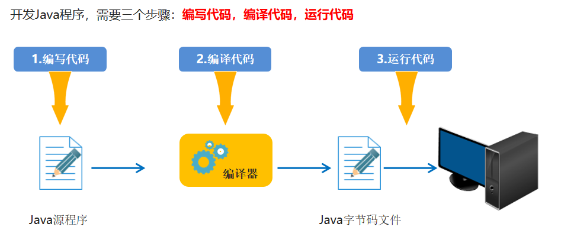
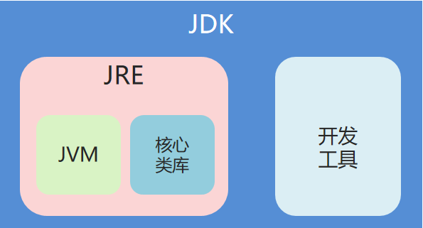
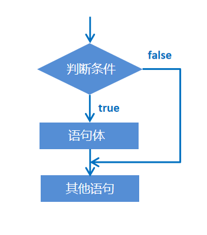
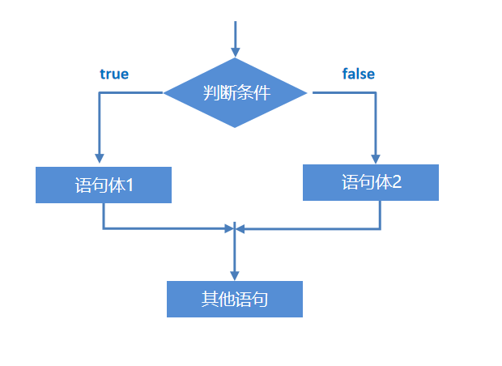
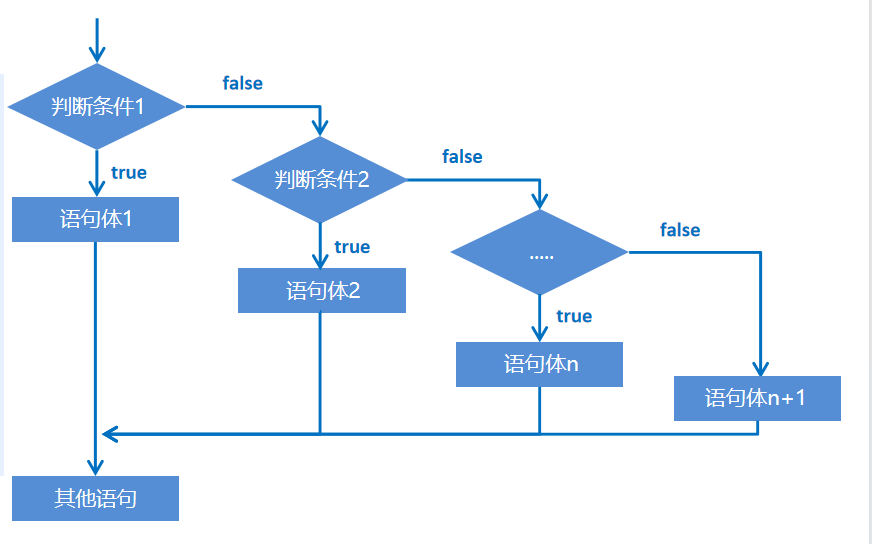
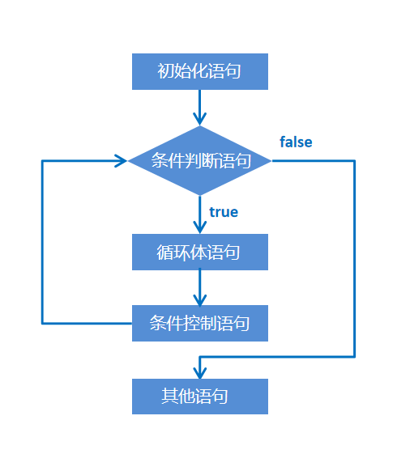
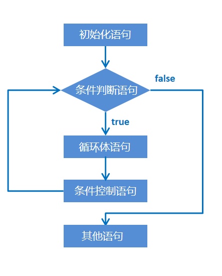
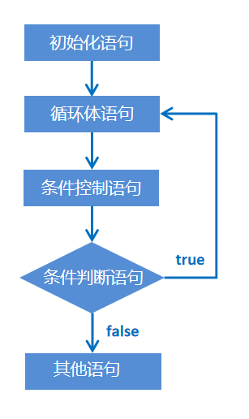

# JAVA基础01

> 姓名：陈伟
>
> 时间：2022-7-19

## Java程序开发运行流程

1. 开发Java程序，需要三个步骤：编写代码，编译代码，运行代码。

   

## JAVA基本数据类型和引用数据类型

### 基本数据类型

- Java是一个强类型语言，Java中的数据必须明确数据类型。
- Java中的数据类型包括基本数据类型和引用数据类型两种。
- Java中的基本数据类型：

#### **整型**

| 关键字 | 内存占用（字节） | 取值范围              |
| ------ | ---------------- | --------------------- |
| byte   | 1                | -128 ~ 127            |
| short  | 2                | -32768 ~ 32767        |
| int    | 4                | -2的31次方到2的31次-1 |
| long   | 8                | -2的63次方到2的63次-1 |

#### **浮点型**

| 关键字 | 内存占用（字节） | 取值范围             |
| ------ | ---------------- | -------------------- |
| float  | 4                | -1.4E-45 ~ 3.4E38    |
| double | 8                | -4.9E-324 ~ 1.79E308 |

#### **字符型**

| 关键字 | 内存占用（字节） | 取值范围  |
| ------ | ---------------- | --------- |
| char   | 2                | 0 ~ 65535 |

#### **布尔型**

| 关键字  | 内存占用（字节） | 取值范围    |
| ------- | ---------------- | ----------- |
| boolean | 1                | true、false |

### 引用数据类型

- 数组
- 类（比如字符串String）

## 关键字

- 都是小写字母
- 高亮显示

## 注释

- 单行注释：（快捷键：ctrl + / ）

  //      

- 多行注释：（快捷键：ctrl + shift + / ） 

  /* */

- 文档注释： (快捷键：/** + Enter)

  /**     */

## 快速复制一行

快捷键：ctrl + D

## 格式化代码

快捷键：ctrl + alt + L

## 批量修改变量，修改类名，包名

快捷键：shift + F6

## 常量

### 字符串常量

使用 "" 括起来

样例： "陈伟"

### 字符常量

使用 '' 括起来，必须有且只有一个字符（空格算一个字符）

样例：'A'，' '

### 整型常量

样例：10，5

### 浮点型常量

样例:10.5，10.0

### 布尔型常量

样例：true， false

### 空常量

样例：null（不能直接输出）

## 变量（数据类型     变量名 = 数据值）

### byte类型

byte b = 10; (不可复制超过范围，例如byte的范围为-127~128，byte b = 129是不可取的)

### short类型

short s = 20;

### int类型

int i = 1000；

### long类型

long l1 = 1000;   (如果数值超过了int的表示范围，必须给数值加一个大写或小写的L)

long l2 = 100000000000000000L;   (一般建议没超过范围也加一个大写或小写的L)

### float类型

float f = 3.14F; （小数默认是double类型，定义为float时，数字要加F或f）

### double类型

double d = 3.14;

### char类型

char c = '我';

### boolean类型

boolean bo = true; （只能赋值为true或false，或者为一个表达式，表达式的真或者假作为赋值）

## 标识符

- 由字母、数字、下划线_、美元符号$组成，第一个字符不能是数字
- 不能使用java中的关键字作为标识符
- 标识符区分大小写

## 命名规范

- 类名使用大驼峰式，例如：HelloWorld
- 变量名、方法名使用小驼峰式，例如：stuAge
- 自定义常量使用全大写，例如MAX_VALUE

## 类型转化

- 自动类型转化

  把一个表示数据范围小的数值或者变量赋值给另一个表示数据范围大的变量

  小数类型都比整型大（小数类型是经过算法压缩的）

```
byte → short → int → long → float → double
                ↑
               char   
```

- 强制类型转化（容易造成精度的丢失）

  把一个表示数据范围大的数值或者变量赋值给另一个表示数据范围小的变量

  格式：数据类型  变量名 = （数据类型）值或者变量;   

  样例：

注意：布尔类型不能和其他类型转换

## JVM、JRE、JDK的关系

- JVM是虚拟机，相当于翻译
- JRE是运行环境，JRE = JVM + 核心类库，可以运行已经开发好的Java程序
- JDK是Java开发工具，JDK = JRE + 开发工具



# JAVA基础02

> 姓名：陈伟
>
> 时间：2022-7-20

## 算术运算符

| 符号 | 作用 | 说明                       |
| ---- | ---- | -------------------------- |
| +    | 加   | 加法运算                   |
| -    | 减   | 减法运算                   |
| *    | 乘   | 乘法运算                   |
| /    | 除   | 获取的是两个数据相除的商   |
| %    | 取余 | 获取的是两个数据相除的余数 |

- 除法运算

  整数操作只能得到整数，要想得到小数，必须有浮点数参与运算。例如5/2，结果是2；

  5.0/2，结果是2.5

- 字符的"＋"操作

  字符在参与运算时，会转换成编码表中对应的数字进行运算。

  常见的字符和数字的对应关系

  'a~z' ------- 97~122

  'A~Z' ------- 65~90

  '0~9' ------- 48~57

- 字符串的"＋"操作

  当"＋"操作中出现字符串时，这个"＋"是字符串连接符，而不是算术运算。

  例如：

  "itheima" + 666，结果为"itheima666"。

  1 + 99 + "年黑马"，结果为"100年黑马"

   在"＋"操作中，如果出现了字符串，就是连接运算符，否则就是算术运算。当连续进行"＋"操作时，从左到右逐个执行。

## 表达式类型提升

- byte，short，char变量在运算时，类型自动提升为int类型

  样例：byte a = 10； byte b = 20； int c = a + b；

- 混合运算时，结果以参加运算的最高类型为准

  样例：byte a = 10；double b = a + 1.0；（1.0默认为double类型，所以需要用double数据类型）

- 常量编译优化

- 样例：byte a = 10+20；//编译后系统将会认为是byte a = 30；

## 自增自减运算符

| 符号 | 作用 | 说明        |
| ---- | ---- | ----------- |
| ++   | 自增 | 变量的值加1 |
| --   | 自减 | 变量的值减1 |

- ++和--既可以放在变量的后边，也可以放在变量的前边。

- 单独使用

  ++和--无论是放在变量的前边还是后边，结果都是一样的。

- 参与操作

  - 如果放在变量的后边，先拿原值参与操作，随后再进行自增或自减（先用后加）

    样例：int a = 10； int b = a++；（b的值为10，a的值变成了11）

  - 如果放在变量的前边，先对变量做自增或自减，然后再拿新值参与操作。（先加后用）

    样例：int a = 10； int b = ++a； （b的值为11，a的值变成了11）

## 赋值运算符

| 符号 | 作用       | 说明                    |
| ---- | ---------- | ----------------------- |
| =    | 赋值       | a = 10，将10赋值给变量a |
| +=   | 加后赋值   | a += b，将a+b的值给a    |
| －=  | 减后赋值   | a－= b，将a-b的值给a    |
| *=   | 乘后赋值   | a *= b，将a×b的值给a    |
| /=   | 除后赋值   | a /= b，将a÷b的值给a    |
| %=   | 取余后赋值 | a %= b，将a÷b的余数给a  |

- 注意事项：扩展的赋值运算符隐含了强制类型转换

  样例：byte a = 10；a = a + 5；（这是不对的写法，因为右边存在数据类型为byte的变量a，因此会认为为int类型，需要强转才可成功编译）

  正确写法：byte a = 10；a = （byte）（a+5）；

  a += 5；这个可成功运行，它隐含了强制类型转换 a = （byte）（a+5）

## 关系运算符

| 符号 | 说明                                                      |
| ---- | --------------------------------------------------------- |
| ==   | a == b，判断a和b的值是否相等，成立为true，不成立为false   |
| !=   | a != b，判断a和b的值是否不相等，成立为true，不成立为false |
| >    | a > b，判断a是否大于b，成立为true，不成立为false          |
| >=   | a >= b，判断a是否大于等于b，成立为true，不成立为false     |
| <    | a < b，判断a是否小于b，成立为true，不成立为false          |
| <=   | a <= b，判断a是否小于等于b，成立为true，不成立为false     |

注意事项：关系运算符都是boolean类型，要么是true，要么是false。千万不要把"=="误写成"="

## 逻辑运算符

- 是用来连接关系表达式的运算符，也可以直接连接布尔类型的常量或者变量。

| 符号 | 作用     | 说明                                           |
| ---- | -------- | ---------------------------------------------- |
| &    | 逻辑与   | a & b，a和b都是true，否则为false               |
| \|   | 逻辑或   | a \| b，a和b都是false，结果为false，否则为true |
| ^    | 逻辑异或 | a ^ b，a和b结果不同为true，相同为false         |
| ！   | 逻辑非   | ！a，结果和a的结果正好相反                     |

## 短路逻辑运算符

| 符号 | 作用   | 说明                           |
| ---- | ------ | ------------------------------ |
| &&   | 短路与 | 作用和 & 相同，但是有短路效果  |
| \|\| | 短路或 | 作用和 \| 相同，但是有短路效果 |

注意事项：

- 逻辑与 & ，无论左边真假，右边都要执行。

  短路与 && ，如果左边为真，右边执行，如果左边为假，右边不执行。

- 逻辑或 | ，无论左边真假，右边都要执行。

  短路或 || ，如果左边为假，右边执行；如果左边为真，右边不执行。

## 三元运算符

- 格式：判断语句 ? 表达式1 ： 表达式2

- 计算规则：

  首先执行判断语句

  如果为true，表达式1的值就是运算结果

  如果为false，表达式2的值就是运算结果

## 键盘录入数据

步骤

- 导入包

   import java.util.Scanner;

  导包的动作必须出现在类定义的上面

- 创建对象

  Scanner sc = new Scanner(System.in);  

  sc是变量名，可以变，其他的都不允许变

- 键盘输入数据：

  int i = sc.nextInt();

  键盘输入一个整数，赋值给变量i

  String s = sc.next();

  String s = sc.nextLine();

  键盘输入一个字符串，赋值给变量s

  注意：next不能接收空格，nextLine可以接收空格


# JAVA基础03

> 姓名：陈伟
>
> 日期：2022-7-23

## 分支语句

分支语句可以根据不同条件的判断结果，选择不同的执行流程。

Java的分支语句可以分为：

### if语句

- if语句格式1

  

  ```java
  格式：
  if(关系表达式){
  	语句体;
  }
  ```

  执行流程：

  1. 首先计算关系表达式的值
  2. 如果关系表达式的值为true就执行语句体
  3. 如果关系表达式的值为false就不执行语句体
  4. 继续执行后面的语句内容

- if语句格式2

  

  ```java
  格式：
  if(关系表达式){
  	语句体1;
  }else{
  	语句体2;
  }
  ```

  执行流程：

  1. 首先计算关系表达式的值
  2. 如果关系表达式的值为true就执行语句体1
  3. 如果关系表达式的值为false就执行语句体2
  4. 继续执行后面的语句内容

- if语句格式3

  
  
  ```java
  格式：
  if(判断条件1){
      语句体1;
  }else if(判断条件2){
      语句体2;
  }
  ...
  else{
      语句体n+1;
  }
  ```
  
  执行流程（多选一，只能执行一个语句体）：
  
  1. 首先计算判断条件1的值
  2. 如果值为true就执行语句体1；如果值为false就计算判断条件2的值
  3. 如果值为true就执行语句体2；如果值为false就计算判断条件3的值
  4. ...
  5. 如果没有任何判断条件为true，就执行语句体n+1


### switch语句

```java
格式:
switch(表达式){
    case 值1:
        语句体1;
        break;
     case 值2:
        语句体2;
        break;
     ...
     default:
        语句体n+1;
        break;
}
```

执行流程：

1. 首先计算表达式的值
2. 依次和case后面的值进行比较，如果有对应的值，就会执行相应的语句，在执行的过程中，遇到break就会结束。
3. 如果所有的case后面的值和表达式都不匹配，就会执行default里面的语句体，然后程序结束掉。

注意事项：

1. 表达式类型：byte、short、int、char，枚举，String
2. case给出的值不允许重复
3. case后面的值只能是常量，不能是变量

### 穿透现象

switch语句的case穿透现象

- 注意：在switch语句中，如果case控制的语句体后面不写break，将出现穿透现象
- 现象：当开始case穿透，后续的case就不会具有匹配效果，内部的语句都会执行直到遇见break，或者将整体switch语句执行完毕，才会结束
- 应用场景：当switch语句中，有多个case选项要执行相同的代码时，就可以使用case穿透来优化代码

## 循环语句

### for循环语句



```java
格式：
for(初始化语句;条件判断语句;条件控制语句){
    循环体语句;
}
```

执行流程：

1. 执行初始化语句

2. 执行条件判断语句，看其结果是true还是false

    如果是false，循环结果

    如果是true，进入循环内部

3. 执行循环体语句

4. 执行条件控制语句

5. 回到2.继续

### while循环语句



```java
初始化语句;
while(条件判断语句){
    循环体语句;
    条件控制语句;
}
```

执行流程:

1. 执行初始化语句

2. 执行条件判断语句，看其结果是true还是false

   如果是false，循环结束

   如果是true，继续执行

3. 执行循环体语句

4. 执行条件控制语句

5. 回到2.继续

### do-while循环语句



```java
初始化语句;
do{
    循环体语句;
    条件控制语句;
}while(条件判断语句);
```

执行流程：

1. 执行初始化语句

2. 执行循环体语句

3. 执行条件控制语句

4. 执行条件判断语句，看其结果是true还是false

   如果是false，循环结束

   如果是true，继续执行

5. 回到2.继续

## 三种循环的区别

| 循环结构 | 执行流程                       | 初始化变量                       |
| -------- | ------------------------------ | -------------------------------- |
| for      | 先判断，再执行                 | 循环外，无法使用初始化变量       |
| while    | 先判断，再执行                 | 循环结束后，初始化变化能继续使用 |
| do-while | 先执行，后判断（至少执行一次） | 循环结束后，初始化变量能继续使用 |

## 死循环格式

```java
for(;;;){
}

while(true){
}

do{
}while(true);
```

注意：

- 死循环推荐while写法
- 命令提示符窗口中 ctrl + C 可以结束死循环

## 嵌套循环

嵌套循环：

- 循环体中可以嵌套另一个循环结构，称为嵌套循环，或者循环嵌套

执行步骤：

- 外循环执行一次，内循环执行一个循环周期
- 整个循环次数：外循环 * 内循环

## 跳转控制语句——break和continue

### continue

- 跳过某次循环体内容的执行
- continue用在循环中，基于条件控制，跳过某次循环体内容的执行，继续下一次的执行

- 注意：使用是基于条件控制的

### break

- 终止循环体内容的执行
- break用在循环中，基于条件控制，终止循环体内容的执行，也就是说结束当前的整个循环
- 注意：使用是基于条件控制的

### 使用注意

- break只能用在switch或者循环中，continue只能用在循环中
- break和continue语句后面都不能直接跟其他语句，否则会编译报错


# JAVA基础04

> 姓名：陈伟
>
> 日期：2022-7-23

## 随机数（Random）

Random的作用和使用步骤

- 作用：用于产生一个随机数

- 使用步骤：

  1. 导包：import java.util.Random

     导包的动作必须出现在类定义的上面

  2. 创建对象：Random r = new Random();

     上面这个格式里面，r是变量名，可以变，其他的都不允许变

  3. 获取随机数：int number = r.nextInt(10)；//获取数据的范围：[0,9]，包括0和9

     上面这个格式历史，number是变量名，可以变；数字10是范围，可以变。其他的都不允许变

- 生成 [a, b] 范围的随机数 (包含a 和 b)

  int number = r.nextInt(b-a+1) + a;

## 数组

### 数组介绍

- 数组（array）是一种数据容器，用来存储（同种数据类型）的多个值
- 数组使用场景：如果要操作的数据，是同一组数据，就可以使用数组容器进行存储
- 数组中数据支持类型转换

### 数组定义格式

- 格式一：数据类型[]  变量名

  范例：int[] array

- 格式二：数据类型 变量名[]

  范例：int array[]

### 数组初始化概述

- Java中的数组必须先初始化，然后才能使用

  所谓初始化：就是在内存中，为数组容器开辟空间，并将数据存入容器中的过程。

### 数组初始化方式

#### 动态初始化

-  特点：初始化时只指定数组长度，由系统为数组分配初始值
  1. 格式：数据类型[]    变量名 = new   数据类型[数组长度];
  2. 范例：int[] arr = new int[3];

#### 静态初始化

- 静态初始化：初始化时，就可以指定数组要存储的元素，系统还会自动计算出该数组长度
  1. 格式：数组类型[]   变量名 = new 数据类型[] {数据1，数据2，数据3，......};
  2. 范例：int[] arr = new int[]{1, 2, 3};
  3. 简化格式：数据类型[]  变量名 = {数据1，数据2，数据3，......};
  4. 范例：int [] arr = {1, 2, 3};

#### 两种初始化的区别对比

- 动态初始化：手动指定数组长度，由系统给出默认初始化值。

  int[] arr = new int[3];

- 静态初始化：手动指定数组元素，系统会根据元素个数，计算出数组的长度

  double[] arr3 = {1.1, 2.2, 3.3};

#### 动态初始化使用场景

- 动态初始化：只明确元素个数，不明确具体数据，推荐使用动态初始化

  例：使用数组容器来存储键盘录入的5个整数

  int[] arr = {?, ?, ?, ?, ?};

  int[] arr = new int[5];

#### 静态初始化使用场景

- 静态初始化：需求中已经明确了要操作的具体数据，直接静态初始化即可

  例：将一班的学生成绩存入数组中 11, 22, 33

  int[] arr = {11, 22, 33};

  定义字符串数组，放星期

  String[] arr = {"星期一", "星期二", "星期三"};

### 内存分配

#### Java中内存分配

Java程序在运行时，需要在内存中分配空间

为了提高运算效率，就对空间进行了不同区域的划分

每一片区域都有特定的处理数据方式和内存管理方式

- **栈内存：方法运行时，进入的内存，局部变量都存放在这块内存当中**
- **堆内存：new出来的内容都会进入堆内存，并且会存在地址值**
- 方法区：字节码文件（.class文件）加载时进入的内存
- 本地方法栈：调用操作系统相关资源
- 寄存器：交给CPU去使用

#### 堆中数据的默认值

| 数据类型                       | 默认值 |
| ------------------------------ | ------ |
| 整数（byte，short，int，long） | 0      |
| 浮点数（float，double）        | 0.0    |
| 布尔（boolean）                | false  |
| 字符（char）                   | 空字符 |
| 引用数据类型                   | null   |

#### 注意事项

- int[] arr1 = new int[3];

  int[] arr2 = new int[2];

  每new一次，在堆内存中，都会产生一块新的空间，每个空间都是独立的

- int[] arr1 = new int[3];

  int[] arr2 = arr1;

  多个数组指向相同的内存空间（共享同个内存），一个数组对元素的修改会直接影响另一个数组

### 数组元素访问

- 数组内部保存的数据的访问方式

- 格式：数组名[索引]

- 索引是数组容器中空间的编号

  特征①：索引从0开始

  特征②：索引是连续的

  特征③：索引逐一增加，每次加1

- 索引作用：访问数组容器中的空间位置

### 数组操作的两个常见小问题

- 索引越界：访问了数组中不存在的索引对应的元素，造成索引越界问题
- 空指针异常：访问的数组已经不再指向堆内存的数据，造成空指针异常
- null：空值，引用数据类型的默认值，表示不指向任何有效对象

### 数组常见操作

- 遍历

  数组遍历：将数组中所有的内容取出来，取出来之后可以（打印，求和，判断...）

  注意：遍历指的是取出数据的过程，不要局限的理解为，遍历就是打印

- 获取数组元素数量

  格式：数组名.length

  范例：arr.length

- 数组遍历通用格式

  ```java
  int[] arr = {......};
  for(int i = 0; i < arr.length; i++){
      arr[i]    //对arr[i]进行操作
  }
  ```


# JAVA基础05

> 姓名：陈伟
>
> 日期：2022-7-25

## 方法

### 方法概述

- 方法（method）就是一段具有独立功能的代码块，不调用就不执行
- 方法的出现，可以**提高代码的复用性**
- 方法使用前提须知
  1. 方法必须先创建才可以使用，该过程称为方法定义
  2. 方法创建后并不是直接运行的，需要手动使用后才执行，该过程称为方法调用

### 方法的定义和调用

- 方法定义

  ```java
  格式：
  public static void 方法名(){
      //方法体
  }
  
  范例：
  public static void eat(){
      //方法体
  }
  ```


- 方法调用

  ```java
  格式：
  方法名();
  
  范例：
  eat();
  ```

- 注意：方法必须先定义后调用，否则程序将报错

- 方法调用过程

  1. 方法没有被调用的时候，都在方法区中的字节码文件（.class）中存储
  2. 方法被调用的时候，需要进入到栈内存中运行

### 带参数方法的定义和调用

- 带参数方法定义

  ```java
  格式：
  public static void 方法名(参数){......}
  
  格式（单个参数）：
  public static void 方法名(数据类型 变量名){......}
  范例（单个参数）:
  public static void method(int number){......}
  
  格式（多个参数）：
  public static void 方法名(数据类型 变量名1, 数据类型 变量名2, ......){......}
  范例（多个参数）：
  public static void getMax(int number1, int number2){......}
  ```

  注意：

  1. 方法定义时，参数中的数据类型和变量名都不能缺少，缺少任意一个程序将报错
  2. 方法定义时，多个参数直接用逗号（,）分隔

- 带参数方法调用

  ```java
  格式：
  方法名(参数);
  
  格式（单个参数）：
  方法名(变量名/常量值);
  范例（单个参数）：
  method(5);
  
  格式（多个参数）：
  方法名(变量名1/常量值1, 变量名2/常量名2);
  范例（多个参数）：
  getMax(5,6);
  ```

  注意：

  1. 方法调用时，参数的数量与类型必须与方法定义中的设置相匹配，否则程序将报错 

- 形参和实参

  1. 形参：全称形式参数，是指方法定义中的参数
  2. 实参：全称实际参数，方法调用中的参数

### 带返回值方法的定义和调用

我们经常会根据一个方法产出的结果，来去组织另外一段代码逻辑，为了拿到这个方法产生的结果，就需要定义带有返回值的方法。

- 带返回值方法定义

  ```java
  格式：
  public static 数据类型 方法名(参数){
      return 数据;
  }
  范例1：
  public static boolean isEvenNumber(int number){
      return true;
  }
  范例2:
  public static int getMax(int a,int b){
      return 100;
  }
  ```

  注意：

  1. 方法定义时return后面的返回值与方法定义上的数据类型要匹配，否则程序将报错         

- 带返回值方法调用

  ```java
  格式1：
  方法名(参数);
  范例：
  isEvenNumber(5);
  
  格式2：
  数据类型 变量名 = 方法名(参数);
  范例：
  boolean flag = isEvenNumber(5);
  ```

  注意：

  1. 方法的返回值通常会使用变量接收，否则该返回值将无意义

### 方法通用格式

```java
格式：
public static 返回值类型 方法名(参数){
    方法体;
    return 数据;
}
```

- public static ——修饰符，目前先记住这个格式
- 返回值类型——方法操作完毕之后返回的结果数据，所对应的数据类型，如果方法操作完毕，没有数据返回，这里写void，而且方法体中一般不写return
- 方法名——调用方法时候使用的标识
- 参数——由数据类型和变量名组成，多个参数之间用逗号隔开（理解：方法运行之间所需要的材料）
- 方法体——完成功能的代码块
- return——如果方法操作完毕，有数据返回，用于把数据返回给调用者
- 定义方法时，要做到两个明确
  1. 明确参数：主要是明确参数的类型和数量
  2. 明确返回值类型：主要是明确方法操作完毕之后是否有数据返回，如果没有，写void；如果有，写对应的数据类型
- 调用方法时
  1. void类型的方法，直接调用即可
  2. 非void类型的方法，推荐用变量接收调用

### 方法的注意事项

- 方法不能嵌套定义
- 方法的返回值类型为void，表示该方法没有返回值，没有返回值的方法可以省略return语句不写，如果要编写return，后面不能跟具体的数据
- return语句下面，不能编写代码，因为永远执行不到，属于无效的代码

### 方法重载

概述：

- 在同一个类中，方法名相同，**参数列表不同**，就可以构成重载（参数个数、参数类型、参数的顺序不同，**就算参数列表不同**）
- 参数列表不同：个数不同 或者 类型不同 或者 顺序不同即可

注意：识别方法之间是否是重载关系，只看方法名和参数，跟返回值无关

方法重载的好处：

- 不用记忆过多繁琐的方法名字，比如JDK中的println方法，就是重载的方法
- 丰富的参数类型，因为重载的方法名字是一样的，方便让调用者使用方法

### 方法的参数传递

- 对于基本数据类型的参数，形参的改变，不影响实参

  原因：每个方法在栈内存中，都会有**独立的**栈空间，方法运行结束后就会弹栈消失

- 对于引用数据类型的参数，形参的改变，直接影响实参

  原因：引用数据类型的传参，传入的是地址值，内存中会造成两个引用指向同一个内存的效果，所以即使方法弹栈，堆内存中的数据也已经是改变后的结果
  
  记法：
  
  1. 参数是基本类型，传参时，是将数据复制一份给方法，形参的修改不会影响实参
  2. 参数是引用类型，传参时，是将实参的地址传给形参，形参对数据的修改会直接影响实参

# JAVA基础06

> 姓名：陈伟
>
> 时间：2022-7-28

## 面向对象和面向过程的思想对比

- 面向过程：是一种以过程为中心的编程思想，实现功能的每一步，都是自己实现的

- 面向对象：是一种以对象为中心的编程思想，通过指挥对象实现具体的功能

  对象：指客观存在的事物，万物皆对象

## 什么是类

- 类是对现实生活中一类具有共同属性和行为的事物的抽象
- 可以将类理解为一个抽象的概念，是一个模板。而对象是该模板的一个具体的代表，是真实存在的事物

## 类的组成

- 属性：事物的各种特征

  例如：学生的属性、姓名、年龄、毕业院校

- 行为：事物存在的功能（能够做的事情）

  例如：学生的行为：学习、Java编程开发

## 类和对象的关系

- 类：类是对现实生活中一类具有共同属性和行为的事物的抽象

- 对象：是能够看得到摸得着的真实存在的实体

  类是对象的描述，对象是类的实体

## 类的定义

- 类的组成：属性和行为

  1. 属性：在类中通过成员变量来体现（类中方法外的变量）
  2. 行为：在类中通过成员方法来体现（和前面的方法相比去掉static关键字即可）

- 类的定义步骤

  ①定义类

  ②编写类的成员变量

  ③编写类的成员方法

  ```java
  public class 类名{
      //成员变量
      数据类型 变量名1;
      数据类型 变量名2;
      
      //成员方法（不加static）
      方法1;
      方法2；
      ...
  }
  ```

## 对象的使用

- 创建对象
  1. 格式：类名 对象名 = new 类名();
  2. 范例: Student s = new Student();
- 使用对象
  1. 使用成员变量
     - 格式：对象名.变量名
     - 范例：s.name
  2. 使用成员方法
     - 格式：对象名.方法名()
     - 范例：s.study();

## 成员变量和局部变量

- 成员变量：类中方法外的变量
- 局部变量：方法中的变量

## 成员变量和局部变量的区别

| 区别         | 成员变量                                   | 局部变量                                       |
| ------------ | ------------------------------------------ | ---------------------------------------------- |
| 定义位置不同 | 类中方法外                                 | 方法内或者方法声明上（形参）                   |
| 内存位置不同 | 堆内存                                     | 栈内存                                         |
| 生命周期不同 | 随着对象的存在而存在，随着对象的消失而消失 | 随着方法的调用而存在，随着方法的调用完毕而消失 |
| 初始化值不同 | 有默认的初始化值                           | 没有默认的初始化值，必须先赋值，才能使用       |

## 封装

- private关键字

  1. 是一个权限修饰符
  2. 可以修饰成员（成员变量和成员方法）
  3. 被private修饰的成员只能在本类中才能访问

- 针对private修饰的成员变量，如果需要被其他类使用，提供相应的操作

  1. 提供"get变量名()"方法，用户获取成员变量的值，方法用public修饰
  2. 提供"set变量名(参数)"方法，用于设置成员变量的值，方法用public修饰

- this关键字

  this关键字的作用：可以调用本类的成员（变量，方法）解决局部变量和成员变量的重名问题

  局部变量和成员变量如果重名，Java使用的是就近原则

- this原理

  记住：方法被哪个对象调用，this就代表哪个对象

- 封装：

  1. 面向对象三大特征之一（封装，继承，多态）
  2. 隐藏实现细节，仅对外暴露公共的访问方式
  3. 私有仅仅是封装的一种体现
  4. 将代码抽取到方法中，这是对代码的一种封装
  5. 将属性抽取到类当中，这是对数据的一种封装
  6. 封装常见的体现：
     - 私有成员变量，提供setXxx和getXxx方法
     - 将代码抽取到方法中，这是对代码的一种封装
     - 将属性抽取到类当中，这是对数据的一种封装
  7. 封装的好处：
     - 提高了代码的安全性
     - 提高了代码的复用性

## 构造方法

### 构造方法概述

- 构建、创造对象的时候，所调用的方法

- 格式：

  1. 方法名与类名相同，大小写也要一致
  2. 没有返回值类型，连void都没有
  3. 没有具体的返回值（不能由return带回结果数据）

- 执行时机：

  1. 创建对象的时候调用，每创建一次对象，就会执行一次构造方法
  2. 不能手动调用构造方法

  ```java
  public class StudentDemo{
      public static void main(String[] args){
          Student s1 = new Student();
      }
  }
  
  class Student{
      private int age;
      
      //无参构造方法
      public Student(){
      }
      
      //带参构造方法
      public Student(int age){
          this.age = age;
      }
  }
  ```

  

### 构造方法的注意事项

- 构造方法的创建
  1. 如果没有定义构造方法，系统将会给出一个默认的无参数构造方法
  2. 如果定义了构造方法，系统将不再提供默认的构造方法
  
- 构造方法的重载
  
  1. 如果自定义了带参构造方法，还要使用无参数构造方法，就必须再写一个无参数构造方法
  
- 推荐的使用方式
  
  1. 无论是否使用，都手动书写无参数构造方法，和带参数构造方法
  
- 构造方法和set方法的区别

  构造方法只能在创建对象的时候，初始化成员变量的值，后期无法通过构造方法修改值

  set方法可以为成员变量多次赋值

## 标准类制作

- 成员变量
  1. 使用private修饰
- 构造方法
  1. 提供一个无参构造方法
  2. 提供一个带多个参数的构造方法
- 成员方法
  1. 提供每一个成员变量对应的setXxx()/getXxx()
  2. 提供一个显示对象信息的show()
- 创建对象并为其成员变量赋值的两种方式
  1. 无参构造方法创建对象后使用setXxx()赋值
  2. 使用带参构造方法直接创建带有属性值的对象 

# JAVA基础07

> 姓名：陈伟
>
> 时间：2022-7-30

## String

### String类的特点

- Sring类在java.lang包下，这个包使用的时候不需要导包
- String类代表字符串，Java程序中的所有字符串文字（例如"abc"）都被实现为此类的实例，也就是说，java程序中所有的双引号字符串，都是String类的对象
- **字符串值不可变**，在内存中创建后不能被更改

### String创建对象的区别

- 以""方式给出的字符串，只要字符串相同，无论在程序代码中出现几次，JVM都只会建立一个String对象，并在字符串常量池中维护

- 字符串常量池：当使用双引号创建字符串对象的时候，系统会检查该字符串是否在字符串常量池中存在

  如果不存在：创建

  如果存在：不会重新创建，而是直接复用

- 通过new创建的字符串对象，每一次new都会申请一个内存空间，虽然内容相同，但是地址值不同

```java
public static void main(String[] args) {
        String s1 = "abc";
        String s2 = "abc";

        String s3 = new String("abc");
        String s4 = new String("abc");

        System.out.println(s1 == s2);//true
        System.out.println(s3 == s4);//false
        System.out.println(s1 == s3);//false
    }
```

### String对象的比较

- 使用 == 做比较

  基本类型：比较的是**数据值**是否相同

  引用类型：比较的是**地址值**是否相同

- 字符串是引用类型，它使用==做比较时比较的是地址值，如果想要比较字符串的内容是否相同，需要使用方法：

  public boolean equals(Object anObject)：比较两个字符串内容是否相同，区分大小写

  public boolean equalsIgnoreCase(String anObject)：比较两个字符串内容是否相同，忽略大小写

### String的遍历

- 可以使用遍历来访问字符串的每一个字符

  字符串变量需要用到以下两个方法：

  public char charAt(int index)：返回指定索引处的char值（字符串的索引也是从0开始的）

  public int length()：返回此字符串的长度

- 字符串遍历的代码

  ```java
  public class Demo2{
      public static void main(String[] args){
          //创建字符串
          String s = "abcdefg";
          
          //遍历访问每个字符
          for(int i = 0; i < s.length(); i++){
              char c = s.charAt(i);
              System.out.println(c);
          }
      }
  }
  ```

### String常见构造方法

| 方法名                         | 说明                                      |
| ------------------------------ | ----------------------------------------- |
| public String()                | 创建一个空白字符串对象，不含有任何内容    |
| public String(char[] chs)      | 根据字符数组的内容，来创建字符串对象      |
| public String(String original) | 根据传入的字符串内容，来创建字符串对象    |
| String s = "abc";              | 直接赋值的方法创建字符串对象，内容就是abc |

### String方法小结

| 方法名                                                       | 说明                                           |
| ------------------------------------------------------------ | ---------------------------------------------- |
| public boolean equals(Object anObject)                       | 比较两个字符串的内容是否相同，严格区别大小写   |
| public boolean equalsIgnoreCase(String anotherString)        | 比较两个字符串的内容是否相同，忽略大小写       |
| public int length()                                          | 返回此字符串的长度                             |
| public char charAt(int index)                                | 获取index位置上的字符                          |
| public char[] toCharArray()                                  | 将字符串拆分为字符数组后返回                   |
| public String replace(CharSequence target, CharSequence replacement) | 使用新值，将字符串中的旧值替换，得到新的字符串 |
| public Stirng[] split(String regex)                          | 根据传入的规则切割字符串，得到字符串数组       |

## StringBuilder

### StringBuilder的概述

- StringBuilder是一个可变的字符串操作类
- 作用：提高字符串的操作效率

### StringBuilder的构造方法

| 方法                             | 说明                                   |
| -------------------------------- | -------------------------------------- |
| public StringBuilder()           | 创建一个空白字符串对象，不含有任何内容 |
| public StringBuilder(String str) | 根据字符串的内容，来创建可变字符串对象 |

### StringBuilder的常用方法

| 方法                           | 说明                                 |
| ------------------------------ | ------------------------------------ |
| public StringBuilder append()  | （任意类型）添加数据，并返回对象本身 |
| public StringBuilder reverse() | 返回相反的字符序列                   |
| public int length()            | 返回长度                             |
| public String toString()       | 把StringBuilder转换为String类型      |

### String和StringBuilder的区别

- String：内容是不可变的
- StringBuilder：内容是可变的

### StringBuilder小结

- StringBuilder的功能是提高String的拼接效率
- String每次拼接都会生成新的字符串，StringBuilder可以在同一个对象上反复拼接

### StringBuilder和String相互转化

- StringBuilder转换为String

  public String toString()：通过toString()就可以实现把StringBuilder转换为String

- String转换为StringBuilder

  public StringBuilder(String s)：通过构造方法就可以实现把String转换为StringBuilder

# JAVA基础08

> 姓名：陈伟
>
> 时间：2022-7-31

## 集合基础

- 如果存储的数据，长度经常发生改变，推荐使用集合

### 集合和数组的区别

- 集合类的特点：提供一种存储空间可变的存储模型，存储的数据容量可以发生改变
- 集合和数组的区别：
  1. 共同点：都是存储数据的容器
  2. 不同点：数组的容量是固定的，集合的容量是可变的

## ArrayList集合

### ArrayList构造方法和添加方法

| 方法名                                | 说明                               |
| ------------------------------------- | ---------------------------------- |
| public ArrayList()                    | 构造方法，创建一个空的集合对象     |
| public boolean add(E e)               | 将指定的元素追加到此集合的末尾     |
| public void add(int index, E element) | 在此集合中的指定位置插入指定的元素 |

ArrayList\<E>：

- 可调整大小的数组实现

- \<E>：是一种特殊的数据类型，泛型

  在出现 E 的地方我们使用引用数据类型替换即可

  举例：ArrayList\<String>，ArrayList\<Student>

### ArrayList集合常用方法

| 方法名                             | 说明                                   |
| ---------------------------------- | -------------------------------------- |
| public boolean remove(Object o)    | 删除指定的元素，返回删除是否成功       |
| public E remove(int index)         | 删除指定索引处的元素，返回被删除的元素 |
| public E set(int index, E element) | 修改指定索引处的元素，返回被修改的元素 |
| public E get(int index)            | 返回指定索引处的元素                   |
| public int size()                  | 返回集合中的元素的个数                 |

- 字符串以什么内容开头，startsWith