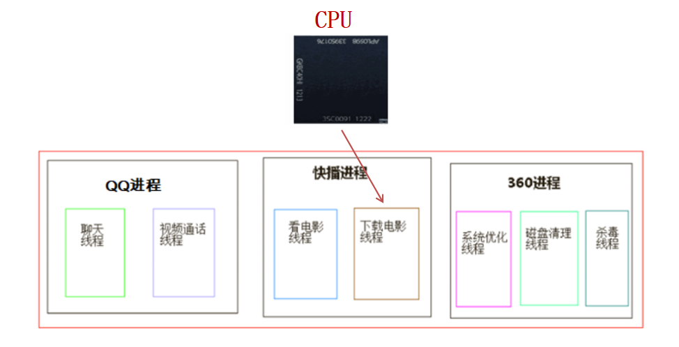
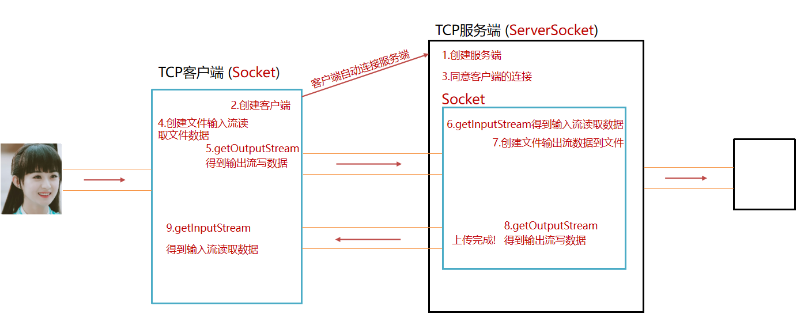
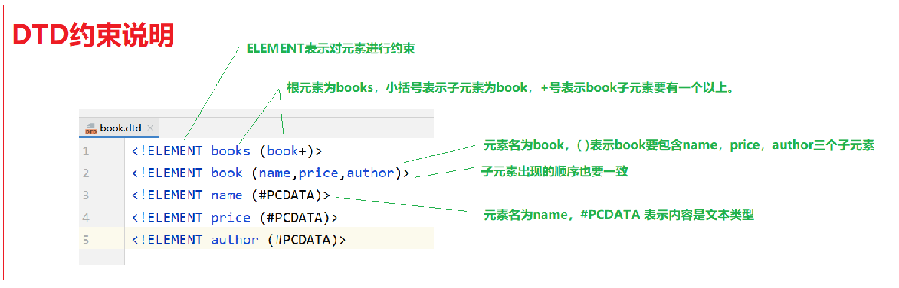

# JAVA进阶01

> 姓名：陈伟
>
> 时间：2022-8-4

## 继承

### 目前定义类存在的问题

- 子类的相同内容在每个子类中都需要写一遍，代码冗余

### 什么是继承

- 生活中的继承

  先有爸爸，后有儿子，儿子继承爸爸的财产

- Java中的继承

  和生活中的继承类似，子类会自动拥有父类的内容 

### Java中如何使用继承

- 把子类共性内容抽取到一个类中，子类继承父类

### 继承的优点

- 减少了代码冗余，提高了代码的复用性
- 有利于功能的扩展，子类继承父类就得到了父类的功能

### 继承的格式

```java
public class 子类名 extends 父类名{
}
```

### 什么时候使用继承

- 继承体现的关系：is...a的关系，子类是父类的一种
- 例如：狗和动物

### 使用继承完成案例，步骤如下

- 分析时，将子类的共性内容抽取到父类中
- 写代码时，先写父类，后写子类

### 子类无法使用的内容

- 父类的构造器不会继承到子类中

  因为构造器名称要和类名相同，而子类和父类类名不一样，父类的构造方法不能继承到子类中来使用

- 父类私有的内容子类不能使用

  父类私有的内容子类会继承保存，由于private关键字导致这个变量只能在本类使用，子类不能使用

```java
class Fu{
    public int x;
    private int y;
}
class Zi extends Fu{
    public int z;
}
```

- Zi zi = new Zi();

  继承后，new Zi();  只创建了一个对象 

### 继承的特点

- Java只支持单继承，不支持多继承

  单继承：子类只能继承一个直接父类

  不支持多继承：子类不能同时继承多个父类

  ```java
  public class 父类A{
      public void method(){
          System.out.println("复习数学");
      }
  }
  
  public class 父类B{
      public void method(){
          System.out.println("复习语文");
      }
  }
  
  public class 子类C extends 父类A,父类B{
  }
  
  public class 测试类{
      public static void main(String[] args){
          子类C z = new 子类C();
          z.method();//复习啥？出现二义性，听哪个爸爸的呢？
      }
  }
  ```

- Java支持多层继承

  A继承B，B继承C

  一个类不写父类会自动继承Object

### 继承后成员变量访问特点

- 在子类方法中访问一个变量满足：就近原则

  1. 先找子类局部变量
  2. 然后找子类成员变量
  3. 然后找父类成员变量

- 可以通过super关键字，指定访问父类的成员变量

  super.父类成员变量

### 继承后成员方法访问特点

- 在子类方法中访问一个方法满足：就近原则

  1. 找子类成员方法
  2. 父类成员方法

- 可以通过super关键字，指定访问父类的成员方法

  super.父类成员方法()

## 方法重写

### 什么是方法重写

- 子类中对父类已有的方法重新写一遍

### 方法重写的应用场景

- 当子类和父类有相同的功能，但父类的功能不满足子类的需求时，子类可以重写父类中的方法

### @Override注解作用

- @Override是放在重写后的方法上，**检验该方法是否是重写方法**，加上注解后如果重写错误，编译阶段会出现错误提示。建议重写方法加上@Override注解，代码安全

### 方法重写注意事项和要求

- 是子类和父类之间的事情
- 方法名要相同
- 参数列表要相同
- 返回值类型要相同
- 子类重写方法的权限要大于等于父类方法的权限（暂时了解：private < 缺省 < protected < public）

### 继承中构造器的访问特点

子类中所有的构造器默认都会先访问父类中的无参构造器，再执行自己

- 为什么要先执行父类构造器

  因为子类会继承父类中的数据，可能还会使用父类的数据。所以，子类初始化之前，一定要先完成父类数据的初始化

- 子类构造器如何调用到父类构造器

  子类构造器的第一行语句默认都是：super()，不写也存在

- 如果父类中没有无参构造器，只有有参构造器，会出现什么现象呢？

  会报错。因为子类默认是调用父类无参构造器的

- 如何解决？

  子类通过super，手动调用父类的有参构造器

- super调用父类构造器使用场景

  子类构造器可以直接通过父类有参构造器来初始化父类的数据

### 继承后构造器的标准做法

- 子类无参调用父类无参构造
- 子类满参构造调用父类满参构造

## this和super总结

- this：代表本类对象的引用
- super：代表父类存储空间的标识（可以理解为父类对象引用）

| 关键字 | 访问成员变量                    | 访问成员方法                         | 访问构造方法              |
| ------ | ------------------------------- | ------------------------------------ | ------------------------- |
| this   | this.成员变量 访问本类成员变量  | this.成员方法(...) 访问本类成员方法  | this(...)  访问本类构造器 |
| super  | super.成员变量 访问父类成员变量 | super.成员方法(...) 访问父类成员方法 | super(...) 访问父类构造器 |

## 抽象方法格式和作用

- 抽象方法概念

  没有方法体的方法

- 抽象方法的格式

  ```java
  public abstract 返回值类型 方法名(参数列表);
  ```

- 抽象方法场景

  父类知道子类一定要完成某个功能，但是每个子类具体的情况都不一样，父类的该功能就可以定义成抽象方法

## 抽象类

- 抽象方法必须放在抽象类中

- 抽象类格式

   ```java
  public abstract class 类名{}
  ```

## 抽象类的使用步骤

- 定义类继承抽象类
- 重写抽象方法
- 使用子类对象

## 抽象类设计目的

- 抽象不能创建对象
- 让子类继承抽象类，重写抽象方法

## 父类中抽象方法有必要存在吗？（面试题）

- 父类不写抽象方法，子类也可以不写这个方法，导致功能缺失

## 抽象类注意事项

- 抽象方法必须放在抽象类中，抽象类中可以没有抽象方法
- 子类必须重写抽象类中的所有抽象方法，如果子类只重写一部分抽象方法子类还是抽象类

## 什么是设计模式

- 软件设计模式是一套被前人反复使用、多数人知晓的、经过分类编目的、代码设计经验的总结
- 使用设计模式是为了可重用代码、让代码更容易被他人理解、保证代码可靠性

### 模板方法模式

#### 什么时候使用模板方法模式

- 当项目中多个子类有相同功能，并且功能有固定的流程，细节可能不同

#### 模板设计模式思想总结

- 父类模板中定义确定的内容，不确定的内容定义成抽象方法，由具体子类完成
- 多个子类直接使用模板以此提高代码复用


# JAVA进阶02

> 姓名：陈伟
>
> 时间：2022-8-5

## 接口的概念和格式

### 什么是接口

- 接口可以理解为比抽象类还抽象的类，接口中全是抽象方法
- 接口体现的是规范，接口中的抽象方法定义的一组行为规范，体现了现实世界中"事物遵守某种规范就必须拥有规定的行为"的思想

```java
class 类名{
    成员变量
    成员方法/抽象方法
}

接口的格式：
interface 接口名{
    成员变量
    抽象方法
}
接口的使用：
class 实现类 implements 接口1,接口2{
}
```

### 接口存在的两个重要意义

- 定义统一规范，约束一类事物的功能设计
- 为后续软件设计，提高程序的扩展性

### 接口的使用

- 接口不能直接创建对象

- 接口是用来被类实现的，实现接口的类称为实现类。实现类可以理解成所谓的子类

- 实现类的格式

  ```java
  class 实现类 implements 接口1,接口2{
      
  }
  
  class 子类 extends 父类{
      
  }
  ```

### 接口实现的注意事项

- 一个类实现接口，必须重写完全部接口的全部抽象方法，否则这个类需要定义成抽象类

## 类实现多个接口

- 接口中的方法默认就是抽象方法，会自动添加：public abstract
- 接口中是常量，会自动添加：public static final

## 接口与接口的多继承

- Java中类只能单继承，一个类只有一个父类

  ```java
  class 子类 extends 父类{
  }
  ```

- 一个类可以同时实现多个接口

  ```java
  class 实现类 implements 接口1,接口2{
  }
  ```

- 一个接口可以同时继承多个接口

  ```java
  interface 接口名 extends 接口1,接口2{
  }
  ```

- 接口多继承的作用

  规范合并，整合多个接口为同一个接口，便于子类实现

## JDK8后接口新增方法

- 默认方法（就是类似之前写的普通实例方法）：必须用default修饰。需要用接口的实现类的对象来调用

  ```java
  public default 返回值类型 方法名(参数列表){}
  ```

- 静态方法：默认会public修饰。注意：接口的静态方法必须用本身的接口名来调用

  ```java
  public static 返回值类型 方法名(){}
  ```

- 私有方法（就是私有的实例方法）：JDK9才开始有的。只能在本来中被其他的默认方法或者私有方法访问

  ```java
  private 返回值类型 方法名(){}
  ```

## 接口和抽象类的区别

- 语法区别

  抽象类：

  abstract class 类名{}

  抽象类中有构造器

  抽象类中可以放普通方法和抽象方法

  一个类只能继承一个抽象类

  接口：

  interface 接口名{}

  没有构造器

  接口中方法只能是抽象方法（JDK1.8之前）

  一个类可以实现多个接口，一个接口可以继承其他接口

- 思想区别

  子类都具有的行为放到抽象类中，部分子类具有的行为放到接口中

## 四个权限修饰符的作用

- 权限修饰符概述

  1. 是用来控制一个类中成员能够访问的范围
  2. 可以修饰成员变量，成员方法，构造器，内部类

- 权限修饰符分类和作用

  权限修饰符有四种，作用范围由小到大（private -> 缺省 -> protected -> public）

| 修饰符    | 同一个类中 | 同一个包中其他类 | 不同包下的子类 | 不同包下的无关类 |
| --------- | ---------- | ---------------- | -------------- | ---------------- |
| public    | √          | √                | √              | √                |
| protected | √          | √                | √              |                  |
| 缺省      | √          | √                |                |                  |
| private   | √          |                  |                |                  |

### 常用的

- private：私有的，只有本类可以使用
- public：公开的，所有地方都能使用

### 不常用的

- 缺省的（默认的），给本包的类使用
- protected：受保护的，给子类使用

### 自己定义成员（方法，成员变量，构造器等）一般满足如下要求

- 成员变量一般私有
- 方法一般公开

## final关键字修饰类和方法的特点

### final的作用

- final关键字是不可变的意思，可以修饰类，方法，变量

### final修饰的特点

- 修饰类：表明该类是最终类，不能被继承
- 修饰方法：表明该方法是最终方法，不能被重写

## final关键字修饰变量的特点

- final修饰变量

  该变量只能进行一次赋值，不能改变了，该变量称为常量

- final修饰变量的注意

  final修饰引用类型的地址值不能发生改变，但是地址里面的内容是可以发生改变的

## static关键字

### static修饰成员变量作用

- static修饰的变量在内存中只有一份，被这个类的所有对象共享

```java
public class Window{
    public String name;
    public static int ticketNumber;
}
```

### static修饰成员变量如何调用

- 类名.静态成员变量（推荐）

```java
Window.ticketNumber
```

- 对象名.静态成员变量（不推荐）

```java
w1.ticketNumber
```

### static修饰成员变量的场景说明

- 如果某个成员变量希望被共享，则定义成静态成员，只有一份

  例如：学校饮水机

- 如果某个成员变量是属于每个对象的，而且每个对象的该数据的值不同则定义成实例成员变量

  例如：个人水杯

### 小结

- static修饰的变量在内存中只有一份，被这个类的所有对象共享
- static修饰的成员属于类，与类一起加载一次
- static修饰的成员变量在静态区，只有一份

## static修饰成员方法

- static修饰方法格式

```java
修饰符 static 返回值类型 方法名(){
    ...
}
```

- 静态成员方法调用
  1. 类名.静态方法名(); （推荐）
  2. 对象名.静态方法名(); （不推荐）
- static修饰方法缺点
  1. 同一个类中，静态方法只能访问静态修饰的成员（静态只能访问静态）
  2. 静态方法中是没有this关键字
- static修饰成员方法的场景说明
  1. 如果该方法是需要访问对象的实例成员的，则该方法必须声明成实例方法
  2. 如果该方法不会使用到普通成员变量，可以考虑声明成静态方法

## 代码块格式和特点

### 代码块介绍

- 代码块是类的5大成分之一（成员变量、构造器、方法、代码块、内部类），定义在类中方法外

  在Java类下，使用{}括起来的代码被称为代码块

  ```java
  public class 类名{
      成员变量
      成员方法
      构造器
      代码块
      内部类
  }
  ```

### 代码块分类

- 静态代码块
  1. 格式：static{}
  2. 特点：需要通过static关键字修饰，随着类的加载而加载，并且自动触发，只执行一次
  3. 使用场景：在类加载的时候做一些静态数据初始化的操作，以便后续使用
- 构造代码块（了解，几乎不用）
  1. 格式：{}
  2. 特点：每次创建对象，调用构造器执行前都会执行该代码块中的代码
  3. 使用场景：初始化实例资源
- 放在类中方法外（成员位置）


# JAVA进阶03

> 姓名：陈伟
>
> 时间：2022-8-7

## 多态的概念、格式

### 多态的概念

- 一类事物的多种形态

### 多态的格式（重点）：父类引用指向子类对象

- 父类 变量名 = new 子类();
- 接口 变量名 = new 实现类();

### 多态的前提

- 有继承/实现关系
- 要有方法重写

### 多态好处

- 左边写父类，右边可以是任意子类，提高代码扩展性
- 定义方法的时候，使用父类型作为参数，该方法就可以接收这父类的一切子类对象，体现出多态的扩展性强

```java
public class Demo01 {
    public static void main(String[] args) {
        Cat c = new Cat();
        Dog d = new Dog();
        // 多态真正的好处是在调用方法时使用多态
        goEat(d);
        goEat(c);
    }
    // 定义一个方法,假设这个方法是你同事写好的,你没有资格改
    // 方法参数写父类,可以传入任意子类对象
    // goEat(d);             Animal d = new Dog();
    // goEat(c);             Animal d = new Cat();
    public static void goEat(Animal d) {
        d.eat();
    }
}

```

### 多态的细节

- 编译看左边，运行看右边

引用类型转换

- 向上转型（自动类型转换）：从子到父

  父类引用指向子类对象

  **父类 变量名 = new 子类();**

- 向下转型（强制类型转换）：从父到子

  父类引用转为子类对象

  **子类 变量 = (子类)父类对象();**

  作用：可以调用子类特有功能

- 强制类型转换异常

  概述：如果被转的引用类型变量，对应的实际类型和目标类型不是同一种类型，那么在转换的时候就会出现ClassCastException

  ```java
  Animal a = new Cat();
  Dog d = (Dog)a;//出现异常ClassCastException
  ```

- 避免强制转换出现问题：关键字instanceof

  **变量名 instanceof 类型**

  通俗的理解：判断左边的变量，是否是右边的类型，返回boolean类型结果

## 内部类概述和分类

### 什么是内部类

- 把一个类定义到另一个类的里面（类中类）

```java
//以前我们定义类的时候，每个类都是独立的
class A{
}
class B{
}
```

```java
class AA{//外部类（宿主）
    
    class BB{//内部类（寄生）
    }
}
```

### 内部类使用场景

- 一个事物内部还有一个事物，内部的事物脱离外部的事物无法独立运行

### 按照定义位置

- 成员内部类
- 局部内部类

## 成员内部类

- 什么是成员位置

  类中方法外就是成员位置

- 什么是成员内部类

  定义在类中方法外的类

- 成员内部类的使用

  1. 创建外部类对象
  2. 通过外部类对象创建内部类对象

- 成员内部类的好处

  可以直接使用外部类的成员（成员变量，成员方法）

```java
public class Body {
    public boolean isLive = true;
    public void walk() {
        System.out.println("走一步");
    }
    // 类中方法外(成员内部类)
    class Heart {
        private String color = "红色";
        public void jump() {
            if (isLive) {
                System.out.println("人活着, 心脏是" + color + " 跳动了!");
                walk();
            } else {
                System.out.println("凉凉!");
            }
        }
    }
}

public class Demo05 {
    public static void main(String[] args) {
        // 1.创建外部类对象
        Body body = new Body();
        // 2.通过外部类对象创建内部类对象
        Body.Heart heart = body.new Heart();
        heart.jump();
        body.isLive = false;
        heart.jump();
    }
}
```

## 静态成员内部类

- 什么是静态成员内部类

  由static修饰的成员内部类

- 静态内部类创建对象的格式

  外部类名.内部类名 对象名 = new 外部类名.内部类名();

```java
public class Body {
    public static boolean isLive = true;
    public static void walk() {
        System.out.println("走一步");
    }
    // 静态成员内部类
    static class Heart {
        private String color = "红色";
        public void jump() {
            if (isLive) {
                System.out.println("人活着, 心脏是" + color + " 跳动了!");
                walk();
            } else {
                System.out.println("凉凉!");
            }
        }
    }
}

public class Demo07 {
    public static void main(String[] args) {
        Body.Heart heart = new Body.Heart();
        heart.jump();
    }
}
```

## 局部内部类

- 什么是局部位置

  方法中就是局部位置

- 什么是局部内部类

  定义在方法中的类

- 局部内部类的使用

  在定义局部内部类的下方创建对象去使用

```java
public class Chinese {
    private String color = "黄色";
    public void eat() {
        // 筷子类(局部内部类)
        class Chopsticks {
            private int length = 28;
            public void use() {
                System.out.println(color + "的人,拿长度为: " + length + "CM的筷子吃饭");
            }
        }
        Chopsticks c = new Chopsticks();
        c.use();
    }
}

public class Demo08 {
    public static void main(String[] args) {
        int a = 10;
        // Chopsticks c = new Chopsticks();
        Chinese chinese = new Chinese();
        chinese.eat();
    }
}

```

## 匿名内部类格式和好处

- 匿名内部类概述：匿名内部类本质上是一个**没有名字**的**局部内部类**（定义在方法内部）
- 匿名内部类作用：方便构建子类对象，简化代码

```java
父类或接口 对象名 = new 父类或接口(){
    重写方法;
}

Swimmable sw = new Swimmable () {
    @Override
    public void swimming() {
        // ...
    }
};
sw.swimming();

```

- 匿名内部类本质
  1. 定义了没有名字的类
  2. 这个没有名字的类实现前面的接口
  3. 创建了这个类的对象


## 匿名内部类在开发中的使用场景

- 方法的参数如果是接口类型

  传入匿名内部类对象（方便）

```java
public class Demo10 {
    public static void main(String[] args) {
        // 体验匿名内部类简化代码
        Thread t = new Thread(new Runnable() {
            @Override
            public void run() {
                System.out.println("匿名内部类");
            }
        });
    }
}

```

## 枚举的使用

- 枚举概念

  一个一个地列举出来。列举某个类型的所有值。

  性别的男和女，一个星期的七天，一年的四季。

  枚举适合只有几个固定值的情况

- 枚举格式

```java
public enum 枚举名{
    成员变量名1,成员变量名2,成员变量名3;
}
```

枚举中的成员变量名也成为”枚举项“

- 枚举的使用

  枚举名.成员变量名

- 枚举的好处

  将来不能随便写数据，一定是从枚举中选着某一项。避免非法数据，保证数据的正确性

- 枚举的应用场景

  枚举适合只有几个固定值的情况

  方向，季节，月份，小时

## 枚举的底层

- 枚举底层

  反编译后观察枚举的本质

```java
enum Season{
    SPRING,SUMMER,AUTUMN,WINTER;
}

public final class Season extends Enum {
    public static final Season SPRING = new Season("SPRING", 0);
    public static final Season SUMMER = new Season("SUMMER", 1);
    public static final Season AUTUMN = new Season("AUTUMN", 2);
    public static final Season WINTER = new Season("WINTER", 3);
    private Season(String s, int i) {
        super(s, i);
    }
}

```


- 枚举本质是一个类，继承java.lang.Enum
- 枚举都是最终类，不可以被继承
- 枚举的构造器都是私有的，枚举对外不能创建对象
- 枚举类的第一行默认都是罗列枚举对象的名称的
- 枚举类相当于是多例模式

## Object类的特点

Object是所有类的父类（祖宗），所有类都直接或间接的继承了Object类

- 一个类没有写父类会自动继承Object类

```java
class Person{
}

class Person extends Object{
}
```

- 间接继承Object类

```java
class Person extends Object{
}

class Student extends Person{
}
```

- Object类的方法是一切子类都可以直接使用的，要学习Object类的一些方法

| 方法名                            | 说明                                                       |
| --------------------------------- | ---------------------------------------------------------- |
| public String toString()          | 返回对象的字符串表示形式。建议所有子类重写该方法，自动生成 |
| public boolean equals(Object obj) | 比较对象是否相等。默认比较地址，重写可以比较内容，自动生成 |

## Object类的toString方法

- toString()方法概述

| 方法名                   | 说明                                                       |
| ------------------------ | ---------------------------------------------------------- |
| public String toString() | 返回对象的字符串表示形式。建议所有子类重写该方法，自动生成 |

直接输出对象名称，默认会自动调用toString()方法，Object类中的toString默认输出对象的地址

- toString()存在的意义

  Object类中toString()方法存在的意义就是为了被子类重写，以便返回对象的内容信息

  可以自动生成toString方法的重写

  alt + insert -> toString()

## Object类的equals方法

- ==号回顾

  1. 基本数据类型比较数据的值是否相等
  2. 引用数据类型比较对象的地址是否相等

- equals()方法概述

  如果不想比较对象地址，想比较对象内容就需要使用equals()方法

| 方法名                            | 说明                           |
| --------------------------------- | ------------------------------ |
| public boolean equals(另一个对象) | 比较对象是否相等，默认比较地址 |

- equals()存在的意义

  Object类中equals()方法存在的意义就是为了被子类重写，以便比较对象的内容

  可以自动生成equals方法的重写

  alt + insert -> equals() and hashCode()

## Objects类的常用方法

- Objects介绍

  Object是JDK1.7提供的类，它里面有很多静态方法帮助我们操作对象

  一般来说类名后面带s都是工具类，里面会提供一些静态方法帮助我们操作某些对象

- Objects类的常用方法

| 方法名                                    | 说明                          |
| ----------------------------------------- | ----------------------------- |
| public static String equals(对象1, 对象2) | 返回对象1.equals(对象2)的结果 |
| public static Boolean isNull(对象)        | 判断对象是否为空              |

- Object类的equals源码分析

```java
public static boolean equals(Object a, Object b){
    return (a == b) || (a != null && a.equals(b));
}
```

# JAVA进阶04

> 姓名：陈伟
>
> 时间：2022-8-8

## 回顾API

- API (Application Programming Interface) 应用程序编程接口

  简单来说：就是Java帮我们已经写好的一些类和方法，我们直接拿过来用久可以了

## Math类常用方法

- Math类介绍

  Math表示数学类，包含执行基本数字运算的方法

  这个类将构造方法私有了，我们不能创建对象，他里面的方法都是static方法，直接使用类名调用即可

| 方法名                                       | 说明             |
| -------------------------------------------- | ---------------- |
| public static int abs(int a)                 | 返回参数的绝对值 |
| public static double ceil(double a)          | 向上取整         |
| public static double floor(double a)         | 向下取整         |
| public static double pow(double a, double b) | 返回a的b次幂的值 |
| public static int round(float a)             | 四舍五入         |

## System类常用方法

- System类介绍

  System表示系统类，有和系统相关的方法

- System类的常用方法

| 方法名                                                       | 说明                                                       |
| ------------------------------------------------------------ | ---------------------------------------------------------- |
| public static void exit(int status)                          | 终止Java虚拟机（参数为0表示正常终止，非0参数表示异常终止） |
| public static long currentTimeMillis()                       | 返回当前时间（以毫秒为单位）                               |
| arraycopy(数据源数组，起始索引，目的地数组，起始索引，拷贝个数) | 拷贝数组                                                   |

## BigDecimal类常用方法

- BigDecimal介绍

  在计算机中double类型是有精度的小数，不是绝对准确的

  ```java
  public class Demo07 {
      public static void main(String[] args) {
          // 小数在计算机中是近似值(浮点型)
          double d = 0.1 + 0.2; // 0.3
          System.out.println("d = " + d); // 0.30000000000000004
      }
  }
  
  ```

  在有些系统中，我们需要保证小数的操作必须是绝对准确的，比如银行系统或电商系统

  BigDecimal类可以表示任意精度的数字

- BigDecimal类的构造器

  | 方法名                 | 说明                                                         |
  | ---------------------- | ------------------------------------------------------------ |
  | BigDecimal(double val) | 根据double数据创建BigDecimal（不建议使用，因为传入的参数可能就已经不准确） |
  | BigDecimal(String val) | 根据String数据创建BigDecimal（建议使用）                     |

- BigDecimal类的常用方法

| 方法名                                                       | 说明               |
| ------------------------------------------------------------ | ------------------ |
| public BigDecimal add(另一个BigDecimal对象)                  | 加法               |
| public BigDecimal subtract(另一个BigDecimal对象)             | 减法               |
| public BigDecimal multiply(另一个BigDecimal对象)             | 乘法               |
| public BigDecimal divide(另一个BigDecimal对象)               | 除法               |
| public BigDecimal divide(另一个BigDecimal对象, 精确几位, 舍入模式) | 除法，保留小数位数 |

## 基本类型的包装类

- 基本类型包装类介绍

  为了对基本数据类型进行更多的操作，Java为每种基本数据类型提供了对应的类，称为基本类型的包装类

- 包装类好处

  包装类不仅可以操作基本类型数据，还提供了方法，功能强大

  | 基本数据类型 | 包装类    |
  | ------------ | --------- |
  | byte         | Byte      |
  | short        | Short     |
  | int          | Integer   |
  | long         | Long      |
  | float        | Float     |
  | double       | Double    |
  | char         | Character |
  | boolean      | Boolean   |

## int和String的相互转换

### int转换为String

- 方式一：加双引号即可
- 方式二：public static String valueOf(int i)：返回int参数的字符串表示形式。该方法是String类中的方法

### String转换为int

- public static int parseInt(String s)：将字符串解析为int类型，该方法是Integer类中的方法

## 自动装箱和自动拆箱

- 装箱

  把基本数据类型转换为对应的包装类类型

  Integer ig1 = Integer.valueOf(5); //手动装箱

- 拆箱

  把包装类类型转换为对应的基本数据类型

  int i = ig1.intValue(); //手动拆箱

  ```java
  //自动装箱：将基本数据类型转成包装类
  Integer it3 = 6;
  //自动拆箱：将包装类转成基本数据类型
  int x = it3;
  ```

## Date类的使用

- 标准基准时间

  格林泥治时间 / 格林威治时间（Greenwich Mean Time）简称GMT。标准基准时间（称为“时代”）即1970年1月1日 00 ：00 : 00 GMT

  中国的标准时间：世界标准时间 + 8小时

  时间换算公式：

  1秒         =       1000毫秒

  1毫秒     =       1000微秒  

  1微秒     =       1000纳秒 

- Date类作用

  Date代表了一个特定的时间，精确到毫秒（2020年10月12日 11 ：12 : 13）

- Date类构造器

| 方法名                 | 说明                                                         |
| ---------------------- | ------------------------------------------------------------ |
| public Date()          | 创建一个Date对象，表示当前时间                               |
| public Date(long date) | 创建一个Date对象，设置为指定时间（与1970年1月1日 00 ：00 ：00相比较） |

- Date类的常用方法

| 方法名                         | 说明                             |
| ------------------------------ | -------------------------------- |
| public long getTime()          | 获取时间对象的毫秒值             |
| public void setTime(long time) | 设置时间，传递毫秒值（一般不用） |

## SimpleDateFormat的使用

- SimpleDateFormat介绍

  SimpleDateFormat可以对Date对象，进行格式化和解析

- 格式化

  Date对象 —> 2020年01月01日 02:03:05

- 解析

  2020年01月01日 02:03:05 —> Date对象

- SimpleDateFormat的构造方法

| 构造器                                  | 说明                                     |
| --------------------------------------- | ---------------------------------------- |
| public SimpleDateFormat()               | 构造一个SimpleDateFormat，使用默认格式   |
| public SimpleDateFormat(String pattern) | 构造一个SimpleDateFormat，使用指定的格式 |

- SimpleDateFormat格式化和解析日期

| 方法名                                | 说明                                 |
| ------------------------------------- | ------------------------------------ |
| public final String format(Date date) | 将日期格式转化成时间字符串           |
| public Date parse(String source)      | 从给定字符串的开始解析文本以生成日期 |

- Date类时间格式

  2020-11-11 13:27:06 —> yyyy-MM-dd HH:mm:ss

  2020年11月11日 13:27:06 —> yyyy年MM月dd日 HH:mm:ss

```java
//格式化
Date now = new Date();
SimpleDateFormat sdf = new SimpleDateFormat("yyyy年MM月dd日 HH时mm分ss秒");
String s = sdf.format(now);

//解析
SimpleDateFormat sdf2 = new SimpleDateFormat("yyyy-MM-dd HH:mm:ss");
Date parse = sdf2.parse("2022-07-03 10:10:10");
```

## Calendar的使用

- Date类的缺点

  Date主要是表示1970的毫秒值，Date类对单独获取年，月，日，时，分，秒，昨天，明天，上个星期，加上或减去一些时间不好处理

- Calendar的作用

  Calendar表示日历，方便调整时间

- Calendar的创建

  Calendar提供了一个类方法getInstance用于获取Calendar对象，其日历字段已使用当前日期和时间初始化

  Calendar cal = Calendar.getInstance();

- Calendar类常用方法

| 方法名                                               | 说明                                                   |
| ---------------------------------------------------- | ------------------------------------------------------ |
| public int get(int field)                            | 返回给定日历字段的值                                   |
| public abstract void add(int field, int amount)      | 根据日历的规则，将指定的时间量添加或减去给定的日历字段 |
| public final void set(int year, int month, int date) | 设置当前日历的年月日                                   |

- Calendar注意事项

  MONTH是从0开始的

  0 表示1月

  1 表示2月

  10 表示11月

## 正则表达式的概念和作用

- 正则表达式的概念

  正则表达式也称为规则表达式，使用一些特殊符号表示特定规则

- 正则表达式的作用

  通过正则表达式可以判断字符串是否符合规则

- 正则表达式初体验

  验证一个号码是否是QQ号码

  1. 长度必须是5-15位
  2. 必须全部是数字
  3. 首位不能为0

- String类的哪个方法可以用正则表达式进行匹配

```java
public boolean matches(String regex)
判断是否匹配正则表达式，匹配返回true，不匹配返回false
```

## 正则表达式的规则


## 字符串其他方法使用正则表达式

- String类中方法

| String类方法名                                        | 说明                                                       |
| ----------------------------------------------------- | ---------------------------------------------------------- |
| public String replaceAll(String regex, String newStr) | 按照正则表达式匹配的内容进行替换                           |
| public String[] split(String regex)                   | 按照正则表达式匹配的内容进行分割字符串，返回一个字符串数组 |

# JAVA进阶05

> 姓名：陈伟
>
> 时间：2022-8-10

## 回顾数组和集合的特点

- 数组的特点

  1. 数组长度固定
  2. 可以存放基本数据类型也可以存放引用数据类型

- 数组适合的场景

  当业务数据的个数是固定的，且都是同一批数据类型的时候，可以采取定义数组存储

- 集合的特点

  1. 集合的长度可以变化
  2. 集合只能存储引用数据

- 注意：集合中只能存储引用类型数据，如果要存储基本类型数据可以选用包装类

```JAVA
ArrayList<int> lists = new ArrayList<>();         错
    
// 存储基本类型使用包装类
ArrayList<Integer> lists = new ArrayList<>();     对
```

- 集合适合的场景

  集合非常适合做元素的增删操作

## Collection集合体系和常用方法

### 集合类体系结构

Collection是单列集合的顶层接口，JDK不提供此接口的任何实现，它提供更具体的子接口（如Set和List）

- List系列集合
  1. 有索引
  2. 元素可以重复
  3. 存储和取出有顺序
- Set系列集合
  1. 没有索引
  2. 元素不可以重复
  3. 存储和取出没有顺序


### Collection集合常用方法

- Collection是单列集合的祖宗接口，它的功能是全部单列集合都可以继承使用的

### Collection的API如下

| 方法名称                            | 说明                             |
| ----------------------------------- | -------------------------------- |
| public boolean add(E e)             | 把给定的对象添加到当前集合中     |
| public void clear()                 | 清空集合中所有的元素             |
| public boolean remove(E e)          | 把给定的对象在当前集合中删除     |
| public boolean contains(Object obj) | 判断当前集合中是否包含给定的对象 |
| public boolean isEmpty()            | 判断当前集合是否为空             |
| public int size()                   | 返回集合中元素的个数             |
| public Object[] toArray()           | 把集合中的元素，存储到数组中     |

## Collection集合的遍历

- 迭代器介绍

  List接口有索引，我们可以通过for循环+get方法来获取数据，但是Set接口这边没有索引，不能通过for循环+get方式获取数据，Collection接口就搞了一种通用的方式方便所有的集合来获取数据，就是迭代器（Iterator）

```java
private static void test01() {
    // List体系有索引,可以通过循环+索引遍历集合中的元素
    ArrayList<Integer> list = new ArrayList<>();
    list.add(110); // 0
    list.add(119); // 1
    list.add(120); // 2
    for (int i = 0; i < list.size(); i++) {
        System.out.println(list.get(i)); // 根据索引获取数据
    }
}

```

- 如何获取迭代器

```java
interface Collection {
    Iterator<E> iterator() 返回此集合中元素的迭代器
}
```

- Iterator中的常用方法

| 方法名称          | 说明                                                  |
| ----------------- | ----------------------------------------------------- |
| boolean hasNext() | 判断是否存在下一个元素，存在返回true，不存在返回false |
| E next()          | 先将指针下移并且取得当前元素                          |

- 迭代器的作用是什么

  获取集合中的元素

- 迭代器的使用步骤

  1. 获取迭代器
  2. 循环判断是否有元素
  3. 获取元素

```java
// 1.得到迭代器
Iterator<String> itr = coll.iterator();
// 2.循环判断是否有元素
while (itr.hasNext()) {
    // 3.有元素就取出
    String name = itr.next();
    System.out.println(name);
}

```

## 增强for循环遍历集合和数组

- 增强for循环介绍

  也称为高级for循环，它是JDK5之后出现的，既可以遍历集合也可以遍历数组。

  增强for其底层原理是迭代器，相当于是迭代器的简化写法

- 增强for循环格式

```java
for (元素类型 变量名 : 数组或集合)  {
      循环体
}
```

- 增强for好处

  简化代码

- 增强for缺点

  无法操作索引

## 数据结构概念和常见数据结构

### 栈的特点

- 先进后出


- 数据进入栈模型的过程称为：压/进栈


- 数据离开栈模型的过程称为：弹/出栈

### 队列的特点

- 先进先出


- 数据从后端进入队列模型的过程称为：入队列


- 数据从前端离开队列模型的过程称为：出队列

### 数组的特点

- 查询快，增删慢


- 元素在内存中是连续存储的


- 查询速度快：查询数据通过地址值和索引定位，查询任意数据耗时相同


- 删除效率低：要将原始数据删除，同时后面每个数据前移


- 添加效率极低：添加位置后的每个数据后移，再添加元素

### 链表的特点

- 链表中的各个元素是游离存储的，每个元素节点包含数据值和下一个元素的地址


- 查询慢，增删快


- 在数据AC之间添加一个数据B
  1. 数据B对应的下一个数据地址指向数据C
  2. 数据A对应的下一个数据地址指向数据B


- 删除数据BD之间的数据C
  1. 数据B对应的下一个数据地址指向数据D
  2. 数据C删除

- 链表种类：


### 二叉树

- 二叉树每个节点最多只有2个子节点


### 二叉查找树

- 二叉查找树又称二叉排序树或者二叉搜索树
  1. 左子树上所有节点的值都小于根节点的值
  2. 右子树上所有节点的值都大于根节点的值

- 二叉查找树的作用：
  1. 提高查询数据的性能


- 二叉查找树添加节点规则：

  1. 小的存左边
  2. 大的存右边
  3. 一样的不存

- 二叉树查找存在的问题

  树往一边倾斜，导致查询的性能与单链表一样，查询速度变慢

  

### 平衡二叉树

- 平衡二叉树介绍

  在查找二叉树的基础上，让树尽可能矮小，以此提高查数据的性能

- 平衡二叉树的要求

  1. 任意节点的左右两个子树的高度差不超过1
  2. 任意节点的左右两个子树都是一颗平衡二叉树

- 平衡二叉树性能问题

  平衡二叉树在添加，修改，删除元素后可能导致不平衡

  当添加一个节点之后，该树不再是一颗平衡二叉树，基本策略是进行左旋，或者右旋保证平衡

- 平衡二叉树-旋转的四种情况

  1. 左左

     当根节点左子树的左子树有节点插入，导致二叉树不平衡

     
  
  1. 右右
  
     当根节点右子树的右子树有节点插入，导致二叉树不平衡
  
     
  
  2. 左右
  
  3. 右左
  
- 平衡二叉树存在的问题

  平衡二叉树的子树高度差不超过1，要求很严格，每次添加，修改，删除数据的时候都可能导致树不平衡，需要进行旋转

- 查询效率高，增删改效率低

### 红黑树

- 红黑树介绍

  红黑树是一种自平衡的二叉查找树

  1972年出现，当时被称之为平衡二叉B树。后来，1978年被修改为如今的"红黑树"。
  它是一种特殊的二叉查找树，红黑树的每一个节点上都有存储位表示节点的颜色，每一个节点可以是红或者黑。

- 红黑树规则

  1. 每一个节点或是红色的，或者是黑色的，**根节点必须是黑色**
  2. 如果一个节点没有子节点或者父节点，这些视为叶节点，每个叶节点是黑色的
  3. 如果某一个节点是红色，那么它的子节点必须是黑色(**不能出现两个红色节点相连的情况**)
  4. 对每一个节点，从该节点到其所有后代叶节点的简单路径上，均包含相同数目的黑色节点。

  **红黑树的要求平衡二叉树更加宽松，保证最短路径到最长路径的数量不超过两倍**

  **红黑树增删改查的性能都很好**


## List集合特有方法

- List系列集合特点

  1. 有索引
  2. 元素可以重复
  3. 存储和取出有顺序

- List最重要的实现类是ArrayList和LinkedList

  1. 功能基本上与List提供的一致
  2. ArrayList底层是基于数组实现的，根据查询元素快，增删相对慢
  3. LinkedList底层基于双链表实现的，查询元素慢，增删首位元素是非常快的

- List集合特有方法

  List集合因为支持索引，除继承了Collection接口的方法外，多了很多索引操作的API

  | 方法名称                       | 说明                                   |
  | ------------------------------ | -------------------------------------- |
  | void add(int index, E element) | 在此集合中的指定位置插入指定的元素     |
  | E remove(int index)            | 删除指定索引处的元素，返回被删除的元素 |
  | E set(int index, E element)    | 修改指定索引处的元素，返回被修改的元素 |
  | E get(int index)               | 返回指定索引处的元素                   |

## ArrayList集合底层原理

- 第一次创建集合并添加第一个元素的时候，在底层创建一个默认长度为10的数组
- 当容量不够的时候会扩容为当前大小的1.5倍

## LinkedList集合的使用和底层原理

- LinkedList的特点
  1. 底层数据结构是双链表，查询慢，增删快
  2. 首尾操作的速度是极快的，所以多了很多首尾操作的特有API
- LinkedList集合的特有功能

| 方法名称                  | 说明                             |
| ------------------------- | -------------------------------- |
| public void addFirst(E e) | 在该列表开头插入指定的元素       |
| public void addLast(E e)  | 将指定的元素追加到此列表的末尾   |
| public E getFirst()       | 返回此列表中的第一个元素         |
| public E getLast()        | 返回此列表中的最后一个元素       |
| public E removeFirst()    | 从此列表中删除并返回第一个元素   |
| public E removeLast()     | 从此列表中删除并返回最后一个元素 |

## HashSet的基本使用

- Set集合特点

  1. 没有索引
  2. 元素不可以重复
  3. 存储和取出没有顺序

- Set集合实现类

  1. HashSet
  2. LinkedHashSet
  3. TreeSet

- Set集合的功能上基本上与集成Collection的API一致

- HashSet集合概述和特点

  1. 无索引
  2. 不重复
  3. 存储和取出没有顺序
  4. 底层数据结构是哈希表

- HashSet集合联系

  存储字符串并遍历

  ```java
  public class Demo01 {
      public static void main(String[] args) {
          Set<String> set = new HashSet<String>();
          set.add("谢霆锋"); // true, 第一次添加成功
          set.add("陈羽凡");
          set.add("王宝强");
          set.add("谢霆锋"); // 重复的,添加失败的
          // 增强for
          for (String s : set) {
              System.out.println(s);
          }
      }
  }
  
  ```

- 哈希码值

  Object类中有一个方法可以获取对象的哈希码值

  1. public int hashCode()：返回对象的哈希码值
  2. 哈希码值是HashSet集合中判断对象是否相同的重要依据

- 默认情况下，不同对象的哈希值是不同的，而重写hashCode()方法，可以让对面的哈希值和对象的属性相关

## 哈希表结构

- HashSet1.8版本前：数组 ＋ 链表

  Set\<String> set = new HashSet<>();

- HashSet1.8版本：数组 ＋ 链表 + 红黑树

## 哈希表存储元素的过程

- HashSet在添加元素时内部会根据（哈希算法）计算元素的应存入的位置

- 模拟哈希算法（存入位置 = 哈希值 % 数组的长度）

- 哈希表存储元素的过程

  1. 根据hashCode值计算元素存放的位置
  2. 如果这个位置没有元素，直接存储
  3. 如果这个位置有元素，调用equals比较
  4. equals()为false，存储
  5. equals()为true，不存储（认为是相同的元素）

- HashSet集合存储自定义元素如何去除重复元素

  重写对象的hashCode()和equals()方法。

## LinkedHashSet的基本使用

- LinkedHashSet集合概述和特点
  1. 有序，不重复，无索引
  2. 这里的有序指的是保证存储和取出的元素顺序一致
  3. 原理：底层数据结构依然是哈希表，只是每个元素又额外的多了一个双链表的机制记录存储的顺序

## Collection集合使用的总结

- 常用的集合

  1. ArrayList             数组           查询快，增删慢
  2. LinkedList           链表           查询慢，增删快
  3. HashSet               哈希表       查询快，增删快

- 如何选择集合

  如果元素可以重复

  ArrayList          查询多

  LinkedList        增删多

  如果元素不可以重复

  HashSet

- 啥都不知道使用ArrayList

# JAVA进阶06

> 姓名：陈伟
>
> 时间：2022-8-11

## TreeSet的使用

- TreeSet集合概述和特点
  1. 不重复，无索引，排序
  2. 注意：TteeSet集合是一定要排序的，
     - 元素自然排序（默认的规则排序）
     - 比较器排序
  3. TreeSet集合底层是基于红黑树的数据结构实现排序的，增删改查性能都较好
- TreeSet的构造器

| 方法名称                                        | 说明                       |
| ----------------------------------------------- | -------------------------- |
| public TreeSet()                                | 根据元素的自然顺序排序     |
| public TreeSet(Comparator<?super E> comparator) | 根据比较器的规则给元素排序 |

- 字符串自然排序
  1. 对于数值类型：Integer，Double，默认进行升序排序
  2. 对于字符串类型：默认按照首字符的编号升序排序
  3. 对于自定义类型如Student对象，TreeSet无法直接排序
- 结论：要想使用TreeSet存储自定义类型，需要指定排序规则

```java
TreeSet<Integer> treeSet1 = new TreeSet<>(new Comparator<Integer>() {
            @Override
            public int compare(Integer o1, Integer o2) {
                return o2 - o1;//o2-o1为降序，o1-o2为升序
            }
        });

TreeSet<String> treeSet2 = new TreeSet<>(new Comparator<String>() {
            @Override
            public int compare(String o1, String o2) {
                return o2.compareTo(o1);//对于字符串，不能直接相减，compareTo相当于字符串的减（－）号，o2.compareTo(o1)为降序，o1.compareTo(o2)为升序，
            }
        });
```

## TreeSet存储自定义对象排序

TreeSet集合存储对象的时候有2种方式可以设计自定义比较规则

- 方式一（自然排序Comparable）

  让自定义的类（如学生类）实现Comparable接口重写里面的compareTo方法来定制比较规则

- 方式二（比较器排序Comparator）

  TreeSet集合有参数构造器，可以设置Comparator接口对应的比较器对象，来定制比较规则。（常用）

TreeSet自然排序

- Comparable自然排序步骤
  1. 元素类需要实现Comparable接口
  2. 重写接口的compareTo()方法
- compareTo方法排序规则
  1. 如果返回值为负数，认为当前存入的元素是较小值，存左边
  2. 如果返回值为正数，认为当前存入的元素是较大值，存右边
  3. 如果返回值为0，认为两个元素一样，不存入集合

## 泛型

### 泛型概述

- 如果没有泛型看做Object类型，任何类型的数据都可以添加到集合中，在运行时强制转换就报错

  是JDK1.5中引入的特性

  参数化类型，不确定的类型，这个类型可以变化

### 泛型格式

- <名称>

### 泛型的好处

- 限定集合只能存储一种类型
- 避免了类型转换异常

### 注意

- 泛型只支持引用数据类型

### 泛型分类

- 类后面       ——>      泛型类
- 方法上       ——>      泛型方法
- 接口后面   ——>      泛型接口

#### 泛型类

##### 泛型类格式

```java
修饰符 class 类名<>名称{
}

示例：
public class ArrayList<T>{
}
```

- 此处T可以随便写，相当于变量名，常见的如T、E、K、V等

##### 泛型类原理

- 创建泛型类的对象时，必须要给这个泛型确定具体的数据类型。把出现泛型变量的地方全部替换成传输的真实数据类型

##### 泛型精髓

- 定义类时不确定数据类型，使用泛型
- 使用类时指定泛型的类型

#### 泛型方法

##### 泛型方法的定义格式

```java
修饰符 <名称> 返回值类型 方法名(名称 变量名){
} 
示例：
public <T> void show(T t){
}
```

##### 作用

- 方法中可以使用泛型接收一切实际类型的数据，方法更具备通用性

#### 泛型接口

##### 泛型接口的定义格式

```java
修饰符 interface 接口名<名称>{
}

示例：
public interface Swimmable<T>{
}
```

##### 使用方式有两种

- 定义实现类时指定泛型类型
- 定义实现类时接着使用泛型

### 泛型通配符的使用

- 泛型通配符?

  泛型可以是任意类型

- 泛型的上下限

  <? extends Number>：泛型可以是Number及其子类，向上限定

  <? super Number>：泛型可以是Number及其父类，向下限定

  

## 可变参数

### 可变参数格式

- 修饰符 返回值类型 方法名(数据类型... 变量名){

  }

### 可变参数好处

- 参数的数量可以变化
- 可以简化代码，避免写很多重载的方法

### 可变参数的注意事项

- 一个方法中只能有一个可变参数
- 可变参数需要在参数列表的最后面

```java
public static void main(String[] args) {
    // add(1);
    // add(1, 2, 3);
    // add(5, 6, 8, 9);
    System.out.println("sum = " + sum);
}
public static int add (int... x) {
    int sum = 0;
    for (int n : x) {
        sum += n;
    }
    return sum;
}

```

## Collections集合工具类

### Collections介绍

- Collections并不属于集合，是用来操作集合的工具类。他里面有很多方法，帮我们方便操作集合，构造器被私有了，我们通过类名去调用它的静态方法

### Collections常用的API

| 方法名称                                                     | 说明                         |
| ------------------------------------------------------------ | ---------------------------- |
| public static \<T> boolean addAll(Collection<? super T> c, T... elements) | 给集合对象批量添加元素       |
| public static void shuffle(List<?> list)                     | 打乱List集合元素的顺序       |
| public static \<T> void sort(List\<T> list)                  | 将集合中元素按照默认规则排序 |
| public static \<T> void sort(List\<T> list, Comparator<? super T> c) | 将集合中元素按照指定顺序排序 |

### Collections集合工具类排序

- 排序方式1

  | 方法名称                                    | 说明                         |
  | ------------------------------------------- | ---------------------------- |
  | public static \<T> void sort(List\<T> list) | 将集合中元素按照默认规则排序 |

  注意：本方式不可以直接对自定义类型的List集合排序，除非自定义类型实现了比较规则Comparable接口

- 排序方式2

  | 方法名称                                                     | 说明                         |
  | ------------------------------------------------------------ | ---------------------------- |
  | public static \<T> void sort(List\<T> list, Comparator<? super T> c) | 将集合中元素按照指定规则排序 |

## Map集合

### Map集合介绍

- Collection是单列集合体系，Map集合是双列每个元素包含两个数据

  Map集合的每个元素是键值对：key=value（键值对元素）

  Map集合也被称为键值对集合

  

### Map集合特点

- 键不能重复
- 一个键对应一个值

### Map集合的使用场景

- 购物车提供的四个商品和购买的数量在后台需要容器存储

  每个商品对象都对应一个购买数量

  把商品对象看成是Map集合的键，购买数量看成是Map集合的值

  键                             值

  李宁鞋子                  2

  Java基础                   3

### Map集合体系

- HashMap：元素按照键不重复，无索引，存储和取出无顺序（与Map体系一致）
- LinkedHashMap：元素按照键不重复，无索引，存储和取出有顺序
- TreeMap：元素按照键排序，不重复，无索引的


### Map集合的常用方法

Map是一个集合，常用的方法就是增删改查

- Map的常用API如下

| 方法名称                            | 说明                                 |
| ----------------------------------- | ------------------------------------ |
| V put(K key, V value)               | 添加元素，修改元素                   |
| V get(Object key)                   | 通过键获取值                         |
| V remove(Object key)                | 根据键删除键值对元素                 |
| void clear()                        | 移除所有的键值对元素                 |
| boolean containsKey(Object key)     | 判断集合是否包含指定的键             |
| boolean containsValue(Object value) | 判断集合是否包含指定的值             |
| int size()                          | 集合的长度，也就是集合中键值对的个数 |

### Map遍历

- 什么是Map遍历

  依次取出Map中的数据

- Map遍历方式一

  键找值的方式遍历：先获取Map集合全部的键，再根据遍历键找值

  - 键找值流程

    1. 获取所有的键
    2. 遍历获取每个键
    3. 通过键获取值

  - 键找值相关API

    | 方法名称          | 说明             |
    | ----------------- | ---------------- |
    | Ser\<K> keySet()  | 获取所有键的集合 |
    | V get(Object key) | 通过键获取值     |

    ```java
    public static void main(String[] args) {
        Map<String, String> map = new HashMap<>();
        // 添加数据
        map.put("黄晓明", "杨颖");
        map.put("李晨", "范冰冰");
        map.put("老干爹", "老干妈");
        map.put("王宝强", "马蓉");
        // 1.得到所有的键
        Set<String> keySet = map.keySet();
        // 2.遍历得到每个键
        for (String key : keySet) {
            // 3.通过键找值
            String value = map.get(key);
            System.out.println(key + " == " + value);
        }
    }
    
    ```

    

- Map遍历方式二

  键值对的方式遍历：把“键值对”看成一个整体

  - 键值对流程

    1. 获取所有的Entry
    2. 遍历取出每个Entry
    3. 取出Entry中的键和值

  - 键值对相关API

    | 方法名称                          | 说明               |
    | --------------------------------- | ------------------ |
    | Set\<Map.Entry\<K, V>> entrySet() | 获取所有键值对对象 |
    | K getKey()                        | 获得键             |
    | V getValue()                      | 获得值             |

    ```java
    public static void main(String[] args) {
        HashMap<String, String> map = new HashMap<>();
        // 添加数据
        map.put("黄晓明", "杨颖");
        map.put("李晨", "范冰冰");
        map.put("老干爹", "老干妈");
        map.put("王宝强", "马蓉");
        // 1.获取所有的Entry
        Set<Map.Entry<String, String>> entrySet = map.entrySet();
        // 2.遍历取出每个Entry
        for (Map.Entry<String, String> entry : entrySet) {
            // 3.获取键和值
            String key = entry.getKey();
            String value = entry.getValue();
            System.out.println(key + " ::: " + value);
        }
    }
    
    ```

    

- Map遍历方式三：

  forEach

- Map遍历方式四：

  JDK1.8开始之后的新技术：Lambda表达式

## HashMap的特点和底层原理

- 由键决定：无序、不重复、无索引。HashMap底层是哈希表结构的
- 依赖hashCode方法和equals方法保证键的唯一
- 如果键要存储的是自定义对象，需要重写hashCode和equals方法
- 基于哈希表，增删改查的性能都较好

## LinkedHashMap

- 在HashMap下面有一个子类LinkedHashMap，它是链表和哈希表组合的一个数据存储结构，是有序的

## TreeMap

- TreeMap集合的特点

  由键决定特性：不重复，无索引，可排序

  1. 可排序：按照键数据的大小默认升序（由小到大）排序，**只能使用键排序**
  2. 注意：TreeMap集合是一定要排序的，可以根据键默认排序，也可以将键按照使用比较器进行排序
  3. TreeMap和TreeSet一样底层是红黑树结构的

- TreeMap构造器

  | 方法名称                                  | 说明                     |
  | ----------------------------------------- | ------------------------ |
  | TreeMap()                                 | 根据键的自然顺序排序     |
  | TreeMap(Comparator<? super K> comparator) | 让键根据比较器的规则排序 |


# Java进阶07

> 姓名：陈伟
>
> 时间：2022-8-14

## 异常的概念和体系

- 异常概念

  异常就是用来描述代码中出现的问题

  异常是程序可能出现了不正常的情况

- 异常体系

  Error：严重问题，程序无法处理，比如：内存不足

  Exception：称为异常，它表示程序可以处理的问题

  

### 编译时异常和运行时异常

- 编译时异常特点

  在编译的时候检测的异常

- 运行时异常特点

  在运行时候检测的异常

  

  ArrayIndexOutOfBoundsException: 数组索引越界异常（运行时异常）

  NullPointerException: 空指针异常（运行时异常）

  ClassCastException: 类型转换异常（运行时异常）

  ArithmeticException: 数学计算异常（运行时异常）

  ParseException: 日期解析异常（编译时异常）

### 异常的产生过程


## 虚拟机默认处理异常的方式

1. 打印异常信息
2. 停止程序

### 异常处理方式1—throws

- Java中处理异常的两种方式

  1. throws处理异常，不负责任
  2. try_catch处理异常，负责任

- throws处理异常的格式

  ```java
  修饰符 返回值类型 方法名(参数) throws 异常类名1, 异常类名2 { 
  } 
  
  ```

- throws的作用

  抛出异常，把异常抛给调用者处理（甩锅）

### 异常处理方式2—try...catch

- try...catch处理异常格式

  ```java
  try {
     可能出现异常的代码;
  } catch(异常类名 变量名) {
     异常的处理代码;
  }
  ```

- try...catch好处

  可以让程序继续往下执行

- 细节

  处理异常可以写父类

```java
try...catch处理异常时代码执行顺序

代码没有问题:
1.走try中代码
2.try中代码没有问题
3.执行完try中所有代码
4.走catch后的代码

代码有问题:

1.执行try代码
2.try中代码有问题
3.try中后续代码不执行
4.走catch中的代码
5.走catch后的代码
```

- 当我们在catch中捕获异常后，可以调用异常对象中的方法进行操作，异常中常用方法有以下3个：

| 方法名                        | 说明                                 |
| ----------------------------- | ------------------------------------ |
| public String getMessage()    | 获取异常的详细消息字符串             |
| public String toString()      | 获取的信息包括异常类型和异常详细消息 |
| public void printStackTrace() | 把异常的错误信息输出在控制台         |

## finally代码块

- finally代码块作用

  - 有一些特定的代码无论异常是否发生，都需要执行。另外，因为异常会引发程序跳转，导致有些语句执行不到，而finally就是解决这个问题的

  - 在finally代码块中的代码一定会被执行

    ```java
    try {
       可能出现异常的代码;
    } catch(异常类名 变量名) {
       异常的处理代码;
    } finally {
       代码;
    }
    
    ```

## 方法重写时异常注意事项

- 我们学面向对象的时候知道子类可以重写父类的方法，当父类方法throws异常时，子类方法如何处理呢？
  1. 子类重写方法throws的异常要比父类方法throws的异常相同或更少
  2. 父类方法没有throws异常，子类方法只能try...catch处理

## 自定义异常和使用自定义异常

- 为什么需要自定义异常类

  JDK提供的异常虽然比较多，但是不一定符合我们的需求

  此时我们根据自己业务的异常情况来定义异常类，例如年龄负数问题，考试成绩负数问题

- 自定义异常存在的意义

  让控制台的报错信息更加的见名之意

- 需求

  模拟网站注册，如果用户年龄小于18不能注册

- 步骤

  1. 定义类继承Exception（编译时异常）/RuntimeException（运行时异常）
  2. 编写构造器

```java
public class U18Exception extends Exception {
    public U18Exception() {
    }

    public U18Exception(String message) {
        super(message);
    }
}

public class Demo07 {
    // 模拟网站注册,如果用户年龄小于18不能注册
    public static void main(String[] args) {
        // 1.让用户输入账号密码
        Scanner sc = new Scanner(System.in);
        System.out.println("请输入账号：");
        String name = sc.next();
        System.out.println("请输入年龄：");
        int age = sc.nextInt();
        // 2.完成注册
        try {
            register(name,age);
        } catch (U18Exception e) {
            System.out.println("年龄不足：" + e.toString());
        }
    }

    private static void register(String name, int age) throws U18Exception {
        if(age < 18){
            throw new U18Exception("年龄小于18！");
        }else{
            System.out.println("注册成功，请尽情浏览！");
        }
    }
}

```

## 多线程

### 为什么要学多线程

- 目前单线程情况，同时只能执行一个任务
- 多线程情况，同时可以执行多个任务

### 并发和并行概念

- 并行

  多个事件在同一时刻，**同时**执行

- 并发

  多个事件在同一时刻，**交替**执行

### 进程和线程概念

#### 进程

- 程序

  是为了完成特定任务，用某种语言编写好的代码

  我们电脑上会安装很多的应用程序，比如Notepad++，微信，QQ，Word等

- 进程概念

  是一个正在运行的程序

- 进程的三个特性

  - 独立性：进程与进程相互独立，各自占据内存空间
  - 动态性：程序是静止的，进程是动态的，进程会动态的占据内存空间、CPU、网络等资源
  - 并发性：多个进程一起竞争CPU来运行自己

#### 线程

- 线程概念

  线程是进程的执行单元

  通俗的说：**线程就是来执行代码的**

- **一个进程最少有一个线程**

  **一个进程也可有多个线程，称为多线程程序**


### 多线程运行原理

- 计算机中的单核CPU，在任意时刻只能执行一条机器指令。每个线程只能获得CPU的使用权才能执行代码

- 多线程运行原理

  CPU在多个线程间快速切换，造成“**同时**”运行的假象



## 实现多线程方式之继承Thread类

- Java中实现多线程的方式有多种
  1. 继承Thread类的方式
  2. 实现Runnable接口的方式
  3. 实现Callable接口的方式

#### Thread类

- Thread类介绍

  Thread类表示线程，通过Thread类启动多个线程

- Thread类启动线程步骤

  1. 定义类继承Thread类
  2. 重写run方法，编写新线程要执行的代码
  3. 创建子类对象
  4. 调用start()方法

- 注意

  多线程程序随机并发执行

- 优缺点

  - 优点：编码简单
  - 缺点：线程类已经继承Thread，无法继承其他类，不利于扩展

## 实现多线程方式之实现Runnable接口

| Thread构造器                   | 说明                         |
| ------------------------------ | ---------------------------- |
| public Thread(Runnable target) | 根据Runnable对象创建线程对象 |

- 实现Runnable接口启动线程步骤
  1. 定义一个类MyRunnable实现Runnable接口
  2. 在MyRunnable类中重写run()方法
  3. 创建MyRunnable类的对象
  4. 创建Thread类的对象，把MyRunnable对象作为构造方法的参数
  5. 调用start()方法启动线程
- 优缺点
  - 优点：可以继续继承类和实现接口，扩展性强
  - 缺点：代码复杂一点，需要创建两个对象
- 两种方式对比

| 符号             | 优点                                         | 缺点                                       |
| ---------------- | -------------------------------------------- | ------------------------------------------ |
| 继承Thread类     | 编程比较简单，可以直接使用Thread类中的方法   | 可以扩展性较差，不能再继承其他的类         |
| 实现Runnable接口 | 扩展性强，实现该接口的同时还可以继承其他的类 | 编程相对复杂，不能直接使用Thread类中的方法 |

## run()方法和start()方法的区别

- 为什么要重写run()方法

  因为run()方法是用来封装被线程执行的代码

- run()方法和start()方法的区别

  - run()：封装线程执行的代码，直接调用，相当于普通方法的调用，并没有开启线程
  - start()：启动新线程，新线程自动调用run()方法

- 为什么要先启动子线程，再执行主线程任务

  避免主线程任务提前执行完毕了

## 匿名内部类创建线程

| Thread构造器                   | 说明                         |
| ------------------------------ | ---------------------------- |
| public Thread(Runnable target) | 根据Runnable对象创建线程对象 |

- 方法参数是接口
  1. 传入接口的实现类对象
  2. 传入匿名内部类对象

## 获取和设置线程名称

- Thread常用API说明

  Thread常用方法：获取线程名称getName()、设置名称setName()、获取当前线程对象currentThread()和sleep()等。

  Thread类的其他方法如：yield、join、interrupt、不推荐的方法stop、守护线程、线程优先级等线程的控制方法，在开发中很少使用

- Thread类API

  | 方法名                    | 说明           |
  | ------------------------- | -------------- |
  | String getName()          | 获取线程的名字 |
  | void setName(String name) | 设置线程的名字 |

  | 构造器                          | 说明                           |
  | ------------------------------- | ------------------------------ |
  | Thread(String name)             | 创建线程对象时，设置线程的名称 |
  | Thread(Runnable r, String name) | 创建线程对象时，设置线程的名称 |

  | 方法名                               | 说明                   |
  | ------------------------------------ | ---------------------- |
  | public static Thread currentThread() | 返回执行当前代码的线程 |

  - 注意：
    - 此方法是Thread类的静态方法，可以直接使用Thread类调用
    - **这个方法是哪个线程执行的，就会得到哪个线程对象**

  

  | 方法名                              | 说明                             |
  | ----------------------------------- | -------------------------------- |
  | public static void sleep(long time) | 让线程休眠指定的时间，单位为毫秒 |

  - 注意
    - 此方法是Thread类的静态方法，可以直接使用Thread类调用
    - 这个方法是哪个线程执行的，哪个线程就会睡眠

## 线程安全

- 什么是线程安全问题

  **多个线程**同时操作**共享资源**导致数据错乱，称为线程安全问题

- 出现线程安全问题的原因

  1. 多线程并发
  2. 同时访问共享资源
  3. 存在修改共享资源

## 线程同步思想

- 如何才能保证线程安全

  多个线程不要同时执行卖票逻辑，而是先后执行卖票逻辑

- 线程同步的核心思想

  加锁，把共享资源进行上锁，每次只能一个线程进入，操作完毕以后解锁，然后其他线程才能进来

- 线程同步方式

  - 同步代码块
  - 同步方法
  - Lock锁

## 同步代码块解决线程安全

- 同步代码块格式

  ```java
  synchronized (锁对象) {
      多条操作共享数据的代码
  }
  
  ```

- 同步代码块作用

  给代码块中的代码加锁，解决线程安全问题

- 同步代码块原理

  每次只能一个线程获取锁进入，执行完毕以后自动解锁，其他线程才可以进来执行

- **锁对象的要求**

  - 原则上：锁对象必须是同一个对象
  - 语法上：任意对象都可以作为锁

## 同步方法解决线程安全

- 同步方法格式

  ```java
  public synchronized void 方法名() {
      // 操作共享资源的代码
  }
  ```

- 同步方法作用

  给方法加锁，解决线程安全问题

- 同步方法原理

  每次只能一个线程进入，执行完毕以后自动解锁，其他线程才可以进来执行

- **同步方法底层原理**

  - 同步方法其实底层也是有隐式锁对象的，只是锁的范围是整个方法
  - 如果方法是实例方法：同步方法默认用**this**作为锁对象
  - 如果方法是静态方法：同步方法默认用**类名.class**作为锁对象

## Lock锁解决线程安全

- Lock介绍

  - 为了更清晰的表达如何加锁和释放锁，JDK5以后提供了一个新的锁对象Lock，更加灵活、方便
  - Lock实现提供比使用synchronized方法和语句可以获得更广泛的锁定操作
  - Lock是接口不能直接实例化，这里采用它的实现类**ReentrantLock**来构建Lock锁对象

- Lock的API

  | 构造器                 | 说明                        |
  | ---------------------- | --------------------------- |
  | public ReentrantLock() | 创建一个ReentrantLock的实例 |

  | 方法名称      | 说明   |
  | ------------- | ------ |
  | void lock()   | 获得锁 |
  | void unlock() | 释放锁 |

  ```java
  lock.lock();
  try {
      操作共享资源代码
  } finally {
      lock.unlock();
  }
  
  ```


# JAVA进阶08

> 姓名：陈伟
>
> 时间：2022-8-15

## 线程通信概念和API

- 什么是线程通信

  多线程通过共享数据和线程相关API对线程执行过程进行一定的控制

- 为什么要线程通信

  多个线程并发执行时，在默认情况下CPU是**随机切换线程**的，当我们需要多个线程来**共同完成**一件任务，并且我们希望他们**有规律**的执行，那么多线程之间需要一些**协调通信**，以此来帮我们达到**多线程共同操作共享数据**

- Object类的等待和唤醒方法

| 方法名           | 说明                   |
| ---------------- | ---------------------- |
| void wait()      | 导致当前线程等待       |
| void notify()    | 唤醒正在等待的单个线程 |
| void notifyAll() | 唤醒正在等待的所有线程 |

- 注意

  上述方法必须使用锁对象在同步代码块中调用进行调用

- **sleep和wait的区别**

  sleep睡眠时不会释放锁

  wait等待时会释放锁

## 线程通信案例—生产者消费者

- 生产者消费者模式概述

  生产者消费者模式是一个十分经典的多线程协作的模式，弄懂生产者消费者问题能够让我们对多线程编程的理解更加深刻

- 所谓的生产者消费者问题，实际上主要是包含了两类线程

  一类是生产者线程用于生产数据

  一类是消费者线程用户消费数据

  两个线程之间采取共享数据的方式进行通信

  简单来说，左边是吃货线程，负责吃，右边是厨师线程，负责做，厨师做好的包子就放在桌子上，等着吃货来

- 生产者分析

  厨师（生产者）

  1. 如果桌子上没有包子就**生产包子**并且**唤醒吃货**
  2. 如果桌子上有包子就**唤醒吃货**并且**自己等待**

- 消费者分析

  吃货（消费者）

  1. 如果桌子上没有包子就**唤醒厨师**并且**自己等待**
  2. 如果桌子上有包子就**吃掉包子**并且**唤醒厨师**

- 案例实现步骤

  1. 定义一个集合，用于存放包子
  2. 创建厨师线程，生产包子
  3. 创建吃货线程，消费包子
  4. 启动线程

```java

```

## 线程的状态

- Java线程的状态介绍

  - 是线程从生到死的过程，以及中间经历的各种状态及状态转换

  - 理解线程的状态有利于提升并发编程的理解能力

  - Java把线程的状态都放在了Thread类中的内部枚举State中

  - 总共定义了6种状态

    ```java
    public enum State {
        NEW,
        RUNNABLE,
        BLOCKED,
        WAITING,
        TIMED_WAITING,
        TERMINATED;
    }
    ```

- 线程状态的转换

  

- 新建状态（NEW） →   创建线程对象

  可运行状态（RUNNABLE） → start方法

  阻塞状态（BLOCKED） → 无法获得锁对象

  无限等待状态（WAITING） → wait方法

  计时等待（TIMED_WAITING） → sleep方法

  终止状态（TERMINATED） → run全部代码运行完毕

## 死锁现象和解决死锁

- 死锁概念

  死锁是指多线程在执行过程中竞争锁而造成的相互等待对方锁的现象

- 死锁举例

  

- 死锁产生的条件

  1. 多个线程
  2. 多把锁
  3. 多个同步代码块嵌套

- 如何避免死锁

  去掉其中一个条件就可以避免死锁

## 线程池的概念和好处

- 每次创建线程存在的问题

  1. 每个线程在创建和销毁时都要写占用CPU，内存等资源
  2. **在并发系统中，频繁创建和销毁大量线程，对性能影响很大，甚至会导致系统资源耗尽的风险**

- 线程池介绍

  线程池是一个容器，**可以保存一些长久存活的线程对象**，负责创建、**复用**、管理线程

  

- 线程池的优势

  - 提高响应速度，减少了创建新线程的时间
  - 降低资源消耗，重复利用线程池中线程，不需要每次都创建、销毁
  - 便于线程管理，线程池可以集中管理并发线程的数量

## 线程池的使用方式之提交Runnable任务

- Executors工具类创建线程池

  JDK1.5起提供了线程池，Executors类是线程池的工具类，通过Executors工具类可以创建线程池

  | 方法名                                                  | 说明                                   |
  | ------------------------------------------------------- | -------------------------------------- |
  | static ExecutorService newFixedThreadPool(int nThreads) | 创建一个线程池，该线程池固定数量的线程 |

- ExecutorsService：真正的代表线程池的接口。常见实现类ThreadPoolExecutor

- ExecutorService线程池中的常用方法

  | 方法名                    | 说明                   |
  | ------------------------- | ---------------------- |
  | submit(Runnable task)     | 提交Runnable类型的任务 |
  | submit(Callable\<T> task) | 提交Callable类型的任务 |
  | void shutdown()           | 关闭线程池             |

- 线程池提交两种任务

  1. 使用Runnable接口
  2. 使用Callable接口

- 提交Runnable任务的使用步骤

  1. 创建线程池
  2. 创建Runnable任务
  3. 提交任务

## 线程池的使用方式之提交Callable任务

- Callable接口介绍

  ```java
  public interface Callable<V> {
      V call() throws Exception;
  }
  
  public interface Runnable {
      public abstract void run();
  }
  
  ```

- Callable方式好处

  1. 有返回值
  2. 可以抛异常

- 线程池的使用步骤

  1. 创建线程池
  2. 创建Callable任务
  3. 提交任务

## ThreadPoolExecutor创建线程池（面试专用）

- Executors使用可能存在的弊端

  高并发系统环境中使用Executors如果不注意可能会出现资源耗尽的风险

  

- ThreadPoolExecutorAPI介绍

  ```java
  public ThreadPoolExecutor(
      int corePoolSize,                       3,
      int maximumPoolSize,					10,		
      long keepAliveTime,                     100,
      TimeUnit unit,                          TimeUnit.SECONDS,
      BlockingQueue<Runnable> workQueue,      new ArrayBlockingQueue<>(6),
      ThreadFactory threadFactory,            Executors.defaultThreadFactory(),
      RejectedExecutionHandler handler        new ThreadPoolExecutor.AbortPolicy()
  ) 
  
  ```

  参数一 corePoolSize：指定线程池的线程数量（核心线程）→ 正式员工数量

  参数二 maximumPoolSize：指定线程池可支持的最大线程数 → 最大员工数量 = 正式员工数量 + 临时员工数量

  参数三 keepAliveTime：指定临时线程的最大存活时间 → 临时工没事做多久被解雇

  参数四 unit：指定线程存活时间的单位（秒、分、时、天） → 时间单位

  参数五 workQueue：指定任务存放的队列 → 等候区

  参数六 threadFactory：指定用谁来创建线程 → 人事部门，作用是招聘工人

  参数七 handler：任务满的时候如何处理（拒绝策略）→ 客人太多坐不下怎么办

- 新任务拒绝策略

  | 策略                                   | 详解                                                         |
  | -------------------------------------- | ------------------------------------------------------------ |
  | ThreadPoolExecutor.AbortPolicy         | 丢弃任务并抛出RejectedExecutionException异常。是**默认的策略** |
  | ThreadPoolExecutor.DiscardPolicy       | 丢弃任务，但是不抛出异常，这是不推荐的做法                   |
  | ThreadPoolExecutor.DiscardOldestPolicy | 抛弃任务中等待最久的任务，然后把当前任务加入队列中           |
  | ThreadPoolExecutor.CallerRunsPolicy    | 由主线程负责调用任务的run()方法从而绕过线程池直接执行        |

- 临时线程什么时候创建

  新任务提交时发现核心线程都在忙，任务队列也满了，并且还可以创建临时线程，此时才会创建临时线程

- 什么时候会开始拒绝任务

  核心线程和临时线程都在忙，任务队列也满了，新的任务过来的时候才会开始任务拒绝

## Lambda表达式

- 面向对象语法的弊端

  1. 定义类
  2. 创建对象
  3. 使用对象，使用成员变量，成员方法

- Lambda表达式是JDK8开始后的一种新语法形式

- **Lambda表达式作用**

  简化匿名内部类的书写

- Lambda表达式的格式

  ```java
  (参数列表) -> {
      方法体;
  }
  ```

- Lambda体验

  

  

- Lambda表达式的省略规则
  1. 参数类型可以省略（Integer o1, Integer o2）省略后（o1, o2）
  2. 如果参数有且仅有一个，那么小括号可以省略（String s）省略后s
  3. 如果代码块的语句只要一条，可以省略{} ; 和return

- Lambda表达式的前提

  1. 方法的参数必须是接口
  2. 接口中只能有一个抽象方法

  ```java
  public class Demo13 {
      public static void main(String[] args) {
          test01(() -> {
              System.out.println("Lambda测试");
          });
      }
      public static void test01(Swimmable a) {
          a.show();
      }
  }
  @FunctionalInterface//此注解可以判断接口是否符合Lambda表达式
  interface Swimmable {
      public abstract void show();
  }
  ```

## Stream流

- 集合操作数据的弊端

  使用集合直接操作数据，每个操作都需要创建新集合，还要遍历老集合，麻烦，繁琐

- Stream流思想

  Stream流相当于工厂里面的流水线，对数据进行加工处理

  Stream流的作用：简化集合和数组的操作

- Stream操作步骤

  1. 获取Stream流
  2. 中间方法
  3. 终结方法

- Stream流的获取

  Stream流操作集合或者数组的第一步是先得到对应的Stream流，然后才能使用它的功能

  - 集合获取Stream流的方式

    | Collection接口中            | 说明                       |
    | --------------------------- | -------------------------- |
    | default Stream\<E> stream() | 获取当前集合对象的Stream流 |

  - 数组获取Stream流的方式

    | Stream接口中                                | 说明                            |
    | ------------------------------------------- | ------------------------------- |
    | public static\<T> Stream\<T> of(T...values) | 获取当前数组/可变数据的Stream流 |

- Stream流的常用API

  - Stream流的常用API

    | 名称                                              | 说明                   |
    | ------------------------------------------------- | ---------------------- |
    | Stream\<T> filter(Predicate<? super T> predicate) | 对流中的数据进行过滤   |
    | Stream\<T> limit(long maxSize)                    | 获取前几个元素         |
    | Stream\<T> skip(long n)                           | 跳过前几个元素         |
    | Stream\<T> distinct()                             | 去除流中重复的元素     |
    | static \<T> Stream\<T> concat(Stream a, Stream b) | 合并a和b两个流为一个流 |

    ```java
    List<String> one = new ArrayList<>();
            Collections.addAll(one, "迪丽热巴", "宋远桥", "宋远桥", "苏星河", "老子", "老子", "庄子", "孙子", "孙子");
    
            // 取前3个数据
            // one.stream().limit(3).forEach(s -> System.out.println(s));
    
            // 跳过前2条数据
            // one.stream().skip(2).forEach(s -> System.out.println(s));
    
            // 去除重复数据
            // one.stream().distinct().forEach(s -> System.out.println(s));
    
            // 映射,转换流中的类型(扩展)
            /*
            one.stream().map(new Function<String, Student>() {
                @Override
                public Student apply(String s) {
                    return new Student(s);
                }
            }).forEach(student -> System.out.println(student));
            */
    
            // 合并流
            List<String> two = new ArrayList<>();
            Collections.addAll(two, "古力娜扎", "马尔扎哈");
            // Stream.concat(one.stream(), two.stream()).forEach(s -> System.out.println(s));
    
            // 统计流中元素的数量: count
            long count = Stream.concat(one.stream(), two.stream()).count();
            System.out.println("count = " + count);
    ```

    

    注意：中间方法也成为非终结方法，调用完成后返回新的Stream流可以继续使用，支持链式编程

  - Stream流的常见终结方法

    | 名称                          | 说明                         |
    | ----------------------------- | ---------------------------- |
    | void forEach(Consumer action) | 对此流的每个元素执行遍历操作 |
    | long count()                  | 返回此流中的元素数           |

    注意：终结操作方法，调用完成后流就无法继续使用了，原因是不会返回Stream了

- Stream流的收集操作

  - Stream流的收集方法

    | 名称                           | 说明                         |
    | ------------------------------ | ---------------------------- |
    | R collect(Collector collector) | 开始收集Stream流，指定收集器 |
    | Object[] toArray()             | 把元素收集到数组中           |

  - 工具类Collectors提供了具体的收集方式

    | 名称                                  | 说明                   |
    | ------------------------------------- | ---------------------- |
    | public static \<T> Collector toList() | 把元素收集到List集合中 |
    | public static \<T> Collector toSet()  | 把元素收集到Set集合中  |

  - 使用哪个方法收集流中的数据到集合

    ```java
    List<String> list = stream.collect(Collectors.toList());
    Set<String> set = stream.collect(Collectors.toSet());
    ```

  - 把流中的数据保存到数组中

    ```java
    Object[] array = stream.toArray();
    ```


# JAVA进阶09

> 姓名：陈伟
>
> 时间：2022-8-17

## File类

### File类作用

计算机的文件系统中包含文件和文件夹

- File类作用
  - java.io.File代表操作系统的**文件/文件夹**对象
  - 通过File对象操作文件和文件夹

### File类构造器

- File类是通过**路径名**定位**文件**和**文件夹**

| 方法名                            | 说明                                         |
| --------------------------------- | -------------------------------------------- |
| File(String pathname)             | 通过路径名字符串创建File对象                 |
| File(String parent, String child) | 从父路径名字符串和子路径名字符串创建File对象 |
| File(File parent, String child)   | 从父抽象路径名和子路径名字符串创建File对象   |

- 斜杠问题

  \在字符串中要写2个 \\\

  Windows系统中路径支持 \ 和 /（Linux系统只支持/）

### File类创建功能

- File类可以创建文件和文件夹

| 方法名                         | 说明               |
| ------------------------------ | ------------------ |
| public boolean createNewFile() | 创建一个新的文件   |
| public boolean mkdir()         | 创建一个单级文件夹 |
| public boolean mkdirs()        | 创建一个多级文件夹 |

### File类删除功能

- File类可以删除文件和文件夹

| 方法名                  | 说明             |
| ----------------------- | ---------------- |
| public boolean delete() | 删除文件或文件夹 |

- **删除目录时的注意事项**
  - delete方法直接删除不走回收站
  - 如果删除的是一个文件，直接删除
  - 如果删除的是一个文件夹，需要先删除文件夹中的内容，最后才能删除文件夹

### 绝对路径和相对路径

- 绝对路径

  从盘符开始

  ```java
  File file1 = new File("D:\\MyFileTest\\aaa\\bbb.flv");
  ```

- 相对路径

  不带盘符，默认从当前项目下的开始寻找

  ```java
  File file1 = new File("模块名\\xxx.png");
  ```

### File类判断和获取功能

- File类可以表示文件或文件夹，以及获取相关信息

| 方法名                          | 说明                   |
| ------------------------------- | ---------------------- |
| public boolean isDirectory()    | 判断是否是文件夹       |
| public boolean isFile()         | 判断是否是文件         |
| public boolean exists()         | 判断是否存在           |
| public String getAbsolutePath() | 返回File对象的绝对路径 |
| public String getName()         | 获取名字               |
| public String getParent()       | 获取父路径             |
| public long length()            | 获取文件大小           |

### File类遍历功能

- File类的listFiles()可以显示文件夹中的所有内容（相当于双击文件夹）

| 方法名                    | 说明                                       |
| ------------------------- | ------------------------------------------ |
| String[] list()           | 获取文件夹里面的内容，以字符串的形式返回   |
| public File() listFiles() | 获取文件夹里面的内容，以File对象的形式返回 |

- 注意

  只有文件夹才能调用listFiles()

## 递归

- 什么是递归

  方法自己调用自己

  ```java
  public class Demo08 {
      public static void main(String[] args) {
          diGui();
      }
      public static void diGui() {
          System.out.println("num = " + num);
          diGui();
      }
  }
  ```

- 递归注意事项

  1. 递归要有出口（递归要能够停下来）
  2. 递归次数不能太多

- 递归思想

  把一个复杂的问题层层转化为一个与原问题相似的规模较小的问题来求解

- 递归解决问题要找到两个内容

  - 递归出口：否则会出现内存溢出
  - 递归规则：与原问题相似的规模较小的问题

  


## IO流作用和分类

- 数据存在的内存中的问题

  不能永久化存储，只要代码运行结束，所有数据都会丢失

- 想永久存储数据怎么办呢

  将数据存储在文件中

- IO流的概念

  - I 表示input，输入
  - O表示output，输出

- IO流的作用

  - 将数据写到**文件**中，实现数据永久化存储
  - 读取**文件**中的数据到程序

- 按流向分（站在程序的角度）

  - 输入流
  - 输出流

- 按操作数据类型分

  - 字节流
  - 字符流


## 字节流写一个字节数据

- 字节输出流的顶级父类OutputStream是抽象的，我们可以使用它的子类FileOutputStream操作文件

| 方法名                                 | 说明                         |
| -------------------------------------- | ---------------------------- |
| void write(int b)                      | 一次写一个字节数据           |
| void write(byte[] b)                   | 一次写一个字节数组数据       |
| void write(byte[] b, int off, int len) | 一次写一个字节数组的部分数据 |

- 字节流写数据的步骤
  1. 创建字节输出流对象
  2. 写数据
  3. 关闭流

```java
public static void main(String[] args) throws IOException {
    // 1.创建IO流
    FileOutputStream fos = new FileOutputStream("study_day11\\abc\\1.txt");
    // 2.写数据
    fos.write(97);
    fos.write(98);
    // 3.关闭
    fos.close();
}
```


- 字节流写数据说明

  IO流类似水流，当创建IO流后，相当于程序和文件建立了管道

## 字节流写多个字节数据

```java
public static void main(String[] args) throws IOException {
    FileOutputStream fos = new FileOutputStream("study_day11\\abc\\2.txt");
    byte[] bs = new byte[] {65, 66, 67, 68, 69};
    // void write(byte[] b) 将byte数组写入流中
    fos.write(bs);
    // void write(byte[] b, int off, int len) 将byte数组的一部分写入流中
    // int off: 从哪个索引开始
    // int len: 写几个
    fos.write(bs, 2, 3);
    fos.close();
}
```


## 字符流读一个字节数据

- 字节输入流的顶级父类InputStream是抽象的，我们可以使用它的子类FileInputStream操作文件

| 方法名             | 说明                               |
| ------------------ | ---------------------------------- |
| int read()         | 从流中读取一个字节                 |
| int read(byte[] b) | 从流中读取多个字节保存参数的数组中 |

- 字节流读数据的步骤
  1. 创建字节输入流对象
  2. 读取数据
  3. 释放资源

```java
public static void main(String[] args) throws IOException {
    // 1.创建IO流
    FileInputStream fis = new FileInputStream("study_day11\\abc\\3.txt");
    // 定义一个变量保存读取到的数据
    int b = fis.read();
    System.out.println((char) b);
    // 3.关闭
    fis.close();
}
```


- 如果要将文件中的所有字节数据读取出来，需要使用循环

```java
public static void main(String[] args) throws IOException {
    // 1.创建IO流
    FileInputStream fis = new FileInputStream("study_day11\\abc\\3.txt");
    // 定义一个变量保存每次读取到的数据
    int b;
    // fis.read(): 读取文件中的内容
    // b = fis.read(): 将读取的内容保存到变量b中
    // (b = fis.read()) != -1: 判断变量b的值是否为-1
    while ((b = fis.read()) != -1) {
        // 读取到内容
        System.out.println((char) b);
    }
    // 3.关闭
    fis.close();
}
```

- 一次读取一个字节存在的问题

  效率低

- 一次读取一个字节循环读取所有数据

```java
int b; // 定义一个变量保存每次读取到的数据
while ((b = fis.read()) != -1) {
    // 读取到内容
    System.out.println((char) b);
}
```

## String和byte数组转换API

- String转成byte[]

| 方法名            | 说明                     |
| ----------------- | ------------------------ |
| byte[] getBytes() | 将String的内容转成byte[] |

- byte[]转成String

| 方法名                                       | 说明                         |
| -------------------------------------------- | ---------------------------- |
| String(byte bytes[])                         | 将byte[]的内容转成String     |
| String(byte bytes[], int offset, int length) | 将byte[]的部分内容转成String |

## 字符流读多个字节数据\

- 字节流读数据的步骤
  1. 创建字节输入流对象
  2. 读取数据
  3. 释放资源

| 方法名             | 说明                               |
| ------------------ | ---------------------------------- |
| int read(byte[] b) | 从流中读取多个字节保存参数的数组中 |

```java
public static void main(String[] args) throws IOException {
    FileInputStream fis = new FileInputStream("study_day11\\abc\\3.txt");
    byte[] buf = new byte[4]; // buf = {0, 0, 0, 0}
    int len = fis.read(buf); // buf = {h, e, l, l}
    System.out.println(len); // 4
    System.out.println(new String(buf));
    fis.close();
}
```


- 循环读取多个字节

```java
public static void main(String[] args) throws IOException {
    FileInputStream fis = new FileInputStream("study_day11\\abc\\3.txt");
    // 定义数组保存读取的内容 数组的长度实际应该写1024的整数倍,建议写1024 * 8
    byte[] buf = new byte[4];
    // 定义一个变量保存读取的数量
    int len;
    while ((len = fis.read(buf)) != -1) {
        // 读取到内容
        System.out.println(new String(buf, 0, len));
    }
    fis.close();
}
```


- 一次读取多个字节好处

  效率高

- 一次读取多个字节循环读取所有数据

```java
// 定义一个数组保存读取到的数据
byte[] buf = new byte[4];
int len; // 定义一个变量保存读取的数量
while ((len = fis.read(buf)) != -1) {
    // 读取到内容
    System.out.println(new String(buf, 0, len));
}
```


## 文件复制实现步骤

1. 创建输入流
2. 创建输出流
3. 循环读写数据
4. 关闭流

## 字符流读一个字符

- 为什么要字符流

  因为字节流一次读一个字节，而不管GBK还是UTF-8一个中文都是多个字节，用字节流每次只能读其中的一部分

- 字符流以字符为单位读取数据，方便程序员读取字符数据

- 字符输入流的顶级父类Reader是抽象的，我们可以使用它的子类FileReader操作文件

| 方法名             | 说明                               |
| ------------------ | ---------------------------------- |
| int read()         | 从流中读取一个字符                 |
| int read(char[] b) | 从流中读取多个字符保存参数的数组中 |

```java
// int read() 读一个字符
public static void test01() throws IOException {
    FileReader fr = new FileReader("study_day11\\abc\\4.txt");
    // 定义变量保存读取的字符
    int ch;
    while ((ch = fr.read()) != -1) {
        System.out.println((char) ch);
    }
    fr.close();
}
```


- 一次读取一个字符存在的问题

  效率低

- 一次读取一个字符循环读取所有数据

```java
int ch; // 定义一个变量保存每次读取到的数据
while ((ch = fis.read()) != -1) {
    // 读取到内容
    System.out.println((char) ch);
}
```


## 字符流读多个字符

| 方法名             | 说明                               |
| ------------------ | ---------------------------------- |
| int read(char[] b) | 从流中读取多个字符保存参数的数组中 |

```java
// int read(char[] cbuf) 读取多个字符
public static void test02() throws IOException {
    FileReader fr = new FileReader("study_day11\\abc\\4.txt");
    // 定义数组保存读取的内容
    char[] chs = new char[3];
    // 定义变量保存读取的数量
    int len;
    while ((len = fr.read(chs)) != -1) {
        System.out.println(new String(chs, 0 , len));
    }
    fr.close();
}
```


- 一次读取多个字节好处

  效率高

- 一次读取多个字节循环读取所有数据

```java
// 定义一个数组保存读取到的数据
byte[] buf = new byte[4];
int len; // 定义一个变量保存读取的数量
while ((len = fis.read(buf)) != -1) {
    // 读取到内容
    System.out.println(new String(buf, 0, len));
}
```


## 字符流写数据

- 字符输出流的顶级父类Writer是抽象的，我们可以使用它的子类FileWriter操作文件

| 方法名                                    | 说明                       |
| ----------------------------------------- | -------------------------- |
| void write(int c)                         | 写一个字符到流中           |
| void write(char[] cbuf)                   | 写入一个字符数组到流中     |
| void write(char[] cbuf, int off, int len) | 写入字符数组的一部分到流中 |
| void write(String str)                    | 写一个字符串到流中         |
| void write(String str, int off, int len)  | 写一个字符串的一部分到流中 |

## 数据追加续写和换行

| 方法名                                         | 说明                                   |
| ---------------------------------------------- | -------------------------------------- |
| public FileWriter(String name)                 | 文件存在时会覆盖以前的数据             |
| public FileWriter(String name, boolean append) | append为true，以追加的形式写数据到文件 |

- 换行符

  windows：\r\n

  linux：\n

  mac：\r

```java
public static void main(String[] args) throws IOException {
    // 第二个参数设置为true,可以追加写数据
    FileOutputStream fos = new FileOutputStream("study_day11\\abc\\3.txt", true);
    fos.write(97);
    // 换行
    fos.write("\r\n".getBytes());
    fos.write(98);
    fos.close();
}
```

# JAVA进阶10

> 姓名：陈伟
>
> 时间：2022-8-19

## IO异常处理

- JDK1.7前的处理方式

  在实际开发中，我们不能直接把异常抛出，应该使用try...catch...finally代码块，处理异常部分

```java
try {
    可能有问题的代码;
} catch (异常类名 变量名) {
    处理异常的代码
} finally {
    释放资源
}

public static void test01() {
    FileWriter fw = null;
    try {
        fw = new FileWriter("study_day12\\abc\\1.txt");
        fw.write("abc");
    } catch (IOException e) {
        e.printStackTrace();
    } finally {
        if (fw != null) {
            try {
                fw.close();
            } catch (IOException e) {
                e.printStackTrace();
            }
        }
    }
}
```


- JDK1.7的处理方式

  JDK7增加 **try-with-resourse** 语句来处理资源，该语句确保了每个资源在语句结束时关闭

```java
try (创建流的代码) {
    其他代码;
} catch (IOException e) {
    处理异常的代码
}

public static void test02() {
    // 类实现了AutoCloseable接口就能放到try的()中,就会自动关流
    try (
        FileWriter fw = new FileWriter("study_day12\\abc\\1.txt");
        FileReader fr = new FileReader("study_day12\\abc\\2.txt");
    ) {
        fw.write("aaa");
    } catch (IOException e) {
        System.out.println("处理了IO流异常!");
    }
}
```


## 缓冲流

- 缓冲流是对4个基本的FileXxx流的增强，所以也是4个流，按照数据类型分类：

  字节缓冲流：**Buffered**InputStream，**Buffered**OutputStream

  字符缓冲流：

  **Buffered**Reader

  **Buffered**Writer

- 缓冲流的基本原理

  是在创建流对象时，会创建一个内置的默认大小的缓冲区数组，通过缓冲区读写，减少系统IO次数，从而提高读写的效率

- 缓冲流的好处

  缓冲流带缓冲区，运转数据性能优异

  缓冲流内置的默认8k大小的缓冲区数组，减少系统IO次数，从而提高读写的效率


### 字节缓冲流

- 字节缓冲流API

| 构造器                                        | 说明                                                         |
| --------------------------------------------- | ------------------------------------------------------------ |
| public BufferedInputStream(InputStream in)    | 把基本的字节输入流包装成一个字节输入缓冲流，从而提高字节输入流读数据的性能 |
| public BufferedOutputStream(OutputStream out) | 把基本的字节输出流包装成一个字节输出缓冲流，从而提高写数据的性能 |

```java
public static void test01() throws IOException {
    // 字节输出缓冲流
    BufferedOutputStream bos = 
	new BufferedOutputStream(new FileOutputStream("路径"));
    bos.write(97);
    bos.write(98);
    bos.write(99);
    bos.close();
}

public static void test02() throws IOException {
    // 字节输入缓冲流
    BufferedInputStream bis = 
	new BufferedInputStream(new FileInputStream("路径"));
    // 循环读取一个字节
    int b; // 保存读取的数据
    while ((b = bis.read()) != -1) {
        System.out.println((char) b);
    }
    bis.close();
}
```


### 字节流复制文件效率对比


- 缓冲流读取一个字节比基本流读取一个字节快非常多
- 缓冲流读取一个字节数组和基本流读取一个字节数组差不多
- 字节流使用时建议使用基本流+数组

### 字符缓冲流及特有方法

- 字符输出缓冲流：BufferedWriter	继承了Writer，可以使用父类Writer中的write方法

| 构造器                          | 说明                                                         |
| ------------------------------- | ------------------------------------------------------------ |
| public BufferedWriter(Writer r) | 把基本的字符输出流包装成一个字符输出缓冲流，从而提高字符输出流写数据的性能 |

- 字符输出缓冲流新增方法

| 方法                    | 说明 |
| ----------------------- | ---- |
| public String newLine() | 换行 |

```java
public static void test01() throws IOException {
    // 创建字符输出缓冲流
    BufferedWriter bw = new BufferedWriter(new FileWriter("路径"));
    // 写数据
    bw.write('好');
    // 特有方法
    bw.newLine(); // 相当于 "\r\n"
    bw.write("大家好,才是真的好,广州好迪!");
    bw.close();
}
```


- 字符缓冲输入流：BufferedReader	继承了Reader，可以使用父类Reader中的read方法

| 构造器                          | 说明                                                         |
| ------------------------------- | ------------------------------------------------------------ |
| public BufferedReader(Reader r) | 把基本的字符输入流包装成一个字符输入缓冲流，从而提高字符输入流读数据的性能 |

- 字符输入缓冲流新增功能

| 方法                     | 说明                                                 |
| ------------------------ | ---------------------------------------------------- |
| public String readLine() | 读取一行数据返回，如果读取没有完毕，无行可读返回null |

```java
public static void test02() throws IOException {
    // 创建字符输入缓冲流
    BufferedReader br = new BufferedReader(new FileReader("路径"));
    // 定义变量保存读取到的一行数据
    String line;
    while ((line = br.readLine()) != null) {
        // 读取到了数据
        System.out.println(line);
    }
    br.close();
}
```

## 字符集和字符编码的概念

- **字符集**是一些字符的集合

  ASCII字符集

  ISO-8859-1字符集

  GBxxx字符集

  Unicode字符集

- **字符编码**是字符与数字之间的对应规则

  将字符转成二进制，称为编码

  使用ASCII编码，将 'b' → 01100010

  将二进制数解析成文字，称为解码

  使用ASCII编码，将 01100010 → 'b'

- 中文在GBK编码中占2个字节，中文在UTF-8编码中占3个字节，IDEA默认是UTF-8编码

- 在IDEA中，使用FileReader读取项目中的文本文件。由于IDEA的设置，都是默认的UTF-8编码，所以没有出现任何问题。但是当读取Windows系统中创建的文本文件时，由于Windows系统的默认是GBK编码，就会出现乱码

- 乱码原因

  IDEA默认使用UTF-8编码，读取GBK编码的文件时出错

  **文件保存到文件中的编码和读取文字时使用的编码不相同就乱码**

- 乱码解决方案

  **保证存储和取出时编码一致即可**

## 转换流使用

- InputStreamReader指定编码读取数据

| 方法名                                                | 说明                 |
| ----------------------------------------------------- | -------------------- |
| InputStreamReader(InputStream in)                     | 使用默认编码读取数据 |
| InputStreamReader(InputStream in, String charsetName) | 使用指定编码读取数据 |


- OutputStreamWriter指定编码写数据

| 方法名                                                  | 说明               |
| ------------------------------------------------------- | ------------------ |
| OutputStreamWriter(OuputStream out)                     | 使用默认编码写数据 |
| OutputStreamWriter(OutputStream out, String charseName) | 使用指定编码写数据 |

## 转换文件编码

- 需求：将GBK编码的文本文件，转换为UTF-8编码的文本文件
- 分析：
  1. 使用GBK编码读取文件内容
  2. 使用UTF-8编码写字符数据到文件
  3. 循环读写

```java
1.创建输入流InputStreamReader指定GBK读取文件
2.创建输出流OutputStreamWriter指定UTF-8写文件
3.循环读写数据
4.关闭流
    
public static void main(String[] args) throws IOException {
    // 1.使用GBK编码读取文件内容
    InputStreamReader isr = new InputStreamReader(new FileInputStream("E:\\MyFileTest\\day11\\gbk.txt"),"GBK");
    // 2.使用UTF-8编码写字符数据到文件
    OutputStreamWriter osw = new OutputStreamWriter(new FileOutputStream("E:\\MyFileTest\\day11\\utf8.txt"),"utf-8");
    // 3.循环读写
    char[] ch = new char[1024*8];
    int len;
    while( (len = isr.read(ch)) != -1){
        osw.write(ch,0,len);
    }
    // 4.关闭文件
    osw.close();
    isr.close();
}
```


- 操作字符时如何选择流

  基本流：FileReader / OutputStreamWriter

  转换流：InputStreamReader / OutputStreamWriter

  - 如果不需要修改编码就使用基本流，使用更简单
  - 如果需要修改编码就使用转换流

## 对象流使用

- 对象流分为两类
  - ObjectOutputStream：对象输出流（保存 / 序列化）
  - ObjectInputStream：对象输入流（读取 / 反序列化）

### 对象输出流的使用

- 对象操作类API

| 构造器                               | 说明                                   |
| ------------------------------------ | -------------------------------------- |
| ObjectOutputStream(OutputStream out) | 对象输出流，把对象以字节的形式写到文件 |
| public void writeObject(Object obj)  | 写一个对象到文件中                     |

- 对象流操作的类需要实现Serializable接口

  否则会出现NotSerializableException异常

### 对象输入流的使用

- 对象操作类API

| 构造器                            | 说明                                     |
| --------------------------------- | ---------------------------------------- |
| ObjectInputStream(InputStream in) | 对象输入流，把写到文件中的对象读到程序中 |
| public Object readObject()        | 读取文件中的对象                         |

### 对象流使用细节

- InvalidClassException：无效的类异常，原因是保存数据后，修改了类，再读取

  解决方案：给类添加一个版本号，模仿String类的版本号（serialVersionUID）

  private static final long serialVersionUID = 42L；

- 如果一个对象中的某个成员变量的值不想被序列化，又该如何实现呢？

  给该成员变量加transient关键字修饰，该关键字标记的成员变量不参与序列化过程

## 打印流

- **作用：打印流可以实现方便、高效的打印数据到文件中去**。打印流有：**PrintStream**，PrintWriter两个类
- 可以实现原样打印，例如打印整数97写出去就是97，打印boolean的true，写出去就是true

| 构造器                         | 说明                              |
| ------------------------------ | --------------------------------- |
| PrintStream(File file)         | 创建PrintStream，指定打印的目的地 |
| PrintStream(String fileName)   | 创建PrintStream，指定打印的目的地 |
| PrintStream(OutputStream out ) | 创建PrintStream，指定打印的目的地 |

| 方法名         | 说明             |
| -------------- | ---------------- |
| print(Xxx x)   | 打印数据，不换行 |
| println(Xxx x) | 打印数据，换行   |

- 打印流作用

  **打印流可以实现方便的打印数据到文件中**

## Properties属性集

### Properties作为集合使用


- Properties类表示属性集。它是一个特殊的集合，可以结合IO流操作
  - Properties实现了Map接口，就是一个双列集合可以存储键值对数据，键和值都是字符串类型
  - Properties可以结合流进行操作，可以把集合中的数据保存到流中，也可以从流中来加载数据
- Properties作为集合的特有方法

| 方法名                                       | 说明                             |
| -------------------------------------------- | -------------------------------- |
| Object setProperty(String key, String value) | 添加键和值，键和值都是String类型 |
| String getProperty(String key)               | 通过键获取值                     |
| Ser\<String> stringPropertyNames()           | 获取所有的键                     |

### Properties和IO流结合使用

- Properties和IO流结合的方法

| 方法名                                        | 说明                                   |
| --------------------------------------------- | -------------------------------------- |
| void load(Reader reader)                      | 从输入字符流读取属性列表（键和值）     |
| void load(InputStream inStream)               | 从输入字节流读取属性列表（键和元素对） |
| void store(Writer writer, String comments)    | 将Properties中的键和值写入输出字符流中 |
| void store(OutputStream out, String comments) | 将Properties中的键和值写入输出字节流中 |

## 装饰模式

- 装饰设计模式的作用

  **可以原本的类增强和扩展类的功能**

- 装饰设计模式有3个角色

  1. 原对象
  2. 装饰对象
  3. 共同的接口

# JAVA进阶11

> 姓名：陈伟
>
> 时间：2022-8-20

## 网络编程概念

- 网络编程作用

  在**不同计算机**上进行**数据传输**

- 网络编程场景

  网络应用程序、即时通信、网游对战、金融证券、国际贸易、邮件等等

- 常见的软件架构有如下2种形式

  1. Client - Server(CS)
  2. Browser / Server(BS)

### Client-Server(CS)：客户端-服务器模式

- 客户端：在电脑上安装一个软件（客户端）
- 程序开发工作量：客户端和服务端都需要大量的工作

### Browser / Server(BS)：浏览器-服务端模式

- 客户端：不需要，只要有浏览器就可以了
- 程序员开发工作量：在服务器端

### IP地址

- IP地址概念

  互联网协议地址（Internet Protocol Address），俗称IP

  IP地址用来给网络中的计算机进行编号

- IP地址作用

  **通过IP地址可以找到网络中的某台电脑**

  IP地址就相当于生活中的家庭住址

- 查看本机IP地址

  在DOS命令行输入：ipconfig

- 检查网络是否连通

  在DOS命令行输入：ping IP地址/域名

- 特殊IP地址

  127.0.0.1：是回送地址也称本地回环地址，可以代表本机的IP地址，一般用来测试使用

### 端口号

- 端口作用

  **通过端口号可以找到电脑上的某个程序**

  用两个字节表示的整数，它的取值范围是0~65535

  其中0~1023之间的端口号用于一些知名的网络服务或者应用。

  我们自己使用1024以上的端口号就可以了

### 协议

- 协议

  计算机网络中，连接和通信的规则被称为网络通信协议

- 网络通信协议有两套参考模型

  OSI参考模型：世界互联协议标准，全球通信规范，单模型过于理想化，未能在因特网上进行广泛推广

  TCP/IP参考模型（或TCP/IP协议）：事实上的国际标准


#### UDP协议

- UDP协议特点：用户数据报协议（User Datagram Protocol）
  - 不需要连接
  - 易丢失数据
  - 速度快
  - 有大小限制一次最多发送64k
- UDP协议通信场景（速度要求高，数据完整性要求不高）
  - 直播
  - 语音通话
  - 视频会话

#### TCP协议

- TCP协议特点：传输控制协议（Transmission Control Protocol）
  - 需要连接
  - 不易丢失数据
  - 速度慢
  - 没有大小限制
- TCP协议通信场景（速度要求不高，数据完整性要求高）
  - 下载
  - 扫码支付
  - 金融等数据通信

### 网络编程三要素

- IP：通过IP地址找到电脑
- 端口：通过端口找到应用程序
- 协议：数据在传输过程中遵守的规则

## UDP通信流程

- UDP协议通信是不需要连接的，相当于我们生活中的寄快递，直接寄出即可


- DatagramPacket：表示数据包


#### UDP通信程序发送端

- InetAddress的使用

  为了方便我们对IP地址的获取和操作，Java提供了一个类InetAddress供我们使用

  InetAddress：此类表示Internet协议（IP）地址

| 方法名                                           | 说明                                                         |
| ------------------------------------------------ | ------------------------------------------------------------ |
| static InetAddress getLocalhost()                | 获取本机的IP地址对象                                         |
| public static InetAddress getByName(String host) | 确定主机名称的IP地址，主机名称可以是机器名称，也可以是IP地址 |
| public String getHostName()                      | 获取此IP地址的主机名                                         |
| public String getHostAddress()                   | 返回文本显示中的IP地址字符串                                 |

#### UDP通信程序接收端


- DatagramSocket的作用

  表示UDP的发送端和接收端

  send()发送数据

  receive()接受作用

- DatagramPacket的作用

  表示数据包

## TCP通信流程

### 使用TCP完成通信

需求：使用TCP完成客户端发送数据给服务端，服务端给客户端回复一个消息

分析：

1. 编写TCP客户端
2. 编写TCP服务端

TCP协议通信是需要连接的，建立连接后以流的形式传输，相当于打电话


### 编写TCP客户端

1. 创建客户端
2. 得到输出流写数据
3. 得到输入流读取数据
4. 关闭资源

```java
import java.io.IOException;
import java.io.InputStream;
import java.io.OutputStream;
import java.net.Socket;

/*
目标: 编写TCP客户端

Socket(String host, int port) 创建客户端, 会自动连接服务端
    String host: 服务端的IP
    int port: 服务端的端口

注意:
    TCP协议先启动客户端,没有服务端,会出现连接异常
    TCP程序一定要先运行服务端
 */
public class TCPClient {
    public static void main(String[] args) throws IOException {
        System.out.println("客户端启动啦!");
        // 1.创建客户端, 创建好的客户端会自动连接 "127.0.0.1" 这台电脑的 10086端口
        Socket socket = new Socket("127.0.0.1", 10086);

        // 2.得到输出流写数据
        OutputStream out = socket.getOutputStream();
        out.write("你好,约吗?".getBytes());

        // 3.得到输入流读取数据
        InputStream in = socket.getInputStream();
        byte[] buf = new byte[1024];
        int len = in.read(buf);
        System.out.println("客户端收到: " + new String(buf, 0, len));

        // 4.关闭资源
        in.close();
        out.close();
        socket.close();
    }
}
```


### 编写TCP服务端

1. 创建TCP服务端
2. 同意客户端的请求
3. 得到输入流读取数据
4. 得到输出流写数据
5. 关闭资源

```java
import java.io.IOException;
import java.io.InputStream;
import java.io.OutputStream;
import java.net.ServerSocket;
import java.net.Socket;

/*
目标:编写TCP服务端
 */
public class TCPServer {
    public static void main(String[] args) throws IOException {
        System.out.println("服务端启动啦!");
        // 1.创建TCP服务端, 创建的服务端会使用本机的10086端口,将来别的程序通过10086端口就能找到这个服务端
        ServerSocket serverSocket = new ServerSocket(10086);

        // 2.同意客户端的请求, 如果没有客户端连接就一直等
        Socket socket = serverSocket.accept();

        // 3.得到输入流读取数据
        InputStream in = socket.getInputStream();
        byte[] buf = new byte[1024];
        int len = in.read(buf);
        System.out.println("服务端收到: " + new String(buf, 0, len));

        // 4.得到输出流写数据
        OutputStream out = socket.getOutputStream();
        out.write("老地方见!".getBytes());

        // 5.关闭资源
        out.close();
        in.close();
        socket.close();
        serverSocket.close();
    }
}
```


### TCP文件上传

客户端读取本地的文件，通过Socket流发送给服务端

服务端读取Socket流中的数据，写到文件中



#### 编写TCP文件上传客户端

1. 创建客户端
2. 创建文件输入流
3. 得到Socket的输出流
4. 循环读写数据
5. 得到Socket输入流读取数据
6. 关闭资源

```java
import java.io.FileInputStream;
import java.io.IOException;
import java.io.InputStream;
import java.io.OutputStream;
import java.net.Socket;

/*
目标:编写文件上传的客户端

Socket(String host, int port) 创建客户端, 会自动连接服务端
    String host: 服务端的IP
    int port: 服务端的端口
 */
public class UploadClient {
    public static void main(String[] args) throws IOException {
        System.out.println("文件上传客户端启动啦!");
        // 1.创建客户端, 客户端会连接127.0.0.1这个IP的电脑的9999端口
        Socket socket = new Socket("127.0.0.1", 9999);

        // 2.创建文件输入流
        FileInputStream fis = new FileInputStream("D:\\MyFileTest\\xyz.png");

        // 3.得到Socket的输出流
        OutputStream out = socket.getOutputStream();

        // 4.循环读写数据
        byte[] buf = new byte[1024 * 8]; // 保存读取的数据
        int len; // 保存读取的数量
        while ((len = fis.read(buf)) != -1) {
            out.write(buf, 0, len);
        }
        socket.shutdownOutput(); // 关闭客户端的输出流,就是结束服务端的输入流
        System.out.println("客户端上传完成!");


        // 5.得到Socket输入流读取数据
        InputStream in = socket.getInputStream();
        len = in.read(buf);
        System.out.println("客户端收到: " + new String(buf, 0, len));

        // 6.关闭资源
        in.close();
        out.close();
        fis.close();
        socket.close();
    }
}
```


#### 编写TCP文件上传服务端

1. 创建服务端
2. 同意客户端的连接
3. 得到Socket输入流
4. 创建文件输出流
5. 循环读写数据
6. 得到Socket的输出流写数据
7. 关闭

```java
import java.io.FileOutputStream;
import java.io.IOException;
import java.io.InputStream;
import java.io.OutputStream;
import java.net.ServerSocket;
import java.net.Socket;
import java.util.UUID;

/*
目标:编写文件上传的服务端


目标:解决上传文件重名问题
    使用时间毫秒值
    UUID生成一个随机的字符串
 */
public class UploadServer {
    public static void main(String[] args) throws IOException {
        System.out.println("文件上传服务端启动啦!");
        // 1.创建服务端, 服务端会使用本机的9999端口, 将来客户端通过9999端口可以找到服务端
        ServerSocket serverSocket = new ServerSocket(9999);

        // 2.同意客户端的连接
        Socket socket = serverSocket.accept();

        // 3.得到Socket输入流
        InputStream in = socket.getInputStream();

        String fileName = UUID.randomUUID().toString() + "_" + System.currentTimeMillis() + ".png";

        // 4.创建文件输出流
        FileOutputStream fos = new FileOutputStream("D:\\MyFileTest\\day12\\upload\\" + fileName);

        // 5.循环读写数据
        byte[] buf = new byte[1024 * 8];
        int len;
        while ((len = in.read(buf)) != -1) {
            fos.write(buf, 0, len);
        }
        System.out.println("服务端接收完成!");

        // 6.得到Socket的输出流写数据
        OutputStream out = socket.getOutputStream();
        out.write("上传完成!".getBytes());

        // 7.关闭
        out.close();
        fos.close();
        in.close();
        socket.close();
        serverSocket.close();
    }
}
```


#### 注意

- fis是文件输入流，文件中没有数据返回-1，可以结束循环
- in是Socket的输入流，Socket流中没有数据，read读取不到数据，会一直等待，不会得到-1
- socket.shutdownOutput(); 的作用是标记流中没有数据了

#### 文件上传加强版

- 支持多人上传

  while(true) {
      serverSocket.accept();
  }

- 支持多人“同时”上传

  多线程

```java
import java.io.FileInputStream;
import java.io.IOException;
import java.io.InputStream;
import java.io.OutputStream;
import java.net.Socket;

/*
目标:编写文件上传的客户端

Socket(String host, int port) 创建客户端, 会自动连接服务端
    String host: 服务端的IP
    int port: 服务端的端口
 */
public class UploadClient {
    public static void main(String[] args) throws IOException {
        System.out.println("文件上传客户端启动啦!");
        // 1.创建客户端, 客户端会连接127.0.0.1这个IP的电脑的9999端口
        Socket socket = new Socket("127.0.0.1", 9999);

        // 2.创建文件输入流
        FileInputStream fis = new FileInputStream("D:\\MyFileTest\\xyz.png");

        // 3.得到Socket的输出流
        OutputStream out = socket.getOutputStream();

        // 4.循环读写数据
        byte[] buf = new byte[1024 * 8]; // 保存读取的数据
        int len; // 保存读取的数量
        while ((len = fis.read(buf)) != -1) {
            out.write(buf, 0, len);
        }
        socket.shutdownOutput(); // 关闭客户端的输出流,就是结束服务端的输入流
        System.out.println("客户端上传完成!");


        // 5.得到Socket输入流读取数据
        InputStream in = socket.getInputStream();
        len = in.read(buf);
        System.out.println("客户端收到: " + new String(buf, 0, len));

        // 6.关闭资源
        in.close();
        out.close();
        fis.close();
        socket.close();
    }
}


import java.io.FileOutputStream;
import java.io.IOException;
import java.io.InputStream;
import java.io.OutputStream;
import java.net.ServerSocket;
import java.net.Socket;
import java.util.UUID;
import java.util.concurrent.ExecutorService;
import java.util.concurrent.Executors;

/*
目标:编写文件上传的服务端


目标:解决上传文件重名问题
    使用时间毫秒值
    UUID生成一个随机的字符串

目标:支持多人上传
目标:支持多人"同时"上传
 */
public class UploadServer {
    public static void main(String[] args) throws IOException {
        System.out.println("文件上传服务端启动啦!");
        // 1.创建服务端, 服务端会使用本机的9999端口, 将来客户端通过9999端口可以找到服务端
        ServerSocket serverSocket = new ServerSocket(9999);

        // 使用线程池,支持多人"同时"上传
        ExecutorService pool = Executors.newFixedThreadPool(12);

        // 支持多人上传
        while (true) {
            // 2.同意客户端的连接
            Socket socket = serverSocket.accept();
            System.out.println("有人连接啦: " + socket.getRemoteSocketAddress());

            // 文件上传的代码让新线程去执行
            UploadTask task = new UploadTask(socket);
            pool.submit(task);

            // serverSocket.close(); 服务端不需要关闭
        }
    }
}

import java.io.FileOutputStream;
import java.io.InputStream;
import java.io.OutputStream;
import java.net.Socket;
import java.util.UUID;

public class UploadTask implements Runnable {
    private Socket socket;
    // 构造器给成员变量赋值
    public UploadTask(Socket socket) {
        this.socket = socket;
    }

    @Override
    public void run() {
        try {
            // 3.得到Socket输入流
            InputStream in = socket.getInputStream();

            String fileName = UUID.randomUUID().toString() + "_" + System.currentTimeMillis() + ".png";

            // 4.创建文件输出流
            FileOutputStream fos = new FileOutputStream("D:\\MyFileTest\\day12\\upload\\" + fileName);

            // 5.循环读写数据
            byte[] buf = new byte[1024 * 8];
            int len;
            while ((len = in.read(buf)) != -1) {
                fos.write(buf, 0, len);
            }
            System.out.println("服务端接收完成!");

            // 6.得到Socket的输出流写数据
            OutputStream out = socket.getOutputStream();
            out.write("上传完成!".getBytes());

            // 7.关闭
            out.close();
            fos.close();
            in.close();
            socket.close();
        } catch (Exception e) {
            System.out.println("文件上传失败: " + e.toString());
        }
    }
}
```


## 模拟B\S服务器

### TCP模拟网站服务器

需求：模拟网站服务器，使用浏览器访问自己编写的服务端程序，浏览器得到服务器发送回的数据

- 浏览器的底层

  TCP客户端

- 服务器的底层

  TCP服务端

```java
import java.io.IOException;
import java.io.OutputStream;
import java.net.ServerSocket;
import java.net.Socket;

/*
目标:模拟网站服务器
网站服务器TCP服务端,将来返回数据给浏览器(TCP客户端)
 */
public class WebServer {
    public static void main(String[] args) throws IOException {
        System.out.println("京东服务器启动啦!");
        // 1.创建TCP服务端
        ServerSocket serverSocket = new ServerSocket(9527);

        while (true) {
            // 2.同意客户端的请求
            Socket socket = serverSocket.accept();
            System.out.println("有人连接啦: " + socket.getRemoteSocketAddress());

            // 3.返回数据给浏览器(TCP客户端)
            OutputStream out = socket.getOutputStream();
            // HTTP是对TCP协议做了封装,有固定的回复格式
            out.write("HTTP/1.1 200 OK\r\n".getBytes()); // 告诉浏览器服务器是正常的
            out.write("Content-Type:text/html;charset=utf-8\r\n".getBytes()); // 告诉浏览器服务器返回的是一个HTML网页,编码是UTF-8
            out.write("\r\n".getBytes());

            // 服务器给浏览器返回的网页数据
            out.write("<h1>来自漂亮的京东网页</h1>".getBytes());

            out.close();
            socket.close();
        }
    }
}
```


## commons-io工具包

### commons-io使用

- commons-io概述

  commons-io是apache开源基金组织提供的一组有关IO操作的类库，可以提高IO功能开发的效率

  commons-io工具包提供了很多有关io操作的类，有两个主要的类FIleUtils，IOUtils

- FileUtils主要有如下方法

| 方法名                                                   | 说明                         |
| -------------------------------------------------------- | ---------------------------- |
| String readFileToString(File file, String encoding)      | 读取文件中的数据，返回字符串 |
| void copyFile(File srcFile, File destFile)               | 复制文件                     |
| void copyDirectoryToDirectory(File srcDir, File destDir) | 复制文件夹                   |

- commons-io使用步骤
  1. 导入commons-io-2.6.jar
  2. 在项目中创建一个文件夹：lib
  3. 将commons-io-2.6.jar文件复制到lib文件夹
  4. 在jar文件上点右键，选择Add as Library -> 点击OK
  5. 在类中导包使用

# JAVA进阶12

> 姓名：陈伟
>
> 时间：2022-8-22

## 单元测试

- 什么是单元测试

  对部分代码进行测试

- Junit概述

  Junit是一个Java编程语言的单元测试工具，是一个非常重要的测试工具

- Junit特点

  - Junit是一个开放源代码的测试工具
  - Junit可以很方便的对Java中的方法进行测试，提高测试效率
  - Junit在一个条中显示进度。如果**运行良好**则是**绿色**；如果**运行失败**，则变成**红色**

### Junit使用的基本流程

- 将Junit的jar包导入到工程中
- 编写测试方法：方法必须是**public、无参数、无返回值的非静态方法**
- 在测试方法上加上**@Test**注解
- 选中测试方法右键通过junit运行该方法

### Junit常用注解

| 注解名       | 说明                                                   |
| ------------ | ------------------------------------------------------ |
| @Test        | 表示测试该方法                                         |
| @Before      | 每次在测试方法运行**前**，都会执行                     |
| @After       | 每次在测试方法运行**后**，都会执行                     |
| @BeforeClass | 修饰静态方法，在所有测试的方法运行前运行，只会运行一次 |
| @AfterClass  | 修饰静态方法，在所有测试的方法运行后运行，只会运行一次 |

## 反射

### Java反射机制

- 在程序的运行过程中，**通过Class对象得到类中的信息**（构造方法，成员方法，成员变量），并操作他们这种动态获取信息以及动态调用对象方法的功能成为Java语言的反射机制

### 反射的应用场景

1. IDEA的智能提示
2. 框架Spring，SpringMVC，Mybatis等的底层原理

### 反射的特点

- **利用反射调用它类中的属性和方法时，无视修饰符**
- **使用反射创建对象，代码更复杂，功能更强大灵活**

### Class对象介绍

- 在Java中有一个类，类名就叫Class

```java
public class Class<T>{
    保存类中的信息（构造方法，成员方法，成员变量）
}
```

- Class类创建的对象我们称为Class对象

```java
class Class{
    成员变量 Field[] fs;
    构造器 Constructor[] cs;
    成员方法 Method[] ms;
}
```


- **Class对象会保存类中的信息**（构造方法，成员方法，成员变量等）
- 有了Class对象就能得到类中的所有信息。可以说得到Class对象反射就完成了一半

### 三种获取Class对象的方式

- 类名.class
- 对象.getClass()
- Class.forName("类全名");

### 获取Class对象的信息

- Class类中的方法

  String getSimpleName()：获得类名

  String getName()：获得类全名：包名+类名

### 反射获取构造方法Constructor并使用

- Class类中获取构造方法
  - Constructor<?>[] getConstructors()：返回**public修饰的所有构造方法**对象的数组
  - Constructor\<T> getConstructor(Class<?>... parameterTypes)：返回**public修饰的单个构造方法**对象
  - Constructor<?>[] getDeclaredConstructors()：返回**任意权限的所有构造方法**对象的数组
  - Constructor\<T> getDeclaredConstructor(Class<?>... parameterTypes)：返回**任意权限的单个构造方法**对象
- Constructor类中用于创建对象的方法
  - T **newInstance**(Object... initargs)：根据指定的构造方法创建对象
  - setAccessible(boolean flag)：设置true，表示允许对私有权限的访问

### 反射获取成员方法Method并使用

- Class类中获取成员方法

  - Method[] getMethods()：返回**所有public的成员方法对象**的数组，包括继承的

  - Method getMethod(String name, Class<?>... parameterTypes)：返回**单个public的成员方法对象**

    - 参数name：表示方法名；

    - 参数parameterTypes：表示方法的形参类型

  - Method[] getDeclaredMethods()：返回**所有成员方法对象**的数组，不包括继承的

  - Method getDeclaredMethod(String name, Class<?>... parameterTypes)：返回**单个成员方法对象**
- Method类中的方法

  - Object invoke(Object obj, Object... args)：运行方法
    - 参数obj：调用成员方法的对象（如果调用的是静态方法，该参数为null即可）
    - 参数args：可变参数，表示调用方法时传递的实参（如果没有就不写）
    - 返回值Object：方法的返回值（如果没有就不用接）

### 反射获取成员变量Field并使用

- Class类中获取成员变量
  - Field getField(String name)：返回单个公共成员变量对象
  - Field[] getFields()：返回所有公共成员变量对象的数组，包括继承的public成员变量
  - Field getDeclaredField(String name)：返回单个成员变量对象
  - Field[] getDeclaredFields()：返回所有本类成员变量对象的数组，不包括继承的
- Field类中的方法
  - void set(Object obj, Object value)：赋值。
    - 参数obj：成员变量所在的对象
    - 参数value：成员变量的值
  - Object get(Object obj)：获取值
    - 参数obj为成员变量所在的对象

## 注解

### 什么是注解

- Annotation表示注解，是JDK1.5的新特性
- 注解的主要作用：对我们的程序进行标注，通过注解可以给类增加额外的信息
- 注解是给编译器或JVM看的，编译器或JVM可以根据注解来完成对应的功能

### 自定义注解的格式

```java
public @interface 注解名称 {
    public 属性类型 属性名();
}
```

注意：属性类型可以是：

基本数据类型，String，Class，注解，枚举，以上类型的数组

- 说明：

  注解中的属性可以有默认值，格式为：**数据类型 属性名() default 默认值**;

### 自定义注解的使用

- 使用自定义注解格式

  @注解名(属性名1 = 值1, 属性名2 = 值2)

- 注意事项

  - 注解中，有默认值的属性可以不赋值
  - 没有默认值的属性一定要赋值

- 自定义注解的特殊情况

  当注解中只有"一个属性"，并且属性名是"value"，使用注解时，可以省略value属性名

### 元注解

- 元注解是指：修饰注解的注解

| 注解名      | 说明                               |
| ----------- | ---------------------------------- |
| @Target     | 指定注解能在哪里使用               |
| @Retention  | 注解的生命周期，可以理解为保留时间 |
| @Documented | 表示注解在生成帮助文档时会保留下来 |
| @Inherited  | 表示该注解会被子类继承             |

- @Target

  作用：用来标识注解使用的位置，如果没有使用该注解标识，则自定义的注解可以使用在任意位置

  可以使用的值定义在ElementType枚举类中，常用值如下：

  - TYPE，类，接口
  - FIELD，成员变量
  - METHOD，成员方法
  - PARAMETER，方法参数
  - CONSTRUCTOR，构造方法
  - LOCAL_VARIABLE，局部变量

- @Retention

  作用：用来标识注解的生命周期（即该注解会保留到哪个阶段）

  可使用的值定义在RententionPolicy枚举类中，常用值如下：

  - SOURCE：注解只作用在源码阶段，生成的字节码文件中不存在
  - CLASS：注解作用在源码阶段，字节码文件阶段，运行阶段不存在（默认值）
  - RUNTIME：注解作用在源码阶段，字节码文件阶段，运行阶段

### 注解解析

- 什么是注解解析

  使用Java反射技术，获得注解的属性数据的过程，称为注解解析

- 注解解析相关方法

| 方法名                                                       | 说明                                                         |
| ------------------------------------------------------------ | ------------------------------------------------------------ |
| T getAnnotation(Class\<T> annotationClass)                   | 根据注解类型获得对应注解对象                                 |
| Annotation[] getAnnotations()                                | 获得当前结构上使用的所有注解                                 |
| boolean isAnnotationPresent(Class\<Annotation> annotationClass) | 判断当前结构上是否使用了指定的注解，如果使用了则返回true，否则false |

**Field，Method，Constructor，Class等反射相关的类可以调用以上方法**

**通过反射来解析注解，注解在谁头上就用谁来解析**

- 注解在类上，使用Class来获取
- 注解在构造方法上，使用Constructor来获取
- 注解在成员方法上，使用Method来获取
- 注解在成员变量上，使用Field来获取


# JAVA进阶13

> 姓名：陈伟
>
> 时间：2022-8-23

## XML

### XML概述

- XML的全称为（eXtensible Markup Language），是一种**可扩展**的**标记语言**
  - 标记语言：通过标签来描述数据的一门语言
  - 可扩展：标签的名字是可以自定义的

```xml
<person id=“1” color=“yellow”>
    <name>武松</name>
    <age>18</age>
    <email>panpan@163.com</email>
</person>
```


- XML作用

  XML的设计宗旨是传输数据。XML作用是用于保存数据

  - 不同的计算机语言之间，不同的操作系统之间进行数据交换
  - 各种框架的配置文件

- 什么是XML?

  可扩展的标记语言，由很多<>标签组成

- XML主要作用

  保存数据

### XML语法规则

#### 文档声明

- XML文件的后缀名为：xml

- 文档声明必须是xml第一行

  \<?xml version="1.0" encoding="UTF-8" ?>

  version：版本号，该属性是必须存在的

  encoding：文件编码，该属性不是必须的（一般取值都是UTF-8）

  文档声明的作用是**声明这个文件内容是一个XML**

#### 标签和属性

- **标签**也称为**元素**

  - 标签由一对尖括号和合法标识符组成\<student>

  - 标签必须成对出现\<student> \</student>

  - 特殊的标签可以不成对，但是必须有结束标记\<student/>

  - 标签中可以定义属性，属性和标签名空格隔开

    属性值必须用引号引起来\<student id="1"> \</student>

  - 标签需要正确的嵌套

    ```xml
    正确用法：
    <student id="1">
        <name>张三</name>
    </student>
    错误用法：
    <student id="1">
        <name>张三
    </student>
        </name>
    ```

#### 根标签

- 处于xml文件最外层的，没有被其他标签包裹的就称为**根标签**
  - **在一个XML文档中，只允许有一个根标签**

#### 注释

- 注释语法格式

  \<!-- 注释内容 -->

- 注释作用

  给程序员看的

- 快捷键

  单行注释：Ctrl + /

  多行注释：Ctrl + Shift + /

- 注意

  在XML中注释不能嵌套

#### 实体字符/转义字符

- 因为很多符号已经被XML所使用，所以在元素体或属性值中想使用这些符号就必须使用实体字符

| 说明   | 字符 | 转义字符 |
| ------ | ---- | -------- |
| 小于   | <    | \&lt;    |
| 大于   | >    | \&gt;    |
| 双引号 | "    | \&quot;  |
| 单引号 | '    | \&apos;  |
| 与符号 | &    | \&amp;   |

- 规律所有的实体字符都是以 **&** 开头，以 **;** 结尾

#### 字符数据区

- 如果大量使用实体字符，会导致XML可读性低。另一种解决方案，可以使用**字符数据区**包裹这些字符

<<6>> 需写成 \&lt;\&lt;6\&lt;\&lt;

- **CDATA**字符数据区的作用

  放在CDATA字符数据区中的数据，作为纯文本解析，原样显示

  ```xml
  <![CDATA[
      <<6>>
  ]]>
  ```

  快捷键：**CD**

### XML约束介绍

- 因为XML文件的标签和属性可以**随意扩展**，通过XML约束来**限定XML文件中可使用的标签以及属性**
- XML的两种约束
  - DTD约束：比较简单，功能相对弱
  - Schema：比较复杂，功能相对强

#### DTD约束说明



- 在企业实际开发中，DTD约束文档是现成的，我们只需引入DTD约束文档，编写出相应的XML文档

| 导入DTD文件的两种格式                              | 说明              |
| -------------------------------------------------- | ----------------- |
| \<!DOCTYPE 根元素 SYSTEM "DTD文件路径">            | 引入本地的dtd约束 |
| \<!DOCTYPE 根元素 PUBLIC "文件描述" "DTD文件路径"> | 引入网络的dtd约束 |

#### Schema约束

- DTD的不足
  - 不能验证数据类型
  - 因为DTD是一个文本文件，本身不能验证是否正确
- Schema约束介绍
  - Schema约束文件扩展名（XML Schema Definition）XML模式定义：xsd
  - Schema功能更强大，数据类型约束更完善
  - Schema文件本身也是XML文件，所以也有根元素，根元素的名字叫：schema
  - 一个XML中可以引用多个Schema约束文件
- Schema约束格式


- 导入Schema约束

  Schema约束导入格式如下

```xml
<根标签
    xmlns="命名空间"
    xmlns:xsi="http://www.w3.org/2001/XMLSchema-instance"
    xsi:schemaLocation="命名空间  schema约束文件名">
    <!-- 编写XML元素 -->
</根标签>
```

注意：只需要根据实际情况，修改红色的地方即可

## Dom4j

### XML的解析介绍

#### 什么是XML的解析

- 使用程序读取XML中的数据

#### 两种解析方式

- SAX解析
- DOM解析

### 常见的解析工具

| 名称  | 说明                                                         |
| ----- | ------------------------------------------------------------ |
| JAXP  | SUN公司提供的一套XML的解析的API                              |
| JDOM  | JDOM是一个开源项目，它基于树型结构，利用纯JAVA的技术对XML文档实现解析、生成、序列化以及多种操作 |
| dom4j | 是JDOM的升级品，用来读写XML文件的。具有**性能优异、功能强大**和极其易使用的特点，它的性能超过sun公司官方的dom技术，同时它也是一个开放源代码的软件，Hibernate也用它来读写配置文件 |
| jsoup | 功能强大DOM方式的XML解析开发包，尤其对HTML解析更加方便       |

### Dom4j解析思想


### Dom4j下载和导入

- 下载

  Dom4j官网地址: http://www.dom4j.org/

- 导入

  1. 在项目中创建一个文件夹：lib
  2. 将dom4j-2.1.1.jar文件复制到 lib 文件夹
  3. 在jar文件上点右键，选择 Add as Library -> 点击OK
  4. 在类中导包使用

### Dom4j解析XML：获取**Document**对象

- SAXReader的方法

| 方法名                   | 说明                          |
| ------------------------ | ----------------------------- |
| SAXReader()              | 构造方法，创建解析器          |
| Document read(File file) | 读取XML文档，生成Document对象 |

- Document的方法

| 方法名                   | 说明       |
| ------------------------ | ---------- |
| Element getRootElement() | 获得根元素 |

### Dom4j解析XML：Element对象

- 一个Element对象，表示XML中的一个标签
- Element类的方法：

| 方法名                               | 说明                                                         |
| ------------------------------------ | ------------------------------------------------------------ |
| List\<Element> elements()            | 得到当前元素下所有子元素                                     |
| List\<Element> elements(String name) | 得到当前元素下指定名字的子元素返回集合                       |
| Element element(String name)         | 得到当前元素下指定名字的子元素，如果有很多名字相同的返回第一个 |
| String getName()                     | 得到元素名字                                                 |
| String attributeValue(String name)   | 通过属性名直接得到属性值                                     |
| String getText()                     | 得到当前标签的文本                                           |

### XPath介绍

- XPath使用**路径表达式**来选取XML文档中的元素节点或属性节点。节点是通过沿着路径（path）来选取的。XPath在解析XML文档方面提供了独树一帜的路径思想

  /元素/子元素/孙元素

  //子元素//孙元素

#### XPath使用步骤

1. 导入jar包（dom4j 和 jaxen-1.1.2.jar）（**重要**）
2. 通过dom4j的SAXReader获取Document对象
3. 利用XPath提供的API，结合XPath的语法完成选取XML文档元素节点进行解析操作

- Document中和XPath相关API

| 方法名                                 | 说明                     |
| -------------------------------------- | ------------------------ |
| Node selectSingleNode("XPath表达式")   | 获取符合表达式的唯一元素 |
| List\<Node> selectNodes("XPath表达式") | 获取符合表达式的元素集合 |

#### XPath：绝对路径

| 路径表达式            | 说明                                         |
| --------------------- | -------------------------------------------- |
| /根元素/子元素/孙元素 | **从根元素开始**，一级一级向下查找，不能跨级 |

#### XPath：相对路径

| 路径表达式      | 说明                                           |
| --------------- | ---------------------------------------------- |
| ./子元素/孙元素 | **从当前元素开始**，一级一级向下查找，不能跨级 |

#### XPath：全部搜索

| 路径表达式   | 说明                                                         |
| ------------ | ------------------------------------------------------------ |
| //name       | 整个xml中查找所有name元素，无论标签在哪一级                  |
| //user/name  | 全文查找所有的user下的name标签（name必须是user的直接子标签） |
| //user//name | user无论在哪一级，name只要是user的子孙元素都可以找到         |

#### XPath：属性查找

| 表达式                 | 说明                                                         |
| ---------------------- | ------------------------------------------------------------ |
| //*[@属性名]           | 全文**查找任意元素**，只要包含指定属性名即可（*表示匹配任意元素） |
| //元素[@属性名]        | 全文**查找指定元素**，并且元素要有指定属性名                 |
| //元素//[@属性名='值'] | 全文**查找指定元素**，并且属性名等于给定值                   |

## 动态代理

### 什么是动态代理？

- 利用反射机制在运行时创建代理类的对象

### 动态代理的好处

- 可以对功能进行增强
- 可以对功能进行拦截

### 动态代理API

Proxy类

```java
public static Object newProxyInstance(ClassLoader loader,
                                      Class<?>[] interfaces,
                                      InvocationHandler h)
    
ClassLoader loader: 类加载器, 固定写法 类名.class.getClassLoader()//只要是本项目的类，类.class.getClassLoader()都可以，因为全部类共用一个类加载器
Class<?>[] interfaces: 多个接口, 代理对象会实现这些接口//这里就是你想代理的类所继承的接口，想代理哪几个接口就写哪几个接口
InvocationHandler h: 执行处理器接口, 放入匿名内部类

```

完整代码：

```java
//登录接口
public interface Login {
    //登录功能
    void login(String account, String password);

    //退出功能
    void logout();
}


public class QQLogin implements Login {
    @Override
    public void login(String account, String password) {
        System.out.println("登录成功");
    }

    @Override
    public void logout() {
        System.out.println("安全退出");
    }
}

public class Demo6 {
    public static void main(String[] args) {

        QQLogin qq = new QQLogin();
        
        //增强登录的功能（登录之后记录时间），不能修改原来的代码
        //动态代码，创建代理类的对象
        /*
        newProxyInstance(ClassLoader loader, 类加载器（负责加载字节码文件，并生成CLASS对象） 类名.class.getClassLoader()
                         Class<?>[] interfaces, 目标类实现的所有接口
                         InvocationHandler h) 执行处理程序（增强的代码），传匿名内部类
         */
        ClassLoader loader = Demo6.class.getClassLoader(); //类加载器
        Class<?>[] interfaces = {Login.class}; //目标类实现的所有接口(想代理哪些接口就写哪些接口)

        Login proxyLogin = (Login) Proxy.newProxyInstance(loader, interfaces, new InvocationHandler() {
            /*
                Object proxy 内存产生的代码对象，不要使用
                Method method 实际调用的方法
                Object[] args 实际调用的方法的实参
             */
            @Override
            public Object invoke(Object proxy, Method method, Object[] args) throws Throwable {
                //System.out.println(method.getName());
                //System.out.println(Arrays.toString(args));
                if(method.getName().equals("login")) {
                    System.out.println(new Date());
                }

                //让原来的方法运行起来
                Object result = method.invoke(qq, args);
                return result;
            }
        });

        //实现后，该代理类的全部方法都会被代理，代理调用相当于进入到上面的invoke方法
        proxyLogin.login("张三","1234");

        proxyLogin.logout();
    }

}
```

## 工厂模式

- 什么是工厂模式

  工厂设计模式（Factory Pattern）是最常用的设计模式之一，分为简单工厂和抽象工厂两种实现

  简单工厂模式用于创建对象的，通过专门定义一个类来负责创建其他类的实例

- 工厂模式作用

  将对象的创建和使用分开，减少代码之间的耦合问题

### 工厂模式实现步骤

1. 编写一个Car接口，提供run方法
2. 编写一个Benz类实现Car接口，重写run方法
3. 编写一个BMW类实现Car接口，重写run方法
4. 提供一个CarFactory（汽车工厂），用于生产汽车对象
5. 定义CarFactoryTest测试汽车工厂