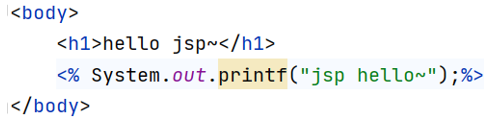
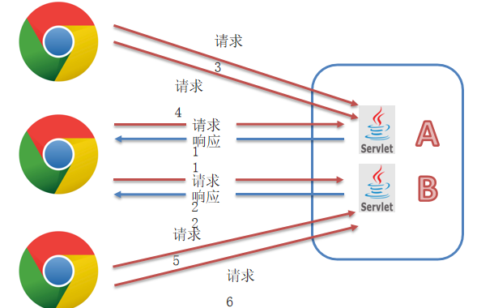
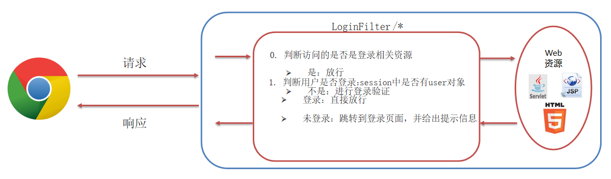

# HTTP、Tomcat、Servlet

> 姓名：陈伟
>
> 时间：2022-9-6

## Web核心

- 什么是JavaWeb
  - Web：全球广域网，也称为万维网（www），能够通过浏览器访问的网站
  - JavaWeb：是用Java技术来解决相关Web互联网领域的技术栈

## JavaWeb技术栈

- B/S 架构：Browser/Server，浏览器/服务器 架构模式
  - 它的特点是，客户端只需要浏览器。应用程序的逻辑和数据都存储在服务器端。
  - 浏览器只需要请求服务器，获取Web资源，服务器把Web资源发送给浏览器即可
  - 好处：易于维护升级：服务器端升级后，客户端无需任何部署就可以使用到新的版本
- B/S 架构的组成
  - 静态资源：HTML、CSS、JavaScript、图片等。负责页面展现，资源是**一成不变**的。
  - 动态资源：Servlet、JSP 等。负责逻辑处理，资源是**变化**的。
  - 数据库：负责存储数据
  - HTTP协议：定义通信规则
  - Web服务器：负责解析 HTTP 协议，解析请求数据，并发送响应数据

## HTTP

- 概念：HyperText Transfer Protocol，超文本传输协议，规定了浏览器和服务器之间数据传输的规则


- HTTP 协议特点：
  - 基于TCP协议：面向连接，安全
  - 基于请求-响应模型的：一次请求对应一次响应
  - HTTP协议是无状态的协议：对于事务处理没有记忆能力。每次请求-响应都是独立的。
    - 缺点：多次请求间不能共享数据。Java中使用会话技术（Cookie、Session）来解决这个问题
    - 优点：速度快

### HTTP—请求数据格式

```http
GET / HTTP/1.1 
Host: www.itcast.cn 
Connection: keep-alive 
Cache-Control: max-age=0 Upgrade-Insecure-Requests: 1 
User-Agent: Mozilla/5.0 Chrome/91.0.4472.106
…
```

- 请求数据分为3部分：
  - **请求行**：请求数据的第一行。其中GET表示请求方式，/表示请求资源路径，HTTP/1.1表示协议版本
  - **请求头**：第二行开始，格式为key：value形式。
  - **请求体**： POST请求的最后一部分，存放请求参数

- 常见的HTTP 请求头：

  - Host: 表示请求的主机名

  - User-Agent: 浏览器版本，例如Chrome浏览器的标识类似Mozilla/5.0 ... 

    Chrome/79，IE浏览器的标识类似Mozilla/5.0 (Windows NT ...) like Gecko；

  - Accept：表示浏览器能接收的资源类型，如text/*，image/*或者*/*表示所有；

  - Accept-Language：表示浏览器偏好的语言，服务器可以据此返回不同语言的网页；

  - Accept-Encoding：表示浏览器可以支持的压缩类型，例如gzip, deflate等。

- GET请求和 POST请求区别
  1. GET请求请求参数在请求行中，没有请求体。POST请求请求参数在请求体中
  2. GET请求请求参数大小有限制，POST没有

```http
POST / HTTP/1.1     
Host: www.itcast.cn 
Connection: keep-alive 
Cache-Control: max-age=0 Upgrade-Insecure-Requests: 1 
User-Agent: Mozilla/5.0 Chrome/91.0.4472.106

username=superbaby&password=123456   // 这里放在请求体里面去 
```


### HTTP—响应数据格式

```http
HTTP/1.1 200 OK
Server: Tengine
Content-Type: text/html
Transfer-Encoding: chunked…

<html>
<head>
     <title></title>
</head>
<body></body>
</html>
```

- 响应数据分为3部分：
  1. **响应行(状态行)**：响应数据的第一行。其中HTTP/1.1表示协议版本，200表示响应状态码，OK表示状态码描述
  2. **响应头**：第二行开始，格式为key：value形式
  3. **响应体**： 最后一部分。存放响应数据

- 状态码
  - 200 ok 客户端请求成功
  - 302 重定向
  - 304 Not Modified 没有修改，使用缓存
  - 404 Not Found 请求资源不存在
  - 405 没有重写doget或dopost方法
  - 500 Internal Server Error 服务端发生不可预期的错误
- 常见的HTTP 响应头
  - Content-Type：表示该响应内容的类型，例如text/html，image/jpeg；
  - Content-Length：表示该响应内容的长度（字节数）；
  - Content-Encoding：表示该响应压缩算法，例如gzip；
  - Cache-Control：指示客户端应如何缓存，例如max-age=300表示可以最多缓存300秒

## Web 服务器

- Web服务器是一个应用程序（软件），对 HTTP协议的操作进行封装，使得程序员不必直接对协议进行操作，让Web开发更加便捷。主要功能是“提供网上信息浏览服务”

### Tomcat

- 概念： Tomcat是Apache 软件基金会一个核心项目，是一个开源免费的轻量级Web服务器，支持Servlet/JSP少量JavaEE规范。
- JavaEE：Java Enterprise Edition，Java企业版。指Java企业级开发的技术规范总和。包含13项技术规范：JDBC、JNDI、EJB、RMI、JSP、Servlet、XML、JMS、Java IDL、JTS、JTA、JavaMail、JAF
- Tomcat 也被称为 Web容器、Servlet容器。Servlet 需要依赖于 Tomcat才能运行 
- 官网：https://tomcat.apache.org/ 

## Servlet


- Servlet 是 Java提供的一门动态web资源开发技术
- Servlet 是JavaEE 规范之一，其实就是一个接口，将来我们需要定义Servlet类实现Servlet接口，并由web服务器运行Servlet


### servlet快速入门

1. 创建 web项目，导入 Servlet依赖坐标

   ```xml
   <dependency>
     <groupId>javax.servlet</groupId>
       <artifactId>javax.servlet-api</artifactId>
       <version>3.1.0</version>
       <scope>provided</scope>
   </dependency>
   ```

2. 创建：定义一个类，实现 Servlet接口，并重写接口中所有方法，并在 service方法中输入一句话

   ```java
   public class ServletDemo1 implements Servlet {
       public void service(){}
   }  
   ```

3. 配置：在类上使用@WebServlet 注解，配置该 Servlet的访问路径

   ```java
   @WebServlet("/demo1")
   public class ServletDemo1 implements Servlet {
   }
   ```

4. 访问：启动 Tomcat，浏览器输入URL 访问该Servlet

   ```http
   http://localhost:8080/web-demo/demo1
   ```

### servlet执行流程


- Servlet 由谁创建？service()方法由谁调用？

  Servlet由web服务器创建，service()方法由web服务器调用。

- 服务器怎么知道Servlet中一定有service方法？

  因为我们自定义的Servlet，必须实现Servlet接口并复写其方法，而Servlet接口中有service方法

### servlet生命周期

- Servlet生命周期就是Servlet从创建到销毁的过程。


- 服务器启动时就加载servlet

```java
@WebServlet(urlPatterns = "/demo", loadOnStartup = 1)
```

- 负整数：第一次被访问时创建Servlet对象

  0或正整数：服务器启动时创建Servlet对象，数字越小优先级越高

- 注意

  一个Servlet在Tomcat容器中只会实例化一次，只会产生一个对象，而且常驻内存。要等到服务器关闭才会销毁。

#### 演示案例

1. 创建一个类实现Servlet接口
2. 重写这三个方法：init(),service(),destory()
3. 使用注解@WebServlet设置访问地址

```java
@WebServlet("/demo02")
public class ServletDemo02 implements Servlet {
    @Override
    public void init(ServletConfig servletConfig) throws ServletException {
        System.out.println("init 初始化方法，执行1次");
    }
    @Override
    public void service(ServletRequest servletRequest, ServletResponse servletResponse) throws ServletException, IOException {
        System.out.println("service 每次请求都执行服务的方法");
    }
    @Override
    public void destroy() {
        System.out.println("destroy 服务器关闭执行销毁的方法");
    }
    @Override
    public String getServletInfo() { return null; }
    @Override
    public ServletConfig getServletConfig() { return null; }
}
```


| **方法**                                              | **作用**                              | **运行次数** |
| ----------------------------------------------------- | ------------------------------------- | ------------ |
| void init(ServletConfig config)                       | 用户第1次请求的时候，初始化的时候执行 | 1次          |
| void service(ServletRequest req, ServletResponse res) | 每次请求都执行                        | 多次         |
| void destroy()                                        | 服务器关闭的时候执行                  | 1次          |

### servlet方法介绍

- 初始化方法，在Servlet被创建时执行，只执行一次

```java
void init(ServletConfig config)
```

- 提供服务方法， 每次Servlet被访问，都会调用该方法

```java
void service(ServletRequest req, ServletResponse res) 
```

- 销毁方法，当Servlet被销毁时，调用该方法。在内存释放或服务器关闭时销毁

```java
void destroy()
```

- 获取ServletConfig对象

```java
ServletConfig getServletConfig()
```

- 获取Servlet信息

```java
String getServletInfo() 
```

### servlet体系结构


就是说 GenericServlet这个抽象类实现了Servlet这个接口 HttpServlet这个类继承了GenericServlet这个类 相当于HttpServlet实现了Servlet接口

- 我们将来开发B/S架构的web项目，都是针对HTTP协议，所以我们自定义Servlet，会继承**HttpServlet**


- HttpServlet 原理

  HTTP 协议中，GET 和 POST 请求方式的数据格式不一样，将来要想在Servlet中处理请求参数，得在service方法中判断请求方式，并且根据请求方式的不同，分别进行处理：


### Servlet urlPattern配置

- Servlet 要想被访问，必须配置其访问路径（**urlPattern**）

  - 一个Servlet，可以配置多个 urlPattern

    @WebServlet(urlPatterns = {"/demo1", "/demo2"})

#### urlPattern 配置规则

1. 精确匹配

   

2. 目录匹配

   

3. 扩展名匹配

   

4. 任意匹配

   

- 注意

  前缀匹配和后缀匹配不能同时出现在一个地址中，否则会出现异常：
  Caused by: java.lang.IllegalArgumentException: Invalid \<url-pattern> [/*.do] in servlet mapping

  因为这种格式是错误的，会导致tomcat加载当前项目失败，整个项目中所有的资源都不能访问

#### 匹配顺序

- 优先级：**前缀**匹配**高于后缀**匹配
- 匹配原则：最佳匹配原则，哪个最接近就访问哪个
- **不能出现两个同名name的Servlet，也不能出现两个Servlet访问地址相同的情况**

| **请求URL**   | **Servlet1** | **Servlet2** | **访问哪个**             |
| ------------- | ------------ | ------------ | ------------------------ |
| /abc/a.html   | /abc/*       | /*           | 第1个，因为第1个更接近   |
| /abc          | /abc/*       | /abc         | 第2个，精确匹配          |
| /abc/a.do     | /abc/*       | *.do         | 第1个，/开头的优先级更高 |
| /a.do         | /*           | *.do         | 第1个，/开头的优先级更高 |
| /xxx/yyy/a.do | /*           | *.do         | 第1个，/开头的优先级更高 |

### XML 配置方式编写 Servlet

- Servlet 从3.0版本后开始支持使用注解配置，3.0版本前只支持 XML 配置文件的配置方式

- 步骤

  1. 编写 Servlet类
  2. 在 web.xml中配置该Servlet

  

# Request 请求和响应 Response

> 姓名：陈伟
>
> 时间：2022-9-11

## Request


- Request：**获取**请求数据
- Response：**设置**响应数据

### Request 继承体系


1. Tomcat需要解析请求数据，封装为request对象，并且创建request对象传递到service方法中
2. 使用request对象，查阅javaEE API文档的HttpServletRequest接口

### Request 获取请求数据

- 请求数据分为3部分：

  1. 请求行：

     ```http
     GET /request-response-demo/req1?username=zhangsan HTTP/1.1 
     ```

     - String getMethod()：获取请求方式： GET
     - String getContextPath()：获取虚拟目录(项目访问路径)： /request-response-demo
     - StringBuffer getRequestURL(): 获取URL(统一资源定位符)：http://localhost:8080/request-response-demo/req1
     - String getRequestURI()：获取URI(统一资源标识符)： /request-response-demo/req1
     - String getQueryString()：获取请求参数（GET方式）： username=zhangsan&password=123

  2. 请求头

     ```http
     User-Agent: Mozilla/5.0 Chrome/91.0.4472.106 // 客户端使用的浏览器的名称
     ```

     - String getHeader(String name)：根据请求头名称，获取值

  3. 请求体  (只有post请求才有请求体)

     ```http
     username=superbaby&password=123
     ```

     - ServletInputStream  getInputStream()：获取字节输入流
     - BufferedReader getReader()：获取字符输入流

### Request 通用方式获取请求参数

- 请求参数获取方式

  - GET 方式

  

  - POST 方式

  

#### 思考

- GET 请求方式 和 POST 请求方式 区别主要在于获取请求参数的方式不一样，是否可以提供一种统一获取请求参数的方式，从而统一doGet 和 doPost方法内的代码？

  **方法如下：**


- Map<String, String[ ]> getParameterMap()：获取所有参数Map集合
- String getParameter(String name)：根据名称获取参数值（单个值）
- String[ ] getParameterValues(String name) ：根据名称获取参数值（数组）

#### idea设置servlet模板

- 使用通用方式获取请求参数后，屏蔽了GET和POST的请求方式代码的不同，则代码可以定义为如下格式


- 可以使用Servlet模板创建Servlet更高效


### Request 请求参数中文乱码处理


- 请求参数如果存在中文数据，则会乱码

- 解决方案

  - POST：设置输入流的编码

    ```java
    req.setCharacterEncoding("UTF-8");
    ```

  - **Tomcat 8.0 之后，GET请求没有乱码问题**

- URL编码

  1. 将字符串按照编码方式转为二进制
  2. 每个字节转为2个16进制数并在前边加上%


#### 解决方案

1. 中文乱码解决方案

   - POST：设置输入流的编码

     ```java
     req.setCharacterEncoding("UTF-8");
     ```

2. URL编码实现方式

   - 编码

     ```java
     URLEncoder.encode(str, "utf-8");
     ```

   - 解码

     ```java
     URLDecoder.decode(s, "utf-8");
     ```

### Request 请求转发

#### 请求转发

- 请求转发（forward）：一种在服务器内部的资源跳转方式


- 实现方式

```java
request.getRequestDispatcher("/资源Two路径").forward(request,response);
```

- 请求转发特点
  - 浏览器地址栏路径不发生变化
  - 只能转发到当前服务器的内部资源
  - 只有一次请求，可以使用 request 共享数据

### 作用域对象


#### 什么是作用域对象

- 作用域对象是用于 Servlet 之间数据共享的服务器内存区域，作用域结构是一个 Map<String, Object>

#### 三个作用域

- 在 Servlet 中一共有三个作用域：请求域、会话域、上下文域

#### 请求域范围

- 只在同一次请求中起作用

#### 作用域方法

| request域有关的方法                 | 作用                                                         |
| ----------------------------------- | ------------------------------------------------------------ |
| Object getAttribute("键")           | 从请求域中通过键获取值                                       |
| void setAttribute("键",Object 数据) | 向请求域中添加键和值，如果键不存在就是添加，如果存在就是修改 |
| void removeAttribute("键")          | 通过键删除键和值                                             |

# Response


## Response 设置响应数据功能介绍

- 响应数据分为3部分

  1. 响应行

     ```HTTP
     HTTP/1.1 200 OK
     ```

     - void setStatus(int sc) ：设置响应状态码

  2. 响应头

     ```http
     Content-Type: text/html
     ```

     - void setHeader(String name, String value) ：设置响应头键值对

  3. 响应体

     ```html
     <html><head>head><body></body></html>
     ```

     - PrintWriter getWriter()：获取字符输出流
     - ServletOutputStream getOutputStream()：获取字节输出流

## Response 完成重定向

- 重定向（Redirect）：在浏览器端跳转

  

- 实现方式

  ```java
  response.setStatus(302);
  response.setHeader("location", "资源Two的路径");
  或
  response.sendRedirect("资源Two的路径");
  ```

- 重定向特点

  - 浏览器地址栏路径发生变化
  - 可以重定向到任意位置的资源（服务器内部、外部均可）
  - 两次请求，不能在多个资源使用 request 共享数据

## Response 响应字符数据

- 使用

  1. 通过Response对象获取字符输出流

     ```java
     PrintWriter out = resp.getWriter();
     ```

  2. 写数据

     ```java
     out.write("数据");
     ```

- 注意

  - 该流不需要关闭，随着响应结束，response对象销毁，由服务器关闭

  - 中文数据乱码：原因通过Response获取的字符输出流默认编码：ISO-8859-1

    ```java
    resp.setContentType("text/html;charset=utf-8");
    ```

## Response 响应字节数据

- 使用

  1. 通过Response对象获取字节输出流

     ```java
     ServletOutputStream outputStream = resp.getOutputStream();
     ```

  2. 写数据

     ```java
     outputStream.write(字节数据);
     ```

- IOUtils 工具类使用

  1. ```xml
     <dependency>
         <groupId>commons-io</groupId>
         <artifactId>commons-io</artifactId>
         <version>2.6</version>
     </dependency>
     ```

  2. ```java
     IOUtils.copy(输入流,输出流);
     ```


# JSP

> 姓名：陈伟
>
> 时间：2022-9-12

## 概念

- Java Server Pages，Java服务端页面
- 一种动态的网页技术，其中既可以定义 HTML、JS、CSS等**静态**内容，还可以定义 Java 代码的**动态**内容
- JSP = HTML + Java
- JSP的作用：简化开发，避免了在Servlet中直接输出HTML标签

## JSP 快速入门

1. 导入jsp坐标

   ```xml
   <dependency>
       <groupId>javax.servlet.jsp</groupId>
       <artifactId>jsp-api</artifactId>
       <version>2.2</version>
       <scope>provided</scope>
   </dependency>
   ```

2. 创建jsp文件

   

3. 编码 html 标签和 java 代码

   

## JSP 原理

- JSP 在被访问时，由JSP容器（Tomcat）将其转换为 Java 文件（Servlet），在由 JSP 容器（Tomcat）将其编译，最终对外提供服务的其实就是这个字节码文件
- **JSP 本质上就是一个 Servlet**


## JSP 脚本

- JSP脚本用于在 JSP页面内定义 Java代码
- JSP 脚本分类：
  - <% %>：内容会直接放到_jspService()方法之中
  - <%= %>：内容会放到out.print()中，作为out.print()的参数
  - <%! %>：内容会放到_jspService()方法之外，被类直接包含

## JSP 缺点

- 由于 JSP页面内，既可以定义 HTML 标签，又可以定义 Java代码，造成了以下问题：

  - 书写麻烦：特别是复杂的页面
  - 阅读麻烦
  - 复杂度高：运行需要依赖于各种环境，JRE，JSP容器，JavaEE…
  - 占内存和磁盘：JSP会自动生成.java和.class文件占磁盘，运行的是.class文件占内存
  - 调试困难：出错后，需要找到自动生成的.java文件进行调试
  - 不利于团队协作：前端人员不会 Java，后端人员不精 HTML

  

## EL 表达式

- Expression Language 表达式语言，用于简化 JSP页面内的Java代码

- 主要功能：获取数据

- 语法：${expression}

  获取作用域中存储的数据

- JSP中的四大域对象：

  - page：页面域，只在一个页面起作用
  - request：请求域，一个用户的一次请求
  - session：会话域，一个用户的所有请求
  - application：上下文域，所有用户的所有请求
  - **el表达式获取数据，会依次从这4个域中寻找，直到找到为止**

  

## **JSTL 标签**

- JSP标准标签库(Jsp Standarded Tag Library) ，使用标签取代JSP页面上的Java代码


```jsp
<c:if test="${flag == 1}">
    男
</c:if>
<c:if test="${flag == 2}">
    女
</c:if>
```

### JSTL 快速入门

1. 导入坐标

   ```xml
   <dependency>
       <groupId>jstl</groupId>
       <artifactId>jstl</artifactId>
       <version>1.2</version>
   </dependency>
   ```

2. 在JSP页面上引入JSTL标签库

   ```jsp
   <%@ taglib prefix="c" uri="http://java.sun.com/jsp/jstl/core" %> 
   ```

3. 使用

   - <c:forEach>


## MVC 模式


- MVC 是一种软件架构开发模式，其中：
  - M：Model，业务模型，处理业务，存储数据，获取数据。 JavaBean对象
  - V：View，视图，界面展示，展示数据。JSP或HTML
  - C：Controller，控制器，处理请求，调用模型和视图。Servlet
- MVC 好处
  - 职责单一，互不影响
  - 有利于分工协作
  - 有利于组件重用

## 三层架构


- 数据访问层：对数据库的CRUD基本操作
- 业务逻辑层：对业务逻辑进行封装，组合数据访问层中基本功能，形成复杂的业务逻辑功能
- 表现层：接收请求，封装数据，调用业务逻辑层，响应数据

## MVC模式和三层架构


# 会话跟踪技术

> 姓名：陈伟
>
> 时间：2022-9-13

## 概念


- 会话：用户打开浏览器，访问web服务器的资源，会话建立，直到有一方断开连接，会话结束。在一次会话中可以包含**多次**请求和响应
- 会话跟踪：一种维护浏览器状态的方法，服务器需要识别多次请求是否来自于同一浏览器，以便在同一次会话的多次请求间**共享数据**
- HTTP协议是**无状态**的，每次浏览器向服务器请求时，服务器都会将该请求视为新的请求，因此我们需要会话跟踪技术来实现会话内数据共享
- 实现方式
  1. 客户端会话跟踪技术：**Cookie**
  2. 服务端会话跟踪技术：**Session**



## Cookie

### Cookie 基本使用

- Cookie：客户端会话技术，将数据保存到客户端，以后每次请求都携带Cookie数据进行访问

- Cookie 基本使用

  

  1. 创建 Cookie 对象，设置数据

     ```java
     Cookie cookie = new Cookie("key","value");
     ```

  2. 发送Cookie到客户端：使用response对象

     ```java
     response.addCookie(cookie);
     ```

  3. 获取客户端携带的所有Cookie，使用request对象

     ```java
     Cookie[] cookies = request.getCookies();
     ```

  4. 遍历数组，获取每一个Cookie对象：for

  5. 使用Cookie对象方法获取数据

     ```java
     cookie.getName();
     cookie.getValue();
     ```

- 注意

  **上述步骤1、2为发送Cookie，3、4、5为获取Cookie**

### Cookie原理

- Cookie的实现是基于HTTP协议的
  - 响应头：set-cookie
  - 请求头：cookie


### Cookie 使用细节

- Cookie 存活时间
  - 默认情况下，Cookie 存储在浏览器内存中，当浏览器关闭，内存释放，则Cookie被销毁
  - setMaxAge(int seconds)：设置Cookie存活时间，但是是秒
    1. 正数：将 Cookie写入浏览器所在电脑的硬盘，持久化存储。到时间自动删除
    2. 负数：默认值，Cookie在当前浏览器内存中，当浏览器关闭，则 Cookie被销毁
    3. 零：删除对应 Cookie
- Cookie 存储中文
  - Tomcat8以上可以的直接存储中文，但键不能使用中文


### Cookie 常用方法

| **方法名**                        | **作用**                                             |
| --------------------------------- | ---------------------------------------------------- |
| new Cookie(名字，值)              | 通过构造方法创建一个Cookie，每个Cookie保存一个键和值 |
| response.addCookie(Cookie cookie) | 把Cookie发送到浏览器                                 |
| Cookie[] request.getCookies()     | 获取浏览器端所有发送回来的Cookie数组对象             |
| setMaxAge(0)                      | 删除Cookie                                           |

### Cookie使用

```java
    protected void doGet(HttpServletRequest request, HttpServletResponse response) throws ServletException, IOException {
        Cookie person = new Cookie("name","NewBoy");
        person.setMaxAge(60*10);
        response.addCookie(person);

        Cookie age = new Cookie("age","18");
        age.setMaxAge(30);
        response.addCookie(age);
        response.setContentType("text/html;charset=utf-8");
        PrintWriter out = response.getWriter();
        out.print("向浏览器端写了Cookie的信息");

    }
```

```java
    protected void doGet(HttpServletRequest request, HttpServletResponse response) throws ServletException, IOException {
        response.setContentType("text/html;charset=utf-8");
        PrintWriter out = response.getWriter();

        Cookie[] cookies = request.getCookies();
        if(cookies != null){
            for (Cookie cookie : cookies) {
                out.println("键："+cookie.getName() + ",值"+cookie.getValue() +"<hr/>");
            }
        }
        else{
            out.print("没有cookie信息");
        }
    }
```


## Session

### 概念

- 服务端会话跟踪技术：将数据保存到服务端

- JavaEE 提供 HttpSession接口，来实现一次会话的多次请求间数据共享功能

- 使用

  1. 获取Session对象

     ```java
     HttpSession session = request.getSession();
     ```

  2. Session对象功能：

     - void setAttribute(String name, Object o)：存储数据到 session 域中
     - Object getAttribute(String name)：根据 key，获取值
     - void removeAttribute(String name)：根据 key，删除该键值对


### Session 原理

- Session是基于Cookie实现的


### Session使用细节

- 在tomcat中配置重启的时候保留会话

  

- Session 钝化、活化：

  - 服务器重启后，Session中的数据是否还在
    - 钝化：在服务器正常关闭后， Tomcat会自动将 Session数据写入硬盘的文件中
    - 活化：再次启动服务器后，从文件中加载数据到Session中

- Session销毁

  - 默认情况下，无操作，30分钟自动销毁

    

  - 调用 Session对象的 invalidate()方法

### Session设置过期的方式

1. setMaxInactiveInterval(秒)
2. web.xml中配置session-timeout 单位是分钟
3. invalidate() 会话马上失效

### Session常用方法

| **方法名**                     | **作用**                                           |
| ------------------------------ | -------------------------------------------------- |
| request.getSession()           | 通过请求对象获取会话对象，第一次是创建，以后是获取 |
| session.setAttribute("键", 值) | 设置值                                             |
| session.getAttribute("键")     | 获取值                                             |
| session.removeAttribute("键")  | 删除值                                             |

### Session使用

```java
    protected void doGet(HttpServletRequest request, HttpServletResponse response) throws ServletException, IOException {
        response.setContentType("text/html;charset=utf-8");
        PrintWriter out = response.getWriter();

        HttpSession session = request.getSession();
        out.println("会话对象：" + session + "<br/>");

        out.print("会话ID：" + session.getId() + "<hr/>");

        session.setAttribute("product","LV包包");
    }
```

```java
    protected void doGet(HttpServletRequest request, HttpServletResponse response) throws ServletException, IOException {
        HttpSession session = request.getSession();

        String product = (String) session.getAttribute("product");

        response.setContentType("text/html;charset=utf-8");
        PrintWriter out = response.getWriter();
        out.print("会话域中值：" + product);

    }
```


### Cookie 和 Session 区别

- Cookie 和 Session 都是来完成一次会话内多次请求间**数据共享**的
- 区别
  - 存储位置：Cookie 是将数据存储在客户端，Session 将数据存储在服务端
  - 安全性：Cookie 不安全，Session 安全
  - 数据大小：Cookie 最大4KB，Session 无大小限制
  - 存储时间：Cookie 可以长期存储，Session 默认30分钟
  - 服务器性能：Cookie 不占服务器资源，Session 占用服务器资源


# Filter 过滤器

> 姓名：陈伟
>
> 时间：2022-9-15

## 概念

- 概念：Filter 表示过滤器，是 JavaWeb 三大组件(Servlet、Filter、Listener)之一。
- 过滤器可以把对资源的请求**进行过滤**，从而实现一些特殊的功能。
- 过滤器一般完成一些**通用**的操作，比如：权限控制、统一编码处理、敏感字符处理等等…


## Filter快速入门

1.  定义类，实现 Filter接口，并重写其所有方法 (注：在Servlet4.0中，只有doFilter方法是必须要写的)

   

2. 配置Filter拦截资源的路径：在类上定义 **@WebFilter** 注解

   

3. 在doFilter方法中输出一句话，并放行

   

## Filter执行流程


1. 放行后访问对应资源，资源访问完成后，还会回到Filter中吗？**会**
2. 如果回到Filter中，是重头执行还是执行放行后的逻辑呢？**放行后逻辑**


## Filter使用细节

### 过滤器生命周期相关方法

| Filter接口中的方法                                           | 作用和执行次数                                               |
| ------------------------------------------------------------ | ------------------------------------------------------------ |
| void init(FilterConfig filterConfig)                         | 初始化的方法，服务器启动执行1次                              |
| void doFilter(ServletRequest request, ServletResponse response, FilterChain chain) | 过滤方法，每次请求都会执行，三个参数：
1.请求对象
2.响应对象
3.过滤链，用于放行 |
| public void destroy()                                        | 销毁方法，执行1次，服务器关闭的时候执行                      |

**注意：从Servlet4.0开始，init和destroy方法都变成了默认方法，只有doFilter方法是必须要写的。必须使用Tomcat9才支持。**

### Filter 拦截路径配置

- 如果请求的URL地址不存在，但是匹配过滤的地址，还是会执行过滤器

  - Filter 可以根据需求，配置不同的拦截资源路径

    

    - 拦截具体的资源：/index.jsp：只有访问index.jsp时才会被拦截。
    - 目录拦截：/user/*：访问/user下的所有资源，都会被拦截
    - 后缀名拦截：*.jsp：访问后缀名为jsp的资源，都会被拦截
    - 拦截所有：/*：访问所有资源，都会被拦截

| **匹配方式** | **匹配哪些资源**                             | **示例**       |
| ------------ | -------------------------------------------- | -------------- |
| 以/开头      | 精确匹配，过滤的地址与资源的访问地址完全一样 | /demo1         |
|              | 目录匹配，拦截指定目录下所有的访问地址       | /admin/*       |
|              | 拦截所有的资源                               | /*             |
| 以扩展名结尾 | 拦截指定扩展名(后缀名)的资源                 | *.do 或 *.html |

### Filter 转发类型注解方式

| **@WebFilter**注解属性                                       | **说明**                                                     |
| ------------------------------------------------------------ | ------------------------------------------------------------ |
| dispatcherTypes = {DispatcherType.REQUEST}                   | 拦截请求行为，默认行为                                       |
| dispatcherTypes = {DispatcherType.FORWARD}                   | 拦截请求转发，注意：如果只配置这种方式，只会拦截请求转发，不会拦截请求 |
| dispatcherTypes = {  DispatcherType.REQUEST,  DispatcherType.FORWARD} | 设置采用拦截请求和请求转发两种行为                           |

### 过滤器拦截方式

| **过滤类型** | **作用**                                                 |
| ------------ | -------------------------------------------------------- |
| REQUEST      | 只拦截直接的请求
注：一次重定向则前后相当于发起了两次请求 |
| FORWARD      | 只拦截通过转发过来的请求                                 |

### 过滤器链

- 一个Web应用，可以配置**多个**过滤器，这多个过滤器称为过滤器链


- **按类全名的字符串顺序 (包名.类名)，按过滤器类名的字母顺序进行排序，哪个在前面就先执行。**

### XML配置Filter

1. 编写过滤器

   

2. 配置Filter拦截资源的路径：在web.xml中配置

   

3. XML配置的过滤器链，**按照配置的先后顺序。如果既有XML，又有注解的方式，XML优先执行。**

### 案例—使用过滤器解决全局汉字乱码问题


- 需求：服务器处理post请求提交中文数据会乱码，所以处理请求的所有资源都要重复冗余处理乱码，可以通过过滤器统一集中处理，从而达到减少冗余代码的目的。


- **注意：开发完成后，可以将所有资源中重复处理的post请求乱码代码可以删除了**

### 案例—登录验证

- 需求：访问服务器资源时，需要先进行登录验证，如果没有登录，则自动跳转到登录页面



# Listener监听器

> 姓名：陈伟
>
> 时间：2022-9-15

## 概念

- 概念：Listener 表示监听器，是 JavaWeb 三大组件(Servlet、Filter、Listener)之一。

- 监听器可以监听就是在application(上下文域),session(会话域),request(请求域)三个

  1. 作用域对象的创建和销毁
  2. 监听添加修改删除属性的变化

  **自动**执行代码的功能组件

- Listener分类：JavaWeb中提供了8个监听器

  

| **ServletContextListener****接口中的方法**       | **功能**                 |
| ------------------------------------------------ | ------------------------ |
| void contextDestroyed(ServletContextEvent sce)   | 上下文对象销毁的时候执行 |
| void contextInitialized(ServletContextEvent sce) | 上下文对象创建的时候执行 |

| **ServletContextAttributeListener**接口中的方法            | **功能** |
| ---------------------------------------------------------- | -------- |
| void attributeAdded(ServletContextAttributeEvent event)    | 监听增加 |
| void attributeRemoved(ServletContextAttributeEvent event)  | 监听删除 |
| void attributeReplaced(ServletContextAttributeEvent event) | 监听修改 |

## ServletContextListener 使用

1. 定义类，实现ServletContextListener接口

   

2. 在类上添加**@WebListener** 注解

## ServletContextAttributeListener 使用

1. 定义类，实现ServletContextAttributeListener接口方法，打印信息

   

2. 在类上添加**@WebListener** 注解

3. 开发Servlet类操作上下文对象增、改、删数据，访问Servlet，观察监听器运行

   

# AJAX

> 姓名：陈伟
>
> 时间：2022-9-15

## 概念

- 概念：AJAX(Asynchronous JavaScript And XML)：**异步的** JavaScript 和 XML

- AJAX作用

  1. 与服务器进行数据交换：通过JavaScript可以给服务器发送请求，并获取服务器响应的数据

     

     - 使用了AJAX和服务器进行通信，就可以使用 HTML+AJAX来**替换JSP**页面了

  2. 异步交互（局部刷新）：可以在**不重新加载整个页面**的情况下，与服务器交换数据并**更新部分**网页的技术，如：搜索联想、用户名是否可用校验，等等…

     

     

- 三个特点

  1. 并行操作：浏览器与服务器是并行操作的，浏览器在工作的时候，服务器也可以工作。
  2. 后台发送：浏览器的请求是后台js发送给服务器的，js会创建单独的线程发送异步请求，这个线程不会影响浏览器的线程运行。
  3. 局部刷新：浏览器接收到结果以后进行页面局部刷新

## 同步和异步


## AJAX 快速入门

1. 编写服务器端：AjaxServlet，判断用户名是否存在

2. 在 JS 中创建 XMLHttpRequest 对象：用于和服务器交换数据

   ```js
   let xmlhttp = new XMLHttpRequest()
   ```

3. 向服务器发送请求

   ```js
   xmlhttp.open("GET","访问地址");
   xmlhttp.send();//发送请求
   ```

4. 获取服务器响应数据

   ```js
   xmlhttp.onreadystatechange = function () {
       if (xmlhttp.readyState == 4 && xmlhttp.status == 200){
           alert(xmlhttp.responseText);
       }
   }
   ```


- 完整代码

```html
<!DOCTYPE html>
<html lang="en">
<head>
    <meta charset="UTF-8">
    <title>首页</title>
</head>
<body>
<h3>判断用户名是否存在</h3>
用户名：
<input type="text" id="user" placeholder="请输入用户名">
<span id="info"></span>

<script type="text/javascript">
    //文本框失去焦点事件
    document.getElementById("user").onblur = function () {
        //获取文本框的值
        let user = this.value;
        //发送数据给服务器
        //1.创建XMLHttpRequest对象
        let request = new XMLHttpRequest();
        //GET请求参数是在请求行中发送
        let url = `AjaxServlet?user=${user}`;
        //2.打开服务器访问地址
        request.open("GET", url);
        //发送数据
        request.send();
        //3.接收服务器返回的数据
        /**
         * 服务器的准备状态发生改变的时候激活
         *  status: 获取服务器的状态码，如：200表示正常响应
         *  readyState：获取服务器准备状态
         *      1. 开始发送请求给服务器
         *      2. 请求已经发送完毕
         *      3. 开始接收服务器响应数据
         *      4. 响应数据已经接收完毕
         *  结论：服务器状态码是200，而且准备状态是4，才去获取数据
         */
        request.onreadystatechange = function () {
            if (request.readyState == 4 && request.status == 200) {
                //获取服务器的数据
                let text = request.responseText;
                //显示在span中
                document.getElementById("info").innerText = text;
            }
        }
    }
</script>
</body>
</html>
```


| 创建XMLHttpRequest对象       | 说明                                                         |
| ---------------------------- | ------------------------------------------------------------ |
| new XMLHttpRequest()         | 构造方法创建对象                                             |
| **XMLHttpRequest对象的事件** | **说明**                                                     |
| onreadystatechange           | 如果准备状态发生了变化就会激活这个事件。在发送请求，接收数据等情况下这个状态会被激活 |
| **XMLHttpRequest对象的属性** | **说明**                                                     |
| readyState                   | 获取准备状态的值：0 还未开始  1 开始发送请求 2 请求结束 3 开始接收响应 4 接收响应完成 |
| status                       | 获取服务器状态码，如：200服务器正常响应                      |
| responseText                 | 获取服务器响应的纯文本                                       |
| **XMLHttpRequest对象的方法** | **说明**                                                     |
| open("GET","URL",true)       | 打开服务器的连接
1. 请求的方式：GET或POST <br/> 2. 访问服务器地址 <br/> 3. 同步或异步，true表示异步，false表示同步 |
| send([参数])                 | 发送请求，POST请求参数通过这个方法发送                       |

# Axios 异步框架

> 姓名：陈伟
>
> 时间：2022-9-16

## 概念

- Axios 对原生的AJAX进行封装，简化书写
- 官网：https://www.axios-http.cn 

## Axios 快速入门

1. 引入 axios 的 js 文件

   ```js
   <script src="js/axios-0.18.0.js"></script>
   ```

2. 使用axios 发送请求，并获取响应结果

   ```js
   axios
     .get("http://localhost:8080/ajax-demo1/Demo1?username=newboy")
     .then(resp=> { // 请求完成后 用 .then来设置一个回调函数 接收一个response对象 data属性就是我们返回的结果
       alert(resp.data);
   })
   ```
   
   ~~~js
   axios({
       methods:"post",
       url:"http://localhost:8080/ajaxx-demo1/aJAXDemo1",
       data:"username=zhangsan"
   }).then(function (resp){
       alert(resp.data);
   });
   ~~~

## Axios 请求方式


| **方法名**         | **作用**         |
| ------------------ | ---------------- |
| get(url)           | 发起GET方式请求  |
| post(url,请求参数) | 发起POST方式请求 |

- 发送 get请求

```js
axios.get("url?key1=value1&key2=value2...")
    .then(resp=> {
    alert(resp.data);
});
```

- 发送 post请求

```js
axios.post("url", "key1=value1&key2=value2... ")
    .then(resp=> {
    alert(resp.data);
});
```

# JSON

> 姓名：陈伟
>
> 时间：2022-9-16

## 概念


- 概念：JavaScript Object Notation。JavaScript 对象表示法

- 由于其语法简单，层次结构鲜明，现多用于作为数据载体，在网络中进行数据传输

- JSON字符串

  

## JS对象的三种格式

| **类型**      | **语法**                                    |
| ------------- | ------------------------------------------- |
| 对象类型      | {name:value,name:value,...}                 |
| 数组/集合类型 | [value1,value2,...]                         |
| 混合类型      | {name: [{name:value,...},{name:value,...}]} |

- **说明：name是字符串类型，value可以是任意类型**

## JSON字符串的应用场景：异步请求数据交换


## JS中操作JS对象与JSON字符串转换的方法

| **JSON**对象的方法 | **说明**                       |
| ------------------ | ------------------------------ |
| stringify(对象)    | 将指定对象转换为json格式字符串 |
| parse(字符串)      | 将指定json格式字符串解析成对象 |


- **Axios中，JSON字符串和JS对象的转换由axios帮我们转换好了**

## JSON字符串数据和Java对象转换


- 请求数据：JSON字符串转为Java对象
- 响应数据：Java对象转为JSON字符串

## Java中的 JSON 转换工具

### JSON转换工具的概述

- JSON的转换工具是通过Java封装好的一些jar工具包，直接将Java对象或集合转换成JSON格式的字符串，也可以将 JSON格式的字符串转成Java对象。

### 常见的JSON转换工具


## 使用Fastjson来进行 JSON 数据和 Java 对象转换

- **Fastjson**是阿里巴巴提供的一个Java语言编写的高性能功能完善的JSON库，是目前Java语言中最快的JSON库，可以实现Java对象和JSON字符串的相互转换。

- 使用

  1. 导入坐标

     ```xml
     <dependency>
         <groupId>com.alibaba</groupId>
         <artifactId>fastjson</artifactId>
         <version>1.2.62</version>
     </dependency>
     ```

  2. Java对象转JSON字符串

     ```java
     String jsonStr = JSON.toJSONString(obj);
     ```

  3. JSON字符串转Java对象

     ```java
     User user = JSON.parseObject(jsonStr, User.class);
     ```

