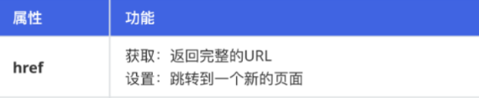

# JavaScript

> 姓名：陈伟
>
> 时间：2022-9-5

## JavaScript介绍

- JavaScript概念

  **JavaScript 是一门跨平台、面向对象的脚本语言。**提升网页的交互功能，提高用户的体验，运行在浏览器端。

  JavaScript（简称：JS） 在 1995 年由 Brendan Eich 发明，并于 1997 年成为一部 ECMA 标准。

- JavaScript作用

  - 表单数据校验
  - 页面元素标签动态增删改查操作，比如：学生信息表数据的动态操作添加、删除、全选等

## JavaScript编写位置

### 第一种：内部位置

- 格式

```html
<script>
        js代码
</script>
```

- 作用

  只能给当前页面使用

- 示例

  ```html
  <script type="text/javascript">
          alert("内部方式");
  </script>
  ```

   type="text/javascript" ，**设置内部代码类型**，这里代表内部是文本JavaScript代码，**可以省略**

### 第二种：外部位置

- 格式

  ```html
  <script type="text/javascript" src="外部.js文件"> </script>
  ```

- 作用

  可以给多个html页面使用，重用性好

- 示例

  创建外部.js文件

  html页面引用外部js文件


- 注意事项

  引用外部js文件的script标签体内不可以写js代码，否则无效。并且script标签必须成对。
  错误1：\<script src="js/out.js" type="text/javascript">无效的js代码编写位置\</script>
  **错误2：\<script src="js/out.js" type="text/javascript"/>**

## JavaScript语言组成


| 组成部分    | 作用                                                        |
| ----------- | ----------------------------------------------------------- |
| ECMA Script | 浏览器脚本语言规范，制定所有脚本语言核心基础语法。          |
| BOM         | Browser Object Model 浏览器对象模型，操作浏览器中各种对象。 |
| DOM         | Document Object Model 文档对象模型，操作网页中各种元素。    |

## 输出语句

- 使用 **window.alert()** 写入警告框
- 使用 **document.write()** 写入 HTML 输出
- 使用 **console.log()** 写入浏览器控制台

```js
window.alert("Hello JS"); // 弹出警告框
document.write("Hello JS"); // 写入HTML
console.log("Hello JS"); // 写入控制台
```

## JavaScript基础语法

### 定义变量

- ES5 定义变量

```js
var  变量名 = 变量值; 
```

- ES6 定义变量

```js
let  变量名 = 变量值;
const  常量名 = 常量值;
```

- 区别
  - ES5 方式语法不严谨，使用范围不受代码块限制，代码块外依然可以使用，造成内存浪费
  - ES6 新增了 **let** 关键字来定义变量。它的用法类似于 **var**，但是所声明的变量，只在 **let** 关键字所在的代码块内有效，且不允许重复声明
  - ES6 新增了**const**关键字，用来声明一个只读的常量。一旦声明，常量的值就不能改变。

### 设置idea支持ES6


### 五种数据类型

| 类型      | 说明                                                       |
| --------- | ---------------------------------------------------------- |
| number    | 数值型：包含整数、小数                                     |
| boolean   | 布尔型：包含true/false                                     |
| string    | 字符串：包含字符和字符串                                   |
| object    | 对象类型：包含系统内置对象和用户自定义的对象，NULL也是对象 |
| undefined | 未定义的类型，未知的类型 没有使用=赋值                     |

- 查询变量名所属类型函数

```javascript
方法1：typeof 变量名
方法2：typeof(变量名)
```

### 运算符

#### 算术运算符

- 算术运算符用于执行两个变量或值的算术运算, 例如：let a=5,b=10;

| 运算符 | 说明       | 表达式    | 值      |
| ------ | ---------- | --------- | ------- |
| +      | 加法       | a + b     | 15      |
| -      | 减法       | a - b     | -5      |
| *      | 乘法       | a * b     | 50      |
| /      | **除法**   | **a / b** | **0.5** |
| %      | 余数(取模) | a % b     | 5       |
| ++     | 自增       | a++       | 6       |
| --     | 自减       | a--       | 4       |

- 注意事项

  JavaScript 中除法是可以除得尽，如果除不尽会保留16位小数

#### 赋值运算符

- 赋值运算符用于给JavaScript 变量赋值, 例如：let a=5,b=10;

| 运算符 | 说明       | 表达式     | 值      |
| ------ | ---------- | ---------- | ------- |
| =      | 等于       | a = b      | 10      |
| +=     | 加等于     | a += b     | 15      |
| -=     | 减等于     | a -= b     | -5      |
| *=     | 乘等于     | a *= b     | 50      |
| **/=** | **除等于** | **a /= b** | **0.5** |
| %=     | 余等于     | a %= b     | 5       |

#### 比较运算符

- 比较运算符用于逻辑语句的判断，从而确定给定的两个值或变量是否相等, 例如：let a=5,b=10;

| 运算符  | 说明                         | 表达式                    | 值        |
| ------- | ---------------------------- | ------------------------- | --------- |
| **==**  | **等于(比较值，不比较类型)** | **a=5,b="5",则：a == b**  | **true**  |
| **===** | **恒等于（比较值和类型）**   | **a=5,b="5",则：a === b** | **false** |
| >       | 大于                         | a > b                     | false     |
| <       | 小于                         | a < b                     | true      |
| >=      | 大于或等于                   | a >= b                    | false     |
| <=      | 小于或等于                   | a <= b                    | true      |
| !=      | 不等于                       | a != b                    | true      |
| !==     | 恒不等于                     | a!==b                     | true      |

- 字符串与数字进行比较的时候会先把字符串转换成数字然后再进行比较。

#### 逻辑运算符

- 逻辑运算符用来确定变量或值之间的逻辑关系，支持**短路运算**, 例如：let a=true, b=false;

| 运算符 | 说明 | 表达式   | 值    |
| ------ | ---- | -------- | ----- |
| &&     | 与   | a && b   | false |
| \|\|   | 或   | a \|\| b | true  |
| !      | 非   | !a       | false |

- 注意事项

  逻辑运算符不支持单与单或的操作

### if语句

- if语句

```java
if (条件表达式) {
     // 代码块;
 }
```

- if...else语句

```java
if (条件表达式) {
     // 代码块;
 } else {
     // 代码块;
 }
```

- if...else if....else 语句

```java
if (条件表达式) {
     // 代码块;
 } else if(条件表达式) {
     // 代码块;
 } else {
     // 代码块;
 }
```

#### if语句条件表达式

- if语句条件表达式除了支持boolean类型表达式，还支持非boolean类型表达式

| 数据类型  | 为真         | 为假     |
| --------- | ------------ | -------- |
| number    | 非0          | 0        |
| string    | 非空字符串   | 空字符串 |
| undefined |              | 假       |
| object    | 对象不为null | null     |

### switch语句

```java
switch (变量名) {
   case 常量值:
      break;
   case 常量值：
      break;
   default:
       break;
}
```

### 循环语句

#### while/do-while循环语句

- while循环语句语法(条件为 true 时循环)

```java
while (条件表达式) {
     需要执行的代码;
 }
```

- do-while循环语法(最少执行1次循环)

```java
do {
     需要执行的代码;
 } while (条件表达式);
```

- break和continue

  break：结束整个循环

  continue：跳过本次循环，执行下一次循环

#### for循环语句

- ES6 普通次数for循环语法

```java
for (let i=0; i<length; i++) {
     循环体需要执行的代码;
 }
```

- ES6 for循环语法(增强for)

```java
for (let 变量 of 数组) {
     循环体需要执行的代码;
 }
```

## JavaScript函数

### 命名函数

- 函数介绍

  相当于Java中方法，是被设计为执行特定任务的代码块，可以实现代码块的重用。

- 函数分类

  - 命名函数：有名字的函数
  - 匿名函数：没有名字的函数

- 命名函数语句

```js
function 函数名(形参列表) { 
    // 要执行的代码块
}
```


- 匿名函数语法

```js
// 定义匿名函数
let 函数名 = function (形参列表) { 
   // 要执行的代码块
};

// 调用匿名函数
```


## JavaScript常用对象

### Array

- JavaScript Array对象用于定义数组
- 定义

```js
let 变量名 = new Array(元素列表); // 方式一
let arr = new Array(1,2,3);

let 变量名 = [元素列表]; // 方式二
let arr = [1,2,3];
```

- 访问

```java
arr[索引] = 新的值;
arr[0] = 1;
```

- 注意

  JS数组类似于Java集合，长度，类型都可变

| **方法名**      | **功能**                                             |
| --------------- | ---------------------------------------------------- |
| concat()        | 拼接一个或多个数组                                   |
| reverse()       | 数组反转                                             |
| join(separator) | 把数组按分隔符拼接成一个字符串                       |
| sort()          | 排序，默认按字符串排序，如果按数字排序，要指定比较器 |
| pop()           | 删除最后一个元素，并返回                             |
| push()          | 在最后添加1个或多个元素                              |

### String

- 定义

```js
let str = new String("hello");
let str = "hello";
let str = 'hello';
```

- 属性

  length：字符串的长度

- 方法

  trim()：移除字符串首尾空白

### 自定义对象

- 格式

```js
let 对象名称 = {
    属性名称1: 属性值1,
    属性名称2: 属性值2,
    ...
    函数名称: function (形参列表) {}
    ...
};
```

- 示例

```js
let person = {
    name: "zhangsan",
    age: 23,
    eat: function () {
        alert("干饭~");
    }
};
```

## BOM

### BOM介绍

- BOM(Browser Object Model)：浏览器对象模型。
- 将浏览器的各个组成部分封装成不同的对象，方便我们进行操作。


### window对象

- Window：浏览器窗口对象
- window中的三个对话框


- 获取

  直接使用 window，其中window. 可以省略

```js
window.alert("abc");
alert("abc");
```

- window中计时器有关的方法

| **window中的方法**              | **作用**                                                     |
| ------------------------------- | ------------------------------------------------------------ |
| setTimeout(函数名, 间隔毫秒数)  | 延迟调用：过一段时间调用一次指定的函数，只调用一次，方法的返回值就是计时器 |
| setInterval(函数名, 间隔毫秒数) | 每隔一段时间调用一次指定的函数，方法的返回值就是计时器，如果要终止调用，就需要清除计时器。 |

### location地址栏对象

- href属性

  就是浏览器的地址栏。我们可以通过为该属性设置新的 URL，使浏览器读取并显示新的 URL 的内容。

- location常用属性



```js
window.location.方法();
location.方法();
```

- 获取

  使用 window.location获取，其中window. 可以省略

### history历史记录

- history作用

  表示访问过的历史记录，如果没有历史记录，这个对象中的方法不可用。

| **方法**  | **作用**                                                     |
| --------- | ------------------------------------------------------------ |
| forward() | 相当于浏览器上前进按钮，如果浏览器上按钮不可用，这个方法就不起作用 |
| back()    | 相当于浏览器上后退按钮                                       |

```js
window.history.方法();
history.方法();
```

- 获取

  使用 window.history获取，其中window. 可以省略

- 注意

  - 浏览器上的前进和后退按钮可以点的时候，这个代码才起作用。
  - 读取的是浏览器缓存中数据，如果要访问服务器的数据，需要刷新。

## DOM

### DOM的概念

- 什么是DOM

  Document Object Model: 文档对象模型(浏览器显示的内容)，DOM用来操作网页中各种元素(标签)。
  每个网页在浏览器中解析的时候，浏览器会在内存中对网页构建一棵树，这棵树对应了网页中所有的元素。如果对DOM树进行操作，影响到网页上元素。document代表了整个DOM树对象，所有标签节点都在document里面查找节点都找document去获取。


### DOM查找元素的四个方法

| **获取元素的方法**                       | **作用**                 |
| ---------------------------------------- | ------------------------ |
| document.getElementById("b1")            | 通过id获取一个元素       |
| document.getElementsByTagName ("标签名") | 通过标签名获取一组元素   |
| document.getElementsByName("name")       | 通过name属性获取一组元素 |
| document.getElementsByClassName("类名")  | 通过样式类名获取一组元素 |

## 事件监听

### 事件介绍

- 什么是事件

  用户可以对网页的元素有各种不同的操作如：单击，双击，鼠标移动等这些操作就称为事件。事件通常与函数配合使用，这样就可以通过发生的事件来驱动JavaScript函数执行。

### 设置事件的两种方式

- 方式一：命名函数

  通过标签中的事件属性进行绑定。

```html
 <button type="button" onclick="函数名()"> </button>
```

- 方式二：匿名函数

  通过DOM元素属性绑定。

```html
<input type="button" id="btn">
document.getElementById("btn").onclick = function () {
alert("我被点了");
}
```

### 常用事件

| 事件名     | 说明                     |
| ---------- | ------------------------ |
| onload     | 某个页面或图像被完成加载 |
| onsubmit   | 当表单提交时触发该事件   |
| onclick    | 鼠标单击事件             |
| ondblclick | 鼠标双击事件             |
| onblur     | 元素失去焦点             |
| onfocus    | 元素获得焦点             |
| onchange   | 用户改变域的内容         |

## 正则表达式

### 正则表达式介绍

- 正则表达式也称为规则表达式，就是用一些特殊的符号表示一些规则

### 正则表达式作用

- 判断字符串是否匹配
- 查找字符串

### 正则表达式的概念和作用

- 概念

  正则表达式定义了字符串组成的规则

- 定义

  - 直接量：注意不要加引号

    ```js
    let reg = new RegExp("1[3456789]\\d{9}");
    ```

  - 创建 RegExp 对象

    ```js
    let reg = /^1[3456789]\d{9}$/;
    ```

- 方法

  | **成员方法**       | **说明**                       |
  | ------------------ | ------------------------------ |
  | test(匹配的字符串) | 根据指定规则验证字符串是否符合 |

- 语法

  

```js
let reg = /^\w+$/;
```