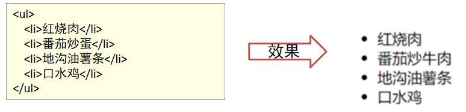
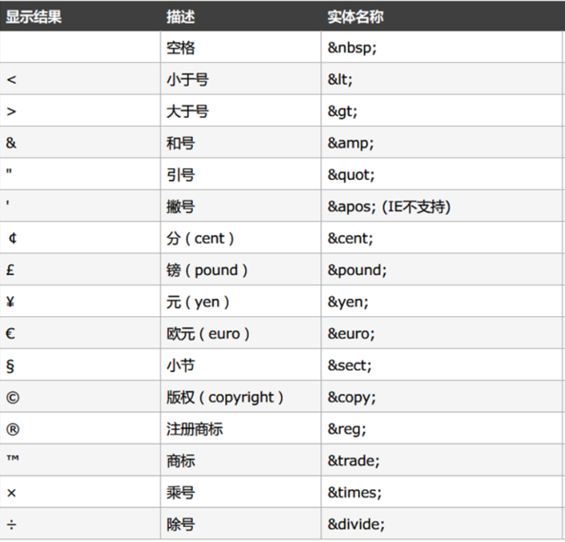
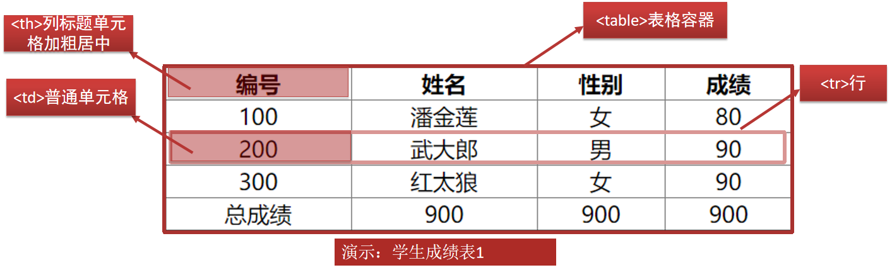

# HTML

> 姓名：陈伟
>
> 时间：2022-9-2

## HTML介绍

- HTML(HyperText Markup Language)：超文本标记语言
- 超文本：不仅可以描述普通文本展现,还可以描述比如图片、超链接、音频、表格数据展现等
- 标记：就是标签。可以使用一系列的标签，描述各种数据
- **HTML作用： 布局数据在网页上展现**
- HTML 发展历程
  - 2014年10月，万维网联盟经过接近8年的艰苦努力发布HTML5 规范
  - HTML5 相比之前版本来说可以更加便捷地处理多媒体内容

## HTML代码的组成

- HTML 页面是由一系列的元素(Element)组成的, 元素的组成如下
  - 标签
  - 属性
  - 内容（标签体）


## 使用IDEA创建第一个HTML网页

1. 点右上角一排浏览器按钮运行，idea会使用内置的服务器在指定的浏览器上运行。

   

2. 在浏览器上运行的结果

   

3. 访问地址：运行在自己的服务器上。

   

- 注意事项

  有部分idea点击浏览器图标并不能打开浏览器，需要如下设置

  

## HTML的网页结构

- 根标签\<html>
- 头部\<head>,用于存放设置网页字符码表与标题信息设置
- 子标签\<title>网页标题
- 主体内容\<body>，用于存放页面上展现的数据 

## HTML基础语法

### 文本标签


### 分割标签

- 分割的含义

  对数据进行分割，便于css美化页面

- 分割标签

  - div 标签大分割，多行数据的分割，用于控制多行数据的样式

  - 举例

    

  - span 标签小分割，一行内数据的分割，用于一行内局部位置数据的样式

  - 举例

    

### 列表标签

- 有序列表

  标签结构： \<ol>\<li>\<li>\</ol>，示例代码如下

  

- 无序列表

  标签结构：\<ul>\<li>\</li>\</ol> ，示例代码如下

  

#### 列表标签属性


### 实体字符

- 介绍：html语法中部分字符会被语法征用，比如页面显示\<p>字符而不是翻译为段落，就需要使用实体字符输出
- 实体字符与显示结果对照表如下表



### 图片标签

- 作业

  在网页中显示图片

- 图片格式

```html

```

| **img标签显示图片** | **作用**                                 |
| ------------------- | ---------------------------------------- |
| src                 | 图片地址                                 |
| width               | 宽度，如果只指定宽度，高度会按等比例缩放 |
| height              | 高度                                     |
| alt                 | 如果图片丢失，出现的替代文字             |

- 注意

  src不能写绝对路径

### 综合案例

- 需求：使用文本标签、列表标签、分割数据标签、实体字符等完成如下效果

- 效果

  

- 案例分析

  

- 实现步骤
  1. 将文本素材内容放入其中。
  2. 使用 \<h1> 标签设置标题, 修饰"公司介绍" 。
  3. 使用 \<hr> 标签加入水平线
  4. 使用 4 个 \<p> 将剩下内容划分为 4 个段落。
  5. 使用 \&nbsp;  设置 第一个段落首行文本缩进 6 个空格。
  6. 使用 \<font> 标签 , 设置第一段 "黑马程序员"字体颜色为红色 。
  7. 使用 \<i> \<b> 标签 , 设置第一段 "传智教育" 斜体与加粗
  8. 使用 \<span> 标签 , 设置其他段"黑马程序员"字体颜色为红色 。
  9. 价格观部分使用无序列表：ol-li
  10. 使用 \<br> 标签实现换行，在最后一段公司与版权中间实现
  11. 设置最后一段样式: 文本居中 颜色为gray
  12. 使用 \&copy; 版权特殊字符实现©显示 

### 超链接—个人简历案例

- 需求：实现个人简历信息中工作经历的“公司介绍”点击跳转到公司介绍页面，简历组成信息锚点定位

- 效果

  

- 分析

  超链接标签介绍：可以实现页面跳转与页面定位功能

- 超链接语法

  

- 实现步骤
  1. 创建一个 html 文件，文件名：个人简历.html，根据资源“素材/个人简历素材.txt”导入代码素材。
  2. 使用 \<a> 标签在“公司介绍”设置跳转到“公司介绍.html”页面。
  3. 使用 \<a> 在 “\<h3>”标签里面的基本信息、教育经历、工作经历、兴趣爱好分别设置锚点名称one、two、fhree、four。
  4. 使用 \<a> 在 “\<p>” 标签里的基本信息、教育经历、工作经历、兴趣爱好跳转到锚点位置

#### 超链接标签跳转页面代码写法

- <a href=“跳转目标页面地址”target=“打开页面方式”>
- target=“_blank”  打开新窗口展现目标页面_
- _target=“_self”     在当前窗口展现目标页面

#### 超链接标签锚点定位写法

- 定义锚点位置：\<a name="位置名称">\</a>
- 跳转到锚点位置：\<a href="#位置名称">\</a>

### 表格—学生成绩表案例

- 需求：使用表格基本布局标签展现多行多列数据

- 效果

  

- 分析

  案例需要使用到表格基本结构标签，标签如下：

  - 表格容器标签：\<table>
  - 表格行标签：\<tr>
  - 表格普通单元格标签：\<td>
  - 表格列标题单元格标签：\<th>



#### 跨行跨列—学生成绩表

- 需求：使用表格展现学生成绩表中成绩跨行、平均分跨列展现数据

- 效果

  

- 分析

  武大郎与红太狼的成绩一样可以跨行合并显示，总成绩只要显示一个就可以所以需要跨列合并显示

  

### 表格布局其他标签与属性

- 表格布局标签

| **标签名** | **作用**                      |
| ---------- | ----------------------------- |
| table      | 表格容器，包含其他的表格元素  |
| tr         | 表示一行 table row            |
| th         | 列标题：加粗，居中 table head |
| td         | 普通单元格                    |
| caption    | 表格的标题                    |

- 表格布局标签的属性

| **属性名**  | **作用**                                                     |
| ----------- | ------------------------------------------------------------ |
| width       | 表格宽度                                                     |
| border      | 外边框的粗细                                                 |
| align       | 对齐方式：用在表格上：整个表格在父容器标签中居中用在tr：表格这一行内容居中用在td：这个单元格内容居中 |
| rowspan     | 跨几行                                                       |
| colspan     | 跨几列                                                       |
| cellspacing | 单元格之间的间距                                             |
| cellpadding | 单元格边框与内容之间的间距                                   |
| style       | style=“border-collapse: collapse“ ，设置单元格边框线与表格外边框线合并 |

### 表单—注册页面案例

- 表单作用

  **接收用户输入数据，并提交数据给服务器**

  

- form表单格式

```html
<form method=“提交数据的方式" action="数据提交的目的地">
    收集数据标签
</form>
```

| **form常用属性** | **作用**           |
| ---------------- | ------------------ |
| action           | 提交给服务器的地址 |
| method           | 提交的方式         |


| **提交方法** | **特点**                 |
| ------------ | ------------------------ |
| GET          | 默认值，参数在地址栏显示 |
| POST         | 参数不会显示，更加安全   |

- form：定义表单
  - action：规定当提交表单时向何处发送表单数据，URL
  - method ：规定用于发送表单数据的方式
    - get：浏览器会将数据直接附在表单的 action URL 之后。大小有限制
    - post：浏览器会将数据放到http请求消息体中。大小无限制

- 注册页面

  - 需求：在页面上允许用户输入用户名、密码、邮箱等信息，录入完成后点击注册提交数据给服务器

  - 效果

    

- 步骤
  1. 创建一个 html 页面。
  2. 使用表格布局表单标签。
  3. 使用 \<input type="text">文本框标签和 \<label> 显示用户名 。
  4. 使用 \<input type="password" > 密码框标签显示密码。
  5. 使用 \<input type="submit"> 提交按钮显示注册。
  6. 使用 \<input type="email"> 邮箱框标签显示邮箱。
  7. 使用 \<input type="radio">单选框标签显示性别。
  8. 使用 \<input type="checkebox"> 复选框标签显示爱好。
  9. 使用 \<select> 下拉框标签显示学历和分组显示所在城市信息。
  10. 使用 \<input type="date"> 日期框显示出生信息。
  11. 使用 \<input type="file"> 文件域框显示上传照片信息。
  12. 使用 \<textarea> 文本域多行文本框标签显示个人简介。
  13. 使用 \<input type="hidden"> 隐藏域框存储数据。
  14. 使用 \<input type="reset"> 重置按钮显示重置。

#### 表单小结


# CSS

> 姓名：陈伟
>
> 时间：2022-9-2

## CSS介绍

- 概念：Cascading Style Sheet层叠样式表，用于渲染html元素进行样式美化的语言
- 作用：网页的美化

## HTML和CSS的区别

- HTML：网页数据的布局（没化妆）
- CSS：网页数据的美化 (化妆包装后)

## CSS基本语法

### css的3种引入方式进行样式控制

- 第一种：内联样式

  - 介绍：在标签中通过 style 属性来控制样式。只能影响当前这一行。

  - 格式

    ```html
    <标签 style=“属性名:属性值;属性名:属性值;”>内容</标签>
    ```

- 第二种：内部样式

  - 介绍：在\<head>标签中通过\<style>标签来控制样式。只能影响当前文件。

  - 格式

    ```html
    <head>
    <style>
    	选择器{
    	     属性名:属性值；	
    	}
    </style>
    </head>
    ```

- 第三种：外部方式（建议使用，css代码与html代码完全分离，不同的html页面可以复用css文件）

  - 介绍：在\<head>标签中通过\<link>标签来引入独立 css 文件。可以影响不同的文件。

  - 格式

    ```html
    <link rel=“stylesheet” href=“外部css文件地址”>
    ```

  - link 用于设置引入外部的资源文件

  - rel=“stylesheet” 设置引入外部资源文件的类型，这里是引入样式文件

  - href，需要引入外部文件的地址

  - css文件，以.css扩展名结尾 

### CSS选择器

- 介绍：用于匹配查找指定的一个或多个 html 元素标签， 匹配元素以后设置样式。

| 名称       | 符号   | 作用                    | 格式                       |
| ---------- | ------ | ----------------------- | -------------------------- |
| 通用选择器 | *      | 匹配所有元素            | *{样式名:样式值; }         |
| 元素选择器 | 标签名 | 根据标签名匹配元素      | div{{样式名:样式值; }      |
| 类选择器   | .类名  | 根据class属性值匹配元素 | .center{样式名:样式值; }   |
| id选择器   | #      | 根据id属性值匹配元素    | #username{样式名:样式值; } |

- 选择器的优先级

  通用选择器 < 标签选择器 < 类选择器 < ID选择器

- 注意事项

  类选择器中“**类名**”不能以数字或特殊符号开始，要符合变量名规范。 

## CSS常用样式

| 功能     | 属性名          | 属性取值                                                     |
| -------- | --------------- | ------------------------------------------------------------ |
| 颜色     | color           | 颜色常量，如：red<br/>使用十六进制，如：#123                 |
| 设置行高 | line-height     | 单位是像素                                                   |
| 文字修饰 | text-decoration | underline 下划线<br/>overline 上划线<br/>line-through 删除线<br/>none 没有下划线 |
| 文本缩进 | text-indent     | 用于缩进文本，可以使用em单位，表示缩进1个字符，无论字符的大小。 |
| 文本对齐 | text-align      | left 把文本排列到左边。默认值：由浏览器决定。<br/> right 把文本排列到右边。<br/> center 把文本排列到中间。 |

| 功能     | 属性名      | 作用                                                         |
| -------- | ----------- | ------------------------------------------------------------ |
| 字体名   | font-family | 设置字体，本机必须要有这种字体                               |
| 设置大小 | font-size   | 单位：像素                                                   |
| 设置样式 | font-style  | 字体设置为斜体<br/>italic 浏览器会显示一个斜体的字体样式。<br/>normal 默认值。浏览器显示一个标准的字体样式。 |
| 设置粗细 | font-weight | bolder加粗                                                   |

### CSS文本样式

line-height: 大小;   /* 设置行高 */
text-decoration:none;    /* 设置取消文本下划线， 常用于a标签取消下划线*/
text-indent:2em;   /* 设置文本缩进，常用于段落首行缩进 */
text-align:center: /* 设置标签内容居中对齐 */

### CSS 字体样式

font-size: 字体大小;
font-weight:bold; /* 设置字体加粗*/