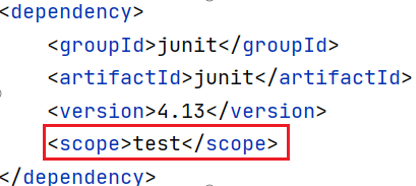
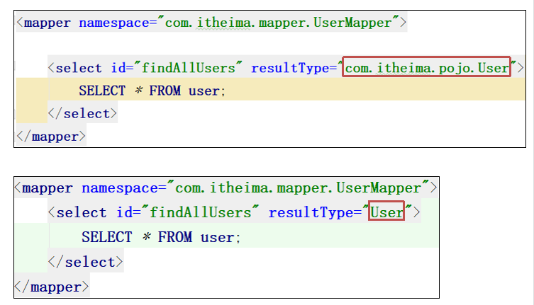

# Maven

> 姓名：陈伟
>
> 时间：2022-8-29

## Maven简介

- Maven是专门用于管理和构建Java项目的工具，它的主要功能有：
  - **提供了一套标准化的项目结构**
  - **提供了一套标准化的构建流程（编译，测试，打包，发布... ）**
  - **提供了一套依赖管理机制**
- 标准化的项目结构


**Maven提供了一套标准化的项目结构，所有IDE使用Maven构建的项目结构完全一样，所有IDE创建的Maven项目可以通用**

- 标准化的构建流程

  编译 → 测试 → 打包 → 发布（**maven提供了一套简单的命令来完成项目构建**）


- 依赖管理

  依赖管理其实就是管理你项目所依赖的第三方资源（jar包、插件...）

  1. maven使用标准的**坐标**来管理各种依赖

  2. 只需要简单的配置就可以完成依赖

     

- 官网：http://maven.apache.org/ 
- maven模型


## Maven仓库介绍


### 仓库分类

- 本地仓库：自己计算机上的一个目录

- 中央仓库：由maven团队维护的全球唯一的仓库

  地址：https://repo1.maven.org/maven2/

- 远程仓库（私服）：一般由公司团队搭建的私有仓库

### 当项目中使用坐标引入对应依赖jar包后，首先会查找本地仓库中是否有对应的jar包

- 如果没有，则去中央仓库中下载对应的jar包到本地仓库
- 如果有，则在项目直接引用

### 还可以搭建远程仓库，将来jar包的查找顺序则变为

- 本地仓库 → 远程仓库 → 中央仓库

## maven安装


## maven配置


## Maven环境变量配置


## IDEA配置maven


## IDEA创建Maven模块

### Maven坐标详解


- 仓库中有很多jar包，项目中如何正确引入jar包呢

  **通过坐标引入jar包**

- 什么是坐标
  - Maven中的坐标是**资源的唯一标识**
  - 使用坐标来定义项目或引入项目中的需要的依赖
- Maven坐标主要组成
  - groupId：定义当前maven项目隶属组织名称（通常是域名反写，例如：com.baidu）
  - artifactId：定义当前maven项目名称（通常是模块名称，例如order-service、goods-service）
  - version：定义当前项目版本号

- 例子


### IDEA创建maven模块

1. 创建模块，选择maven，点击next
2. 填写模块名称，坐标信息，点击finnish，创建完成
3. 编写 HelloWorld，并运行


## IDEA操作Maven

### Maven依赖管理

#### **使用坐标导入jar包**

1. 在 pom.xml 中编写 \<dependencies>标签
2. 在 \<dependencies> 标签中使用 \<dependency> 引入坐标
3. 定义坐标的 groupId，artifactId，version
4. 点击刷新按钮，使坐标生效


#### 使用坐标导入jar包-快捷方式

1. 在 pom.xml 中按 alt + insert，选择Dependecy

   

2. 在弹出的面板中搜索对应坐标，然后双击选中对应坐标

   

3. 点击刷新按钮，使坐标生效

#### 在线查询jar包依赖

- 通过https://mvnrepository.com/ 在线搜索坐标写法


### Maven常用命令

- IDEA操作maven命令


| **命令**        | **说明**           |
| --------------- | ------------------ |
| **mvn clean**   | 删除target目录     |
| **mvn compile** | 编译main目录       |
| **mvn test**    | 执行test目录       |
| **mvn package** | 打包到target目录下 |
| **mvn install** | 安装到本地仓库中   |

### Maven生命周期

- maven构建项目生命周期描述的是一次构建过程经历了多少次事件


- maven对项目构建的生命周期划分为3套
  - clean：清理工作
  - **default：核心工作，例如编译，测试，打包，安装等**
  - site：产生报告，发布站点等

#### default构建生命周期


## 依赖管理

- 通过设置坐标的依赖范围（scope），可以设置对应jar包的作用范围



- \<scope>：默认值compile

| **依赖范围** | **编译类路径** | **测试类路径** | **运行类路径** | **例子**          |
| ------------ | -------------- | -------------- | -------------- | ----------------- |
| **compile**  | Y              | Y              | Y              | logback           |
| **test**     | -              | Y              | -              | Junit             |
| **provided** | Y              | Y              | -              | servlet-api       |
| **runtime**  | -              | Y              | Y              | jdbc驱动          |
| **system**   | Y              | Y              | -              | 存储在本地的jar包 |

**import                                 引入DependencyManagement**

## IDEA导入Maven模块

### IDEA删除和导入Maven项目


### 配置maven helper插件


# MyBatis入门

## 什么是MyBatis？

- MyBatis是一款优秀的**持久层框架**，用于简化 JDBC 开发
- MyBatis 本是 Apache 的一个开源项目 iBatis，2010年这个项目由 apache software foundation 迁移到了 google code，并且改名为 MyBatis。2013年11月迁移到 Github 
- 官网：https://mybatis.org/mybatis-3/zh/index.html
- https://mybatis.net.cn/ 

## 持久层

- 负责将数据保存到数据库的那一层代码
- JavaEE三层架构：表现层，业务层，持久层

## 框架

- 框架就是一个**半成品**软件，是一套可重用的、通用的、软件基础代码模型
- 在框架的基础之上构建软件编写更加高效、规范、通用、可扩展

## JDBC 缺点和 MyBatis 简化


## MyBatis快速入门之查询user表中所有的数据


```java
public class User {
    private int id;
    private String username;
    private Date birthday;
    private String sex;
    private String address;
       // 省略构造方法/get/set/toString
}
```


### 编码

1. 加载核心配置文件，获取SqlSessionFactory对象
2. 获取SqlSession对象，执行SQL语句
3. 释放资源

```java
public static void main(String[] args) throws IOException {
    // 加载核心配置文件，获取SqlSessionFactory对象
    String resource = "mybatis-config.xml";
    InputStream inputStream = Resources.getResourceAsStream(resource);
    SqlSessionFactory sqlSessionFactory = new SqlSessionFactoryBuilder().build(inputStream);
    // 获取 SqlSession 对象，执行 SQL 语句
    SqlSession sqlSession = sqlSessionFactory.openSession();
    UserMapper mapper = sqlSession.getMapper(UserMapper.class);
    List<User> userList = mapper.findAllUsers();
    for (User user : userList) {
        System.out.println(user);
    }
    // 释放资源
    sqlSession.close();
}
```


## MyBatis 核心配置文件详解

- MyBatis 核心配置文件的顶层结构如下
  - configuration（配置）
    - properties（属性）
    - settings（设置）
    - typeAliases（类型别名）
    - typeHandlers（类型处理器）
    - objectFactory（对象工厂）
    - plugins（插件）
    - environments（环境配置）
      - environment（环境变量）
        - transactionManager（事务管理器）
        - dataSource（数据源）
    - databaseIdProvider（数据库厂商标识）
    - mappers（映射器）

- **如果Mapper接口名称和SQL映射文件名称相同，并在同一目录下，则可以使用包扫描的方式简化SQL映射文件的加载**


- 别名

  别名，让类使用更简单

### typeAliases作用

- 给自定义的实体类取别名，让类使用更简单

```xml
<typeAliases>
    <package name="com.itheima.pojo"/>
</typeAliases>
```



**细节：配置各个标签时，需要遵守前后顺序**

## MyBatisX 插件

- MybatisX 是一款基于 IDEA 的快速开发插件，为效率而生
- 主要功能
  - XML 和 接口方法 相互跳转
  - 根据接口方法生成 statement


# MyBatis进阶

> 姓名：陈伟
>
> 时间：2022-8-30

## 复制模块


- **文件夹名要和 .iml 文件夹名一致，pom.xml 里面的 artifactId 名也要一致**

## 配置文件完成增删改查

### MyBatis三种开发方式

1. **接口代理的开发方式（重点）**
2. **使用注解的开发方式（重点）**
3. 传统DAO实现类的开发方式（目前淘汰）

### 查看用户详情—根据用户ID查询用户


1. 在接口中**添加方法**

   ```java
   public interface UserMapper {
       // 通过id查询到一个用户
       User selectById(int id);
   }
   ```

2. 在接口映射文件 UserMapper.xml **配置SQL语句**

   ```xml
   <mapper namespace="com.itheima.mapper.UserMapper">
       <select id="selectById"
                   resultType="com.itheima.pojo.User">
           SELECT * FROM USER WHERE id=#{id};
       </select>
   </mapper>
   ```

3. 执行方法

| **select元素属性** | **作用**                         |
| ------------------ | -------------------------------- |
| id                 | 方法名，必须与接口中方法名相同   |
| parameterType      | 方法参数的类型，可以省略         |
| resultType         | 方法的返回类型                   |
| #{变量名}          | 先使用?占位, 后续将具体值赋值给? |
| ${变量名}          | 字符串拼接。会存在SQL注入问题    |

- SQL语句中特殊字符处理
  - 转义字符
  - \<![CDATA[ 内容 ]]>：CD提示

### 删除一个用户—根据用户ID删除用户


1. 在接口中**添加方法**

   ```java
   public interface UserMapper {
       // 通过id删除一个用户
       void deleteById(int id);
   }
   ```

2. 在接口映射文件 UserMapper.xml **配置SQL语句**

   ```xml
   <mapper namespace="com.itheima.mapper.UserMapper">
       <delete id="deleteById">
           DELETE from user where id=#{id};
       </delete>
   </mapper>
   ```

3. 执行方法

#### 事务的处理

- Java程序代码执行成功，但是数据库中并没有删除记录。

  原因是没有提交事务，数据库的**增、删、改**要求提交事务

- 方式一：手动提交事务

```java
sqlSession.commit();  
```

- 方式二：自动提交事务

```java
sqlSession = factory.openSession(true);
```

### 修改用户数据—修改所有字段


1. 在接口中**添加方法**

   ```java
   public interface UserMapper {
       // 修改用户
       void update(User user);
   }
   ```

2. 在接口映射文件 UserMapper.xml **配置SQL语句**

   ```xml
   <update id="update">
       UPDATE user SET 
           username=#{username}, 
           birthday=#{birthday}, 
           sex=#{sex}, 
           address=#{address} 
       WHERE
            id=#{id};
   </update>
   ```

3. 执行方法

### 添加用户


1. 在接口中**添加方法**

   ```java
   public interface UserMapper {
       // 添加用户
       void add(User user);
   }
   ```

2. 在接口映射文件 UserMapper.xml **配置SQL语句**

   ```xml
   <insert id="add">
      INSERT INTO user VALUES
           (null, #{username}, #{birthday},#{sex},#{address});
   </insert>
   ```

3. 执行方法

- 通过属性 useGeneratedKeys 得到**新增记录的主键值**


| 属性             | 说明                      |
| ---------------- | ------------------------- |
| useGeneratedKeys | true，使用mysql生成的主键 |
| keyProperty      | 实体类中对应的属性        |

### 映射配置文件小结

| **标签**  | **说明**          |
| --------- | ----------------- |
| \<select> | 编写查询的SQL语句 |
| \<insert> | 编写添加的SQL语句 |
| \<update> | 编写修改的SQL语句 |
| \<delete> | 编写删除的SQL语句 |

### 多参数处理

- 根据用户名和性别查询用户

```java
public interface UserMapper {
    // 多条件查询
    List<User> selectByCondition(@Param("username") String username, @Param("sex") String sex);
    List<User> selectByCondition(User user);
    List<User> selectByCondition(Map map);
}
```

```xml
<select id="selectByCondition" resultType="com.itheima.pojo.User">
    SELECT * FROM user WHERE username LIKE #{username} AND sex=#{sex};
</select>
```

- 多条件查询，参数接收
  1. 散装参数：如果方法中有多个参数，需要使用 @Param(
     "SQL参数占位符名称")
  2. 对象参数：对象的属性名称要和参数占位符名称一致
  3. Map 集合参数：Map的键要和占位符名称一致

## 动态SQL

之前我们编写SQL语句的时候都是将SQL语句固定写好的

### 动态SQL概念

- **SQL语句会变化**

```mysql
SELECT * FROM user;
SELECT * FROM user WHERE username like ‘%精%’;
SELECT * FROM user WHERE username like ‘%精%’ and sex=‘女’;
```

### 多条件查询

#### if标签

- if标签的格式

  ```xml
  <if test="条件">
    SQL片段
  </if>
  ```

- if标签的作用

  **当条件为true就拼接SQL片段**

- 需求

  **根据用户名和性别查询用户**，如果用户名称不为空，则用户名作为查询条件，如果性别不为空，则性别作为查询条件

- 测试

  1. 通过用户名和性别查询多个用户
  2. 只设置用户名查询

```xml
<select id="selectByCondition" resultType="com.itheima.pojo.User">
    SELECT * FROM user
    WHERE
    <if test="username!=null and username!=''">
        username LIKE #{username}
    </if>
    <if test="sex!=null and sex!=''">
        AND sex=#{sex};
    </if>
</select>
```

#### where标签

- where标签作用
  1. 自动补全where这个关键字
  2. 去掉多余的 **and** 和 **or** 关键字

```xml
<select id="selectByCondition" resultType="com.itheima.pojo.User">
	SELECT * FROM user
	<where>
		<if test="username!=null and username!=''">
			username LIKE #{username}
		</if>
		<if test="sex!=null and sex!=''">
			AND sex=#{sex};
		</if>
	</where>
</select>
```

#### set标签

- 之前我们编写的修改的SQL语句时是根据用户ID更新用户所有字段的数据

```xml
<update id="update">
    UPDATE user SET username=#{username}, birthday=#{birthday}, sex=#{sex}, address=#{address} WHERE id=#{id};
</update>
```


- 根据用户ID更新用户所有字段的数据，这样存在问题，没有值的字段也会被更新为null，最好是有数据的字段更新，没有数据的字段不更新，有些为空则不用更新
- set标签的作用
  1. 用在 update 语句中，相当于 set 关键字
  2. 去掉SQL代码片段中后面多余的逗号

```xml
<update id="update">
    UPDATE user
    <set>
        <if test="username!=null and username!=''">
            username=#{username},
        </if>
        <if test="birthday!=null">
            birthday=#{birthday},
        </if>
        <if test="sex!=null and sex!=''">
            sex=#{sex},
        </if>
        <if test="address!=null and address!=''">
            address=#{address}
        </if>
    </set>
    WHERE id=#{id};
</update>
```

#### foreach标签

- foreach标签

  遍历**数组**或**集合**

| foreach标签的属性 | 作用                           |
| ----------------- | ------------------------------ |
| collection        | 参数名                         |
| item              | 设置变量名，代表每个遍历的元素 |
| separator         | 遍历一个元素添加的内容         |
| #{变量名}         | 先使用?占位, 后面给?赋值       |
| open              | 在遍历前添加一次字符           |
| close             | 在遍历后添加一次字符           |

```java
public interface UserMapper {
    // 批量删除
    void deleteByIds(@Param("ids") int[] ids);
}
```

```xml
<delete id="deleteByIds">
    DELETE FROM user WHERE id IN
    <foreach collection="ids" item="ele" open="(" close=");" separator=",">
        #{ele}
    </foreach>
</delete>
```

#### sql和include标签

- 我们发现在接口映射文件中会出现很多相同的SQL语句，每个地方都写一遍有些麻烦。我们可以把相同的SQL语句抽取出来，在需要的地方引入即可
  - sql和include标签的作用
    1. sql标签：定义一段SQL语句，起个名字可以重用
    2. include标签：引入上面定义的SQL代码段

```xml
<!--抽取重复的SQL并取个名字-->
<sql id="commont">
    INSERT INTO user (username,birthday,sex,address) VALUES
</sql>

<insert id="addUsers" parameterType="list">
    <!--引入上面的的SQL-->
    <include refid="commont"/>
    <foreach collection="list" close=";" separator="," item="user">
        (#{user.username},#{user.birthday},#{user.sex},#{user.address})
    </foreach>
</insert>
```

####  choose-when-otherwise标签

-  MyBatis 中动态语句 choose-when-otherwise **类似于 Java 中的 switch-case-default 语句** 

  choose标签是按顺序判断其内部when标签中的test条件出否成立，如果有一个成立，则 choose 结束。当 choose 中所有 when 的条件都不满则时，则执行 otherwise 中的sql。类似于Java 的 switch 语句，choose 为 switch，when 为 case，otherwise 则为 default。

```xml
<!--  choose(判断参数) - 按顺序将实体类 User 第一个不为空的属性作为：where条件 -->  
<select id="getUserList_choose" resultMap="resultMap_user" parameterType="com.yiibai.pojo.User">  
    SELECT *  
      FROM User u   
    <where>  
        <choose>  
            <when test="username !=null ">  
                u.username LIKE CONCAT(CONCAT('%', #{username, jdbcType=VARCHAR}),'%')  
            </when >  
            <when test="sex != null and sex != '' ">  
                AND u.sex = #{sex, jdbcType=INTEGER}  
            </when >  
            <when test="birthday != null ">  
                AND u.birthday = #{birthday, jdbcType=DATE}  
            </when >  
            <otherwise>  
            </otherwise>  
        </choose>  
    </where>    
</select>  
```


## 接口映射文件：resultMap输出映射

- MyBatis 可以把查询的结果自动封装为对象

  但是有要求：**查询结果的字段名称**要与**对象的成员变量名**一致


- **当查询结果的字段名称和类的成员变量名不一致**，名称不一致的成员变量没有数据


### 解决方法

- **使用 resultMap 解决：resultMap 可以建立查询的列与对象属性的对应关系**
- 在**核心配置文件中**使用 setting 设置 mapUnderscoreToCamelCase 为 true 将映射下划线为驼峰命名法

### 接口映射文件：resultMap输出映射

1. 定义 resultMap 标签，id 属性：唯一标识，type属性：要封装的类型
2. **id 标签**：对主键字段进行映射
3. **result 标签**：对普通字段进行映射
4. 在查询的结果中使用 resultMap


# MyBatis高级

> 姓名：陈伟
>
> 时间：2022-9-1

## MyBatis多表查询

### 一对一关联

- 需求：查询1号用户和他的扩展信息，一对一关联


- 数据准备

```mysql
CREATE DATABASE day20;
USE day20;

-- 创建用户基本表
CREATE TABLE USER (
  id INT PRIMARY KEY AUTO_INCREMENT,
  username VARCHAR(20) NOT NULL,
  birthday DATE,
  sex CHAR(1) DEFAULT '男',
  address VARCHAR(50)
);

INSERT INTO USER VALUES (NULL, '孙悟空','1980-10-24','男','花果山水帘洞'),(NULL, '白骨精','1992-11-12','女','白虎岭白骨洞'),(NULL, '猪八戒','1983-05-20','男','福临山云栈洞'),(NULL, '蜘蛛精','1995-03-22','女','盤丝洞');

-- 用户扩展信息表，一个用户对应一条用户扩展信息
CREATE TABLE user_info (
   id INT PRIMARY KEY,   -- 既是主键又是外键
   height DOUBLE,  -- 身高厘米
   weight DOUBLE,   -- 体重公斤
   married TINYINT   -- 是否结婚，1为结婚，0为未婚
);

-- 插入用户扩展信息表
INSERT INTO user_info VALUES(1,185,90,1),(2,170,60,0);
```

- 步骤

  1. 创建数据库表

  2. 创建模块，导入依赖包：mybatis mysql

  3. 编写mybatis-config.xml 和 UserMapper.xml 配置文件

  4. 编写实体类：User UserInfo

     User中包含了UserInfo对象

  5. 编写UserMapper接口

  6. 对结果映射

  7. 测试

- 编写关联查询sql语句，查询1号用户和他的扩展信息

```mysql
SELECT * FROM USER u INNER JOIN user_info i ON u.id = i.id WHERE u.id=1;
```

- 查询结果


- User类和UserInfo类


- UserMapper接口

```java
public interface UserMapper {
    // 一对一:通过用户ID查找用户和扩展信息
    User findUserAndInfo(int uid);
}
```

- 接口映射UserMapper.xml的配置

  association标签的作用：**一对一关联映射**

| association标签的属性 | 说明                     |
| --------------------- | ------------------------ |
| property              | 指定另一方对象的属性名字 |
| resultMap             | 指定另一方的映射         |

- 配置步骤
  1. 定义**User的映射UserMap**和**UserInfo的映射UserInfoMap**
  2. 使用association定义一对一关联映射，指定：property和resultMap

### 一对多关联

- 需求：查询某个用户，并且查询关联用户的多个订单信息


- 准备数据

```mysql
-- 创建订单表
CREATE TABLE `order` (
    oid INT PRIMARY KEY AUTO_INCREMENT,   -- 主键
    user_id INT NOT NULL,   -- 用户id，外键
    number VARCHAR(20),   -- 订单编号
    create_time DATETIME,  -- 下单时间
    note VARCHAR(100)  -- 备注
);

-- 添加订单数据
INSERT INTO `order` VALUES(NULL, 1,'10001001', NOW(), '小米9袋'),(NULL, 1,'10001002', NOW(), '9袋小米'),(NULL, 1,'10001003', NOW(), '小米9手机');
INSERT INTO `order` VALUES(NULL, 2,'10001004', NOW(), '逃生锤'),(NULL, 2,'10001005', NOW(), '安全带');
```

- 步骤
  1. 创建数据库表
  2. 编写实体类
  3. dao接口添加方法
  4. 接口映射配置sql
  5. 测试
- 查询某个用户，并且查询关联用户的多个订单信息

```mysql
SELECT * FROM USER u INNER JOIN `order` o ON u.id=o.user_id WHERE u.id=1;
```

- 查询结果


- 实体类


- UserMapper接口

```java
public interface UserMapper {
    // 一对多:通过用户ID查找用户和订单
    User findUserAndOrders(int uid);
}
```

- 接口映射UserMapper.xml的配置

  collection的作用：**一对多的关联映射**

| collection标签的属性 | 说明                     |
| -------------------- | ------------------------ |
| property             | 指定另一方对象的属性名字 |
| resultMap            | 指定另一方的映射         |

- 接口映射文件配置
  1. 定义订单的映射OrderMap
  2. collection：配置一对多关系，指定property和resultMap
  3. 查询某个用户，并且查询关联的多个订单信息


### 小结

| resultMap标签的属性 | 说明                           |
| ------------------- | ------------------------------ |
| id                  | 定义映射的唯一标识             |
| type                | 指定要映射的类(可以使用别名)   |
| autoMapping         | 如果列名与属性名相同，自动映射 |

| resultMap的子标签 | 说明       |
| ----------------- | ---------- |
| \<id>             | 映射主键列 |
| \<result>         | 映射普通列 |

| association标签的属性 | 说明                       |
| --------------------- | -------------------------- |
| property              | 另一方在实体类中的属性名字 |
| resultMap             | 另一方的映射id             |

| collection标签的属性 | 说明                   |
| -------------------- | ---------------------- |
| property             | 多方在实体类中属性名字 |
| resultMap            | 多方的映射id           |

## MyBatis级联查询

### association：一对一的级联查询


- 需求
  1. 通过id查询1号用户User的基本信息
  2. 使用**级联查询**的方式，关联查询出对应的用户扩展信息UserInfo

```mysql
-- 查询用户的基本信息
SELECT * FROM USER WHERE id=1;

-- 查询用户的扩展信息
SELECT * FROM user_info WHERE id=1;
```

1. 在UserMapper接口中添加
   - 通过用户ID查询用户的基本信息
   - 通过用户ID查询用户扩展信息
2. 在UserMapper.xml中添加方法对应sql语句


| **association标签的属性** | **说明**                            |
| ------------------------- | ----------------------------------- |
| property                  | 指定另一方在当前实体类中属性名      |
| column                    | 下一个SQL需要的参数值，从哪一列获取 |
| select                    | 下一个要查询的方法名字，id的值      |

### association：一对多的级联查询


| **collection****标签的属性** | **说明**                                 |
| ---------------------------- | ---------------------------------------- |
| property                     | 指定另一方(多方)在当前实体类中成员变量名 |
| column                       | 这个字段的值作为下一个SQL需要的参数      |
| select                       | 下一个要查询的方法的名字                 |

## 要点

- 数据低于一万条内，可以使用表连接查询
- 数据超过一万条，建议拆分sql语句，可以提高性能

## MyBatis缓存

- MyBatis缓存介绍

  现在我们每次执行相同的SQL语句都是去数据库中查询，存在效率问题。
  MyBatis框架提供了缓存策略，通过缓存策略可以减少查询数据库的次数，提升系统性能。
  在MyBatis框架中缓存分为一级缓存和二级缓存。
  一般来说缓存在内存中。


### MyBatis一级缓存

- 一级缓存是**sqlSession**范围的缓存，只能在同一个sqlSession内部有效。它本身已经存在，一级缓存不需要手动处理，可以直接使用。

```java
// 测试一级缓存
public void test03() {
    SqlSession sqlSession = MyBatisUtils.getSqlSession();
    UserMapper mapper = sqlSession.getMapper(UserMapper.class);

    // 第一次查询
    User user = mapper.findUserById(1);
    System.out.println(user.getUsername());

    // 清除缓存
    // sqlSession.clearCache();

    // 第二次查询
    User user2 = mapper.findUserById(1);
    System.out.println(user2.getUsername());

    sqlSession.close();
}
```


- 第一次查询数据时，会将查询的数据放入一级缓存中。后面的相同查询直接从缓存中获取。
  一级缓存是 SqlSession 范围缓存。当调用 SqlSession 的修改、添加、删除、提交、关闭等方法时，一级缓存会被清空。


### MyBatis二级缓存

- 二级缓存是mapper映射级别缓存，作用范围跨越SqlSession，即可以在多个SqlSession之间共享二级缓存数据。
- 二级缓存关键点
  1. 实体类需要实现 **Serializable** 接口
  2. 至少要准备2个 SqlSession，再进行测试

- 二级缓存开启步骤

  - 修改实体类实现Serializable接口

    ```java
    public class User implements Serializable {
        private Integer id; // 主键
        private String username; // 用户名
        private Date birthday; // 生日
        private String sex; // 性别
        private String address; // 地址
        // 省略其他
    }
    ```

  - 在 mybatis-config.xml 配置开启二级缓存

    

  - 在 UserMapper.xml 开启二级缓存使用

    

```java
public void test04() {
    // 第一个sqlSession
    SqlSession sqlSession1 = MyBatisUtils.getSqlSession();
    UserMapper mapper1 = sqlSession1.getMapper(UserMapper.class);
    User user1 = mapper1.findUserById(1);
    System.out.println("第一次" + user1.getUsername());
    sqlSession1.close(); // 要关闭数据才会保存二级缓存中

    // 第二个sqlSession
    SqlSession sqlSession2 = MyBatisUtils.getSqlSession();
    UserMapper mapper2 = sqlSession2.getMapper(UserMapper.class);
    User user2 = mapper2.findUserById(1);
    System.out.println("第二次" + user2.getUsername());
    sqlSession2.close();
}
```


## MyBatis注解开发方式

### 根据用户id删除用户

- 在UserMapper接口添加方法和对应的SQL语句

```java
public interface UserMapper {
    // 1.根据用户id删除用户
    @Delete("DELETE FROM user WHERE id=#{uid}")
    void deleteUser(int uid);
}
```

- 测试

```java
public void test01() {
    SqlSession sqlSession = MyBatisUtils.getSqlSession(true);
    UserMapper mapper = sqlSession.getMapper(UserMapper.class);
    mapper.deleteUser(3);
    sqlSession.close();
}
```

### 根据用户id修改用户

- 在UserMapper接口添加方法和对应的SQL语句

```java
public interface UserMapper {
    // 2.根据用户id修改用户
    @Update("UPDATE user SET username=#{username}, birthday=#{birthday}, sex=#{sex}, address=#{address} WHERE id=#{id}")
    void updateUser(User user);
}
```

- 测试

```java
public void test02() {
    SqlSession sqlSession = MyBatisUtils.getSqlSession(true);
    UserMapper mapper = sqlSession.getMapper(UserMapper.class);
    User user = new User(4, "二师兄", Date.valueOf("1999-09-09"), "妖", "高老庄", null);
    mapper.updateUser(user);
    sqlSession.close();
}
```

### 添加用户

- 在UserMapper接口添加方法和对应的SQL语句

```java
public interface UserMapper {
    // 3.添加新的用户
    @Insert("INSERT INTO user VALUES (NULL, #{username}, #{birthday}, #{sex}, #{address})")
    void addUser(User user);
}
```

- 测试

```java
public void test03() {
    SqlSession sqlSession = MyBatisUtils.getSqlSession(true);
    UserMapper mapper = sqlSession.getMapper(UserMapper.class);
    User user = new User(0, "五师兄", Date.valueOf("1999-09-09"), "妖", "普陀山", null);
    mapper.addUser(user);

    System.out.println("添加数据后: " + user);
    sqlSession.close();
}
```

- 获取返回的主键

```java
@Options(useGeneratedKeys = true, keyProperty = "主键属性", keyColumn = "主键列")
```

### 根据用户id查询用户

- 在UserMapper接口添加方法和对应的SQL语句

```java
public interface UserMapper {
    @Select("SELECT * FROM user WHERE id=#{id}")
    User findUserById(Integer id);
}
```

- 测试

```java
public void test04() {
    SqlSession sqlSession = MyBatisUtils.getSqlSession(true);
    UserMapper mapper = sqlSession.getMapper(UserMapper.class);

    User user = mapper.findUserById(5);
    System.out.println("user = " + user);

    sqlSession.close();
}
```