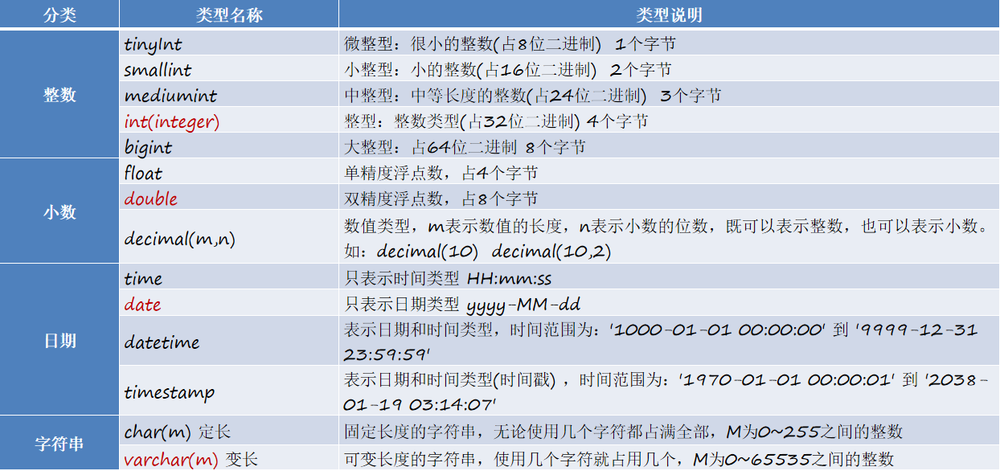

# mysql基础

> 姓名：陈伟
>
> 时间：2022-8-25

## 数据库

### 数据库的介绍

- **存储**和**管理**数据的**仓库**
- 英文单词为**Database**，简称**DB**
- 数据库中的数据是有组织的进行存储
- MySQL由瑞典 MySQL AB 公司开发，后来Sun公司收购了MySQL，而Sun公司又被Oracle收购

### 数据库的优点

- 永久保存，高效便捷
- 通过SQL语句比较方便的操作数据库

### DOS命令行登录MySQL

```mysql
登录格式1：登录本机的MySQL
	mysql -u用户名 -p密码 
	示例:mysql -uroot -proot

登录格式2：登录远程的MySQL
	mysql -u用户名 -p密码 –h远程主机ip 
	示例:mysql -uroot -proot -h127.0.0.1

退出MySQL
	exit 或 quit
```


### 数据库、表、数据的关系

- MySQL服务器中可以创建多个**数据库**
- 每个数据库中可以包含**多张表**
- 每个表中可以存储**多条数据记录**
- 客户端通过**数据库管理系统**来操作MySQL数据库

### 关系型数据库

- 关系型数据库是建立在关系模型基础上的数据库，简单说，关系型数据库是由多张能互相连接的**二维表**组成的数据库

## SQL的介绍

### SQL的介绍

SQL（Structured Query Language）：结构化查询语言，一门操作关系型数据库的编程语言

定义操作所有关系型数据库的统一标准。每一种数据库操作的方式可能会存在一些不一样的地方，我们称为“**方言**“

### 通用语法规则

1. SQL语句可以单行或多行书写，以分好结尾
2. MySQL数据库的SQL语句不区分大小写，关键字建议使用大写
3. 单行注释：—— 注释内容（建议使用）     #注释内容（MySQL特有）
4. 多行注释：/* 注释内容 */

### SQL的介绍

- **DDL**（Data Definition Language）数据定义语言，用来定义数据库对象：数据库，表，列等
- **DML**（Data Manipulation Language）数据库操作语言，用来对数据库中表的数据进行增删改
- **DQL** （Data Query Language）数据查询语言，用来查询数据库中表的记录（数据）
- DCL （Data Control Language）数据控制语言，用来定义数据库的访问权限和安全级别，及创建用户  

### 小结

- **数据库、表、数据**的关系：文件夹——文件——数据
- SQL（Structured Query Language）：结构化查询语言，可以操作数据库

## DDL操作数据库和表

### DDL查询和创建数据库

```mysql
查询所有数据库
	SHOW DATABASES;
创建数据库
	CREATE DATABASE 数据库名称;
创建数据库(判断，如果不存在则创建)
	CREATE DATABASE IF NOT EXISTS 数据库名称;
删除数据库
	DROP DATABASE 数据库名称; 
删除数据库(判断，如果存在则删除)
	DROP DATABASE IF EXISTS 数据库名称; 
使用数据库
	USE 数据库名称;
```


### DDL创建表

```mysql
创建表格式
CREATE TABLE 表名 (字段名 数据类型, 字段名 数据类型);

CREATE TABLE 表名 (
          字段名 数据类型,
          字段名 数据类型,
          ...
          字段名 数据类型
);

常用数据类型
   int：整数类型
   double：小数类型
   varchar(长度)：字符串类型
   date 表示日期类型 yyyy-MM-dd
```


### MySQL常见的数据类型



### DDL查看和删除表

```mysql
查询所有的表
	SHOW TABLES;

查询表结构(了解)
	DESC 表名;

删除表
	DROP TABLE 表名;
```


### DDL修改表

```mysql
修改表名
	ALTER TABLE 表名 RENAME TO 新表名;
单独添加一个字段
	ALTER TABLE 表名 ADD 字段名 数据类型;
修改某字段的数据类型
	ALTER TABLE 表名 MODIFY 字段名 新数据类型;
修改字段名和数据类型
	ALTER TABLE 表名 CHANGE 字段名 新字段名 新数据类型;
删除某一字段
	ALTER TABLE 表名 DROP 字段名;
```

- 规律：所有的修改表结构的语句都是ALTER TABLE 表名 XXX;

## DML表数据的增删改

### DML往表中新增数据

```mysql
给指定列添加数据
	INSERT INTO 表名(字段名1, 字段名2, …) VALUES (值1, 值2, …);
示例:INSERT INTO goods (NAME, price, sales_volume, produced_date) VALUES ('华为P40', 5999, 1000, '2020-08-20');

给全部列添加数据
	INSERT INTO 表名 VALUES (值1, 值2, …);
示例:INSERT INTO goods VALUES ('小米11', 4999, 5000, '2020-12-28');

批量添加数据(一次加入多条数据)
	INSERT INTO 表名 VALUES (值1, 值2, …), (值1, 值2, …), (值1, 值2, …);
```


- 插入数据注意事项
  1. 字段名和值的数量要对应
  2. 值的类型和字段的类型要对应
  3. 除了数值类型，其他数据类型的数据都需要加引号（单引双引都行，推荐单引）

### DML修改和删除表数据

```mysql
修改表中的数据
	UPDATE 表名 SET 字段名=新的值 [WHERE 条件];
	修改语句中必须加条件，如果不加条件，则会将所有数据都修改。

删除表中的数据
	DELETE FROM 表名 [WHERE 条件];
	删除语句中必须加条件，如果不加条件，则会将所有数据都删除。
```


## DQL查询数据

### 基础查询

```mysql
查询指定字段的数据
	SELECT 字段名1, 字段名2 FROM 表名;

查询所有字段的数据
	SELECT * FROM 表名;
	
去除重复查询
SELECT DISTINCT 字段名1 FROM 表名;

计算列的值(四则运算)
SELECT 字段名1 (+ - * /) 字段名2 FROM 表名;

起别名查询
SELECT 字段名1 AS 别名1, 字段名2 AS 别名2 FROM 表名;
```


### 条件查询

```mysql
条件查询语法
	SELECT 字段名 FROM 表名 WHERE 条件;
```

- 比较运算符

| 符号     | 功能     |
| -------- | -------- |
| >        | 大于     |
| <        | 小于     |
| \>=      | 大于等于 |
| <=       | 小于等于 |
| =        | 等于     |
| <> 或 != | 不等于   |

- 逻辑运算符

| 符号       | 功能     |
| ---------- | -------- |
| AND 或 &&  | 并且     |
| OR 或 \|\| | 或者     |
| NOT 或 !   | 非，不是 |

- 范围

| 符号             | 功能                     |
| ---------------- | ------------------------ |
| BETWEEN...AND... | 在某个范围之内（都包含） |
| IN(...)          | 多选一                   |

- NULL的处理

| 符号        | 功能     |
| ----------- | -------- |
| IS NULL     | 是NULL   |
| IS NOT NULL | 不是NULL |

### 模糊查询

```mysql
模糊查询语法
	SELECT * FROM 表名 WHERE 字段名 LIKE '通配符字符串';

MySQL通配符有两个
%: 表示任意多个字符
_: 表示一个字符
```


### 排序

```mysql
排序查询语法
	SELECT 字段名 FROM 表名 ORDER BY 列名 排序方式;

排序方式
    ASC: 升序
    DESC: 降序

如果有多个排序条件，只有当前边的条件值一样时，才会判断第二条件。
```


### 复杂查询

#### 聚合函数

- 之前我们做的查询都是横向查询，它们都是根据条件一行一行的进行判断，而使用聚合函数查询是纵向查询，它是对一列的值进行计算，然后返回一个结果值

- 五个聚合函数

  COUNT：统计指定列记录数

  SUM：计算指定列的数值和

  MAX：计算指定列的最大值

  MIN：计算指定列的最小值

  AVG：计算指定列的平均值 average

- 聚合函数的使用

  写在SELECT后字段名的地方

```mysql
SELECT 字段名 FROM 表名;

SELECT 聚合函数(字段名) FROM 表名;
```


- 注意事项
  1. 记录为**NULL**的不统计
  2. 如果不是数值类型，那么计算结果为0

#### 分组

SELECT * FROM 表名 GROUP BY 字段名;

- 分组的作用

  1. **分组的目的是为了做统计**
  2. **分组通常和聚合函数一起使用**

- 注意事项

  分组之后，查询的字段为**分组字段**和**聚合函数**，查询其他字段无任何意义

#### having和where的区别

- where是在分组前对数据进行过滤，having是在分组后对数据进行过滤
- where后面不可以使用聚合函数，having后面可以使用聚合函数

#### 分页

- 当我们浏览一些购物网站，比如京东，淘宝，返回的商品信息可能有几万甚至上百万条，服务器一次性把这么多的数据返回给浏览器合适吗？

  这时会出现的问题：

  1. 数据量太大，程序存放不下
  2. 处理太慢
  3. 传输太慢
  4. 严重降低用户体验

- 解决方案

  获取其中一部分数据

##### LIMIT

- LIMIT语句作用

  LIMIT是限制的意思，LIMIT的作用就是获取部分查询的数据

- LIMIT语句格式

  SELECT * FROM 表名 LIMIT offset, length;

  - offset是指偏移量，可以认为是跳过的记录数量，不写则默认为0
  - length是指需要显示的总记录数

- 提示

  - 分页查询 limit 是MySQL数据库的方言
  - Oracle 分页查询使用 rownumber
  - SQL Server 分页查询使用 top


# mysql高级02

> 姓名：陈伟
>
> 时间：2022-8-26

## 约束

- 什么是约束

  对表中的数据进行限定，保证数据的**正确性、有效性、完整性**

| 约束        | 说明                    |
| ----------- | ----------------------- |
| PRIMARY KEY | 主键约束                |
| UNIQUE      | 唯一约束                |
| NOT NULL    | 非空约束                |
| DEFAULT     | 默认值约束              |
| FOREIGN KEY | 外键约束                |
| CHECK       | 检查约束（mysql不支持） |

- **MySQL不支持检查约束**
- 约束通常是在创建表结构的时候创建

### 主键约束

- 主键的作用

  **用来区分表中的数据**

- 主键的特点

  1. 主键必须是唯一不重复的值
  2. 主键不能包含 **NULL** 值

- 建表时添加主键约束

```mysql
CREATE TABLE 表名 (
	字段名 字段类型 PRIMARY KEY,
	字段名 字段类型
);

CREATE TABLE 表名(
   列名 数据类型,
   [CONSTRAINT] [约束名称] PRIMARY KEY(列名)
); 
```

- 删除主键约束

```mysql
ALTER TABLE 表名 DROP PRIMARY KEY;
```

- 建表后单独添加主键约束

```mysql
ALTER TABLE 表名 ADD PRIMARY KEY(字段名);
```

- 主键自增

  主键如果让我们自己添加很有可能重复，我们通常希望在每次插入新纪录时，数据库自动生成主键字段的值

```mysql
字段名 字段类型 PRIMARY KEY AUTO_INCREMENT
```

- 注意事项

  AUTO_INCREMENT 在字段类型必须是数值类型

### 唯一约束

- 唯一约束的作用

  **让字段的值唯一，不能重复**

```mysql
CREATE TABLE 表名 (
	字段名 字段类型 UNIQUE,
	字段名 字段类型
);
```

- 非空约束的作用

  **让字段的值不能为NULL**

```mysql
CREATE TABLE 表名 (
	字段名 字段类型 NOT NULL,
	字段名 字段类型
);
```

- 默认值约束的作用

  **如果这个字段不设置值，就使用默认值**

```mysql
CREATE TABLE 表名 (
	字段名 字段类型 DEFAULT 值,
	字段名 字段类型
);
```

### 外键约束

- 一张表中的某个字段引用其他表的主键，这个字段称为**外键**
  - 主表：将数据给别人用的表
  - 副表/从表：使用别人数据的表
- 新建表时增加外键约束

```mysql
CREATE TABLE 表名 (
    字段名 字段类型,
    字段名 字段类型,
    -- 添加外键约束
    [CONSTRAINT 外键约束名] FOREIGN KEY(外键字段名) REFERENCES 主表(主键字段名)
);
```

- 关键字解释
  - CONSTRAINT：表示约束外键约束名：给外键约束取个名字，将来通过约束名可以删除这个约束
  - FOREIGN KEY(外键字段名)：指定某个字段作为外键
  - REFERENCES 主表(主键字段名)：引用主表的主键的值
- 删除外键约束

```mysql
ALTER TABLE 表名 DROP FOREIGN KEY 外键约束名;
```

- 已有表增加外键约束

```mysql
ALTER TABLE 从表 ADD [CONSTRAINT 外键约束名称] FOREIGN KEY (外键字段名) REFERENCES 主表(主键字段名);
```

## 数据库设计

- 软件的研发步骤


- 数据库设计概念

  - 数据库设计就是根据业务系统的具体需求，结合我们所选用的DBMS，为这个业务系统构造出最优的数据存储模型
  - 建立数据库中的**表结构**以及表与表之间的**关联关系**的过程

- 数据库设计的步骤

  1. 需求分析（数据是什么？数据具有哪些属性？数据与属性的特点是什么）

  2. 逻辑分析（通过ER图对数据库进行逻辑建模，不需要考虑我们所选用的数据库管理系统）

     

  3. 物理设计（根据数据库自身的特点把逻辑设计转换为物理设计）

  4. 维护设计（①对新的需求进行建表；②表优化）

### 表关系

- 一对一
  - 如：用户 和 用户 详情
  - 一对一关系多用于表拆分，将一个实体中经常使用的字段放一张表，不经常使用的字段放另一张表，用于提升查询性能
  - 一对一关系多用于表拆分，将一个实体中经常使用的字段放一张表，不经常使用的字段放另一张表，用于提升查询性能
  - 实现方式：在任意一方加入外键，关联另一方主键，并且设置外键为**唯一（UNIQUE）**
- 一对多（多对一）
  - 如：部门 和 员工
  - 一个部门对应多个员工，一个员工对应一个部门
  - 实现方式：在多的一方建立外键，指向一的一方的主键
- 多对多
  - 如：商品 和 订单
  - 一个商品对应多个订单，一个订单包含多个商品
  - 实现方式：建立第三张**中间表**，中间表至少包含**两个外键**，分别**关联两方主键**

## 多表查询

- 为什么要有多表查询

  **查询多张表才能得到我们想要的数据**

- 多表查询的分类

  - 表连接查询

    **同时查询多张表**

  - 子查询

    **先查一张表，后查另一张表**

  

准备数据

```mysql
-- 创建部门表
CREATE TABLE tb_dept (
  id INT PRIMARY KEY AUTO_INCREMENT,
  NAME VARCHAR(20)
);

INSERT INTO tb_dept (NAME) VALUES ('开发部'),('市场部'),('财务部');

-- 创建员工表
CREATE TABLE tb_emp (
  id INT PRIMARY KEY AUTO_INCREMENT,
  NAME VARCHAR(10),
  gender CHAR(1),   -- 性别
  salary DOUBLE,   -- 工资
  join_date DATE,  -- 入职日期
  dept_id INT
);

INSERT INTO tb_emp(NAME,gender,salary,join_date,dept_id) VALUES('孙悟空','男',7200,'2013-02-24',1);
INSERT INTO tb_emp(NAME,gender,salary,join_date,dept_id) VALUES('猪八戒','男',3600,'2010-12-02',2);
INSERT INTO tb_emp(NAME,gender,salary,join_date,dept_id) VALUES('唐僧','男',9000,'2008-08-08',2);
INSERT INTO tb_emp(NAME,gender,salary,join_date,dept_id) VALUES('白骨精','女',5000,'2015-10-07',3);
INSERT INTO tb_emp(NAME,gender,salary,join_date,dept_id) VALUES('蜘蛛精','女',4500,'2011-03-14',1);
```

### 表连接笛卡尔积现象

- 查询孙悟空员工的信息，包括所在的部门名称


- 左表的每条数据和右表的每条数据组合，这种效果称为**笛卡尔乘积**
- 我们发现不是所有的数据组合都是有用的，只有员工表.dept_id = 部门表的数据才是有用的。所以需要通过条件过滤掉没用的数据。过滤掉没用数据的条件称为**表连接条件**

### 表连接查询之内连接

- 隐式内连接（了解）

  看不到 join 关键字，条件使用 where 指定

```mysql
SELECT 字段列表 FROM 表1,表2… WHERE 条件;
```

- 显示内连接（常用）

  使用 inner join ... on 语句，可以省略 inner

```mysql
SELECT 字段列表 FROM 表1 [INNER] JOIN 表2 ON 条件;
```

- 内连接效果

  获取满足条件的数据


- 表连接方式


#### 表连接查询之左外连接

- 左外连接

  使用 left outer join ... on，outer可以省略

```mysql
SELECT 字段列表 FROM 表1 LEFT [OUTER] JOIN 表2 ON 条件;
```

- 左外连接效果


左外连接可以理解为：将满足要求的数据显示，**左表不满足要求的数据也显示**

#### 表连接查询之右外连接

- 右外连接

  使用right outer join ... on，outer可以省略

```mysql
SELECT 字段列表 FROM 表1 RIGHT [OUTER] JOIN 表2 ON 条件;
```

- 右外连接效果


右外连接可以理解为：满足要求的数据显示，**并且右表不满足要求的数据也显示**

### 子查询

- 什么是子查询

  **一个查询语句的结果作为另一个查询语句的一部分**

```mysql
SELECT 查询字段 FROM 表 WHERE 条件;

SELECT * FROM employee WHERE salary=(SELECT MAX(salary) FROM employee);
```

- 子查询需要放在 () 中
- **先执行子查询，将子查询的结果作为父查询的一部分**

#### 子查询结果的三种情况

- 子查询结果是**单行单列**，在where后面作为**条件**，**where后面使用的是比较运算符： =，>，<=，<>**

```mysql
SELECT 查询字段 FROM 表 WHERE 字段=(子查询);
```

- 子查询结果是**多行单列**，结果集类似于一个数组，在where后面作为条件，父查询使用 IN / ANY / ALL 运算符

```mysql
SELECT 查询字段 FROM 表 WHERE 字段 IN (子查询);
```

- 子查询结果是**多行多列**，在**from**后面作为**虚拟表**

```mysql
SELECT 查询字段 FROM (子查询) 表别名 WHERE 条件;
```

## 事务

### 事务简介

- 数据库的**事务**（Transaction）是一种机制、一个操作序列，包含了**一组数据库操作命令**
- 事务把所有的命令作为一个整体一起向系统提交或撤销操作请求，即这一组数据库命令要么**同时成功，要么同时失败**
- 事务是一个不可分割的工作逻辑单元

```mysql
-- 开启事务
START TRANSACTION;
或者  BEGIN;
-- 提交事务
COMMIT;
-- 回滚事务
ROLLBACK;
```

### 手动提交事务

- 使用DOS控制台演示手动提交事务
  - 模拟张三给李四转500元钱（成功）
    1. 在DOS命令行执行以下SQL语句：①开启事务；②张三账号－500；③李四账号＋500；
    2. 在DOS命令行执行 commit 提交事务
    3. 使用SQLYog查看数据库：发现数据改变
  - 模拟张三给李四转500元钱（失败）
    1. 在DOS命令行执行以下SQL语句：①开启事务；②张三账号－500；
    2. 在DOS命令行执行 rollback 回滚事务
    3. 使用SQLYog查看数据库：发现数据没有改变

### 事务的四大特性（ACID）

| 事务特性              | 含义                                                         |
| --------------------- | ------------------------------------------------------------ |
| 原子性（Atomicity）   | 事务是不可分割的最小操作单位，要么同时成功，要么同时失败     |
| 一致性（Consistency） | 事务前后数据的完整性必须保持一致                             |
| 隔离性（Isolation）   | 是指多个事务并发访问数据库时，一个事务不能被其他的事务所干扰，多个并发事务之间数据要相互隔离，不能相互影响 |
| 持久性（Durability）  | 事务一旦提交或回滚，它对数据库中的数据的改变就是永久的       |

### 自动提交事务

- 自动提交事务介绍

  在没有手动开启事务的情况下，每条增删改语句执行完毕自动提交事务，MySQL默认开始自动提交事务

- 查看MySQL是否开启自动提交事务

```mysql
SELECT @@autocommit; -- 推荐
```

0：（关闭自动提交）

1：（开启自动提交）


- 关闭自动提交事务

```mysql
set autocommit = 0;
```

1. 在控制台执行以下SQL语句：张三－500
2. 使用SQLYog查看数据库，发现数据并没有改变
3. 在控制台执行 commit 提交任务
4. 使用SQLYog查看数据库，发现数据改变


# JDBC

> 姓名：陈伟
>
> 时间：2022-8-27

## JDBC简介

- 客户端操作MySQL数据库的方式
  - 使用DOS命令行方式
  - 使用第三方客户端来访问MySQL：SQLyog、Navicat、SQLWave、MyDB Studio、EMS SQL Manager for MySQL
  - **通过Java来访问MySQL数据库**


## JDBC的概念

- 什么是JDBC

  **J**ava **D**ata **B**ase **C**onnectivity：**Java数据库连接**

- JDBC 作用

  **通过JDBC可以让Java程序操作数据库**

- JDBC 本质

  - 官方（Sun公司）定义的一套操作所有关系型数据库的规则，即接口（API）
  - 各个数据库厂商去实现这套接口，提供数据库驱动jar包
  - 我们可以使用这套接口（JDBC）编程，真正执行的代码是驱动jar包中的实现类

- JDBC的好处

  1. 我们只需要会调用JDBC接口中的方法即可，使用简单
  2. 使用同一套Java代码，进行少量的修改就可以访问其他JDBC支持的数据库

## JDBC四个核心对象


## JDBC注册驱动

我们Java程序需要通过数据库驱动才能连接到数据库，因此需要注册驱动

在注册驱动前需要先导入驱动的 jar 包

- 导入驱动jar包


- java.sql.DriverManager 类用于注册驱动。提供如下方法注册驱动

```java
static void registerDriver(Driver driver)  向 DriverManager 注册给定驱动程序。
```

- 示例代码

```java
public class Demo01 {
	public static void main(String[] args) throws Exception {
		// 注册驱动
		DriverManager.registerDriver(new com.mysql.jdbc.Driver());
	}
}
```

- 注意
  - **MySQL5 之后的驱动包，可以省略注册驱动的步骤**
  - **自动加载jar包中META-INF/services/java.sql.Driver文件中的驱动类**

## 获得Connection连接

- Connection介绍

  表示Java程序与数据库之间的连接，只有拿到Connection才能操作数据库

| DriverManager类中的静态方法                                  | 描述                            |
| ------------------------------------------------------------ | ------------------------------- |
| **static** Connection **getConnection**(String url, String user, String password) | 连接到给定数据库URL，并返回连接 |

- 参数说明	

  1. String url：连接数据库的URL，用于说明连接数据库的位置
  2. String user：数据库的账号
  3. String password：数据库的密码

  连接数据库的URL地址格式：**协议名:子协议://服务器名或IP地址:端口号/数据库名**

- MySQL写法：**jdbc:mysql://localhost:3306/day20**

  如果是本地服务器，端口号是默认的3306，则可以简写：**jdbc:mysql:///day20**

## 获得Statement对象

- 在java.sql.Connection接口中有如下方法获取到Statement对象

```java
Statement createStatement() 
创建一个 Statement 对象来将 SQL 语句发送到数据库
```

- 案例代码

```java
// 1.注册驱动

// 2.获取连接
Connection conn = DriverManager.getConnection("jdbc:mysql:///day20", "root", "root");

// 3.获取小货车
Statement stmt = conn.createStatement();
```

## JDBC实现对单表数据增、删、改

- 我们要对数据库进行增、删、改、查，需要使用 **statement** 对象来执行SQL语句
- **Statement**的API介绍

```java
ResultSet executeQuery(String sql)
用于执行查询语句; 返回查询到的结果集

int executeUpdate(String sql)
用于执行除查询外的SQL; 返回影响的行数
```

## JDBC功能类详解

### ResultSet的原理

- ResultSet用于保存执行查询SQL语句的结果，我们不能一次性取出所有的数据，需要一行一行的取出
- ResultSet内部有一个指针，记录获取到哪行数据
  - 获取查询结果

```java
boolean next()：(1) 将光标从当前位置向前移动一行 （2）判断当前行是否为有效行
返回值：
true：有效行，当前行有数据
false：无效行，当前行没有数据
```

```java
xxx  getXxx(参数)：获取数据
xxx：数据类型；如：int getInt(参数) ; String getString(参数)
参数：
String：列的名称
```

```java
while (rs.next()) {
    rs.getXxx(字段名); // 取出数据
}
```

### ResultSet获取数据的API

- ResultSet获取数据的API是有规律的get后面加数据类型，我们统称getXXX()

| 方法名                                 | 说明          |
| -------------------------------------- | ------------- |
| boolean getBoolean(String columnLabel) | 获取boolean值 |
| byte getByte(String columnLabel)       | 获取byte值    |
| double getDouble(String columnLabel)   | 获取double值  |
| int getInt(String columnLabel)         | 获取int值     |
| long getLong(String columnLabel)       | 获取long值    |
| String getString(String columnLabel)   | 获取String值  |

| SQL类型       | jdbc对应方法   | 返回类型                            |
| ------------- | -------------- | ----------------------------------- |
| BIT(1) bit(n) | getBoolean()   | boolean                             |
| TINYINT       | getByte()      | byte                                |
| SMALLINT      | getShort()     | short                               |
| INT           | getInt()       | int                                 |
| BIGINT        | getLong()      | long                                |
| CHAR, VARCHAR | getString()    | String                              |
| DATE          | getDate()      | java.sql.Date 只表示日期            |
| TIME          | getTime()      | java.sql.Time 只表示时间            |
| TIMESTAMP     | getTimestamp() | java.sql.Timestamp 同时有日期和时间 |

- 注意：这只是一个建议，不按这个表的对应关系也可以，只要数据类型可以自动转化。如：int类型，使用String去取，也是可以的。但如果是String类型，使用int去取就不行

### Statement查询数据

- 使用PreparedStatement实现查询数据，将查询出的数据保存到对象中
- 对象关系映射介绍


## JDBC事务

### JDBC事务API

- Connection接口中与事务有关的方法

| 方法名                                 | 说明                           |
| -------------------------------------- | ------------------------------ |
| void setAutoCommit(boolean autoCommit) | false:开启事务，true：关闭事务 |
| void commit()                          | 提交事务                       |
| void rollback()                        | 回滚事务                       |

- **MySQL命令操作失误**

  **开启事务 start transaction**

  **提交事务 commit**

  **回滚事务 rollback**

- 使用步骤

  1. 注册驱动
  2. 获取连接
  3. **开启事务**
  4. 获取到Statement
  5. Statement执行SQL
  6. **提交或回滚事务**
  7. 关闭资源

```java
	public static void main(String[] args) {
        // 1.注册驱动(自动注册)
        // 2.获取连接
        Connection conn = null;
        Statement stmt = null;
        try {
            conn = DriverManager.getConnection("jdbc:mysql://localhost:3306/day17", "root", "root");
            // 3.开启事务
            conn.setAutoCommit(false); //设置为false 为开启事务
            // 4.获取到Statement
            stmt = conn.createStatement();
            // 5.Statement执行SQL
            // 张三-500
            stmt.executeUpdate("update account set balance = balance - 500 where id = 1");
            // 李四+500
            stmt.executeUpdate("update account set balance = balance + 500 where id = 2");
            // 6.成功提交事务
            conn.commit();
            System.out.println("成功提交事务~");
        } catch (SQLException e) {
            // 6.失败回滚事务
            try {
                conn.rollback();
                System.out.println("回滚事务~");
            } catch (SQLException ex) {
                ex.printStackTrace();
            }
            e.printStackTrace();
        }  finally {
            if(stmt!=null) {
                try {
                    stmt.close();
                } catch (SQLException e) {
                    e.printStackTrace();
                }
            }
            if(conn!=null){
                try {
                    conn.close();
                } catch (SQLException e) {
                    e.printStackTrace();
                }
            }
        }
    }
```

## SQL注入攻击

### SQL注入的概念

- 在前面JDBC实现登录案例中，当我们输入以下密码，我们发现我们账号和密码都不对竟然登录成功了

```java
请输入用户名：
hehe
请输入密码：
a'or'1'='1
```

- 问题分析

```mysql
"SELECT * FROM user WHERE name='" + name + "' AND password='" + password + "';";

// 将用户输入的账号密码拼接后
"SELECT * FROM user WHERE name='hehe' AND password='a'or'1'='1';"
```

- SQL注入攻击的原理
  - 按照正常道理来说，我们在密码处输入的所有内容，都应该认为是密码的组成
  - 但是现在Statement对象在执行sql语句时，将密码的一部分内容当做查询条件来执行了

### 解决SQL注入

- PreparedStatement预编译执行者对象
  - **预编译：SQL语句在执行前就已经编译好了，执行速度更快**
  - 安全性更高：没有字符串拼接的SQL语句，所以避免SQL注入的问题
  - 代码的可读性更好，因为没有字符串的拼接

#### PreparedStatement使用

- SQL语句中的参数使用 ？作为占位符
- 给 ？ 占位符赋值

```java
String sql = "SELECT * FROM USER WHERE NAME=? AND PASSWORD=?;";
PreparedStatement pstmt = conn.prepareStatement(sql);
pstmt.setString(1, “zhangsan”);
pstmt.setString(2, “6666”);
```

#### 设置参数

- setXxx(参数1, 参数2);       Xxx代表：数据类型
- 参数1：第几个？（编号从1开始）
- 参数2：？的实际参数

#### 执行SQL语句

- int executeUpdate();    执行insert、update、delete语句
- ResultSet executeQuery();  执行select语句

```java
public static void main(String[] args) throws SQLException {
		// 1.使用数据库保存用户的账号和密码
		// 2.让用户输入账号和密码
		Scanner sc = new Scanner(System.in);
		System.out.println("请输入账号:");
		String name = sc.nextLine();
		System.out.println("请输入密码:");
		String password = sc.nextLine();
		Connection conn = DriverManager.getConnection("jdbc:mysql://localhost:3306/day17", "root", "root");
		String sql = "select * from user where name = ? and password = ? order by id";
		PreparedStatement pstmt = conn.prepareStatement(sql);
		pstmt.setString(1,name);
		pstmt.setString(2,password);
		ResultSet rs = pstmt.executeQuery();
		// 4.如果查询到数据，说明登录成功
		if(rs.next()){
			System.out.println("欢迎您," + name);
		} else {
			// 5.如果查询不到数据，说明登录失败
			System.out.println("账号或密码错误......");
		}
		while(rs.next()){
			System.out.println(rs.getString("name") + "," + rs.getString("password"));
		}
		// 6.关闭资源
		rs.close();
		pstmt.close();
		conn.close();
	}
```

## 数据库连接池

### 数据库连接池简介

- 之前JDBC访问数据库的步骤：

  创建数据库连接 → 运行SQL语句 → 关闭连接

  每次数据库访问执行这样重复的动作

- **每次创建数据库连接的问题**

  获取数据库连接需要消耗比较多的资源，而每次操作都要重新获取新的连接对象，执行一次操作就把连接关闭，而数据库创建连接通常需要消耗相对较多的资源。这样数据库连接对象的使用率低


### 连接池的概念

- 连接池就是一个容器，连接池中保存了一些数据库连接，这些连接是可以重复使用的


### 连接池的原理

1. 启动连接池，连接池就会初始化一些连接
2. 当用户需要使用数据库连接，直接从连接池中取出
3. 当用于使用完连接，会将连接重新放回连接池中

### 连接池好处

- 连接池中会保存一些连接，这些连接可以重复使用，降低数据资源的消耗


### 常用连接池的介绍

- java**x**.sql.**DataSource**表示数据库连接池，是JDK种提供的一个接口，没有具体的实现，它的实现由连接池的厂商去实现，使用方法如下

```java
public interface DataSource {
	Connection getConnection();
	...
}
```

- 常用的连接池实现组件有以下这些
  - 阿里巴巴-德鲁伊Druid连接池：Druid是阿里巴巴开源平台上的一个项目
  - C3P0是一个开源的连接池，目前使用它的开源项目有Hibernate，Spring等
  - DBCP（DataBase Connection Pool）数据库连接池，是Tomcat使用的连接池组件

## Druid数据库连接池

### Druid连接池简介

- Druid是阿里巴巴开发的号称为监控而生的数据库连接池，Druid是目前最好的数据库连接池。在功能、性能、扩展性方面，都超过其他数据库连接池，同时加入了日志监控，可以很好的监控数据库连接池和SQL的执行情况。Druid已经在阿里巴巴部署了超过600个应用，经过一年多生产环境大规模部署的严苛考验。Druid地址：https://github.com/alibaba/druid DRUID连接池使用的jar包：druid-1.0.9.jar

### Druid常用的配置参数

| 方法名      | 说明                                   |
| ----------- | -------------------------------------- |
| initialSize | 刚启动连接池时，连接池中包含连接的数量 |
| maxActive   | 连接池中最多可以放多少个连接           |
| maxWait     | 获取连接时最大等待时间，单位毫秒       |

### Druid连接池介绍

- com.alibaba.druid.pool.DruidDataSourceFactory类有创建连接池的方法

```java
public static DataSource createDataSource(Properties properties)
创建一个连接池，连接池的参数使用properties中的数据
```

- 我们可以看到Druid连接池在创建的时候需要一个Properties对象来设置参数，所以我们使用properties文件来保存对应的参数。Druid连接池的配置文件名称随便，放到src目录下面方便加载

  druid.properties文件内容

```properties
driverClassName=com.mysql.jdbc.Driver
url=jdbc:mysql://127.0.0.1:3306/day17
username=root
password=root
initialSize=5
maxActive=10
maxWait=3000
```

### Druid连接池使用步骤

1. 导入druid-1.0.0.jar的jar包
2. 复制druid.properties文件到src下，并设置对应参数
3. 加载properties文件的内容到Properties对象中
4. 创建Druid连接池，使用配置文件中的参数
5. 从Druid连接池中取出连接
6. 执行SQL语句
7. 关闭资源

```java
	public static void main(String[] args) throws Exception {
//		1.导入druid-1.0.0.jar的jar包
//		2.复制druid.properties文件到src下，并设置对应参数
//		3.加载properties文件的内容到Properties对象中
		Properties pp = new Properties();
		pp.load(new FileInputStream("study_day18\\src\\druid.properties"));
//		4.创建Druid连接池，使用配置文件中的参数
		DataSource ds = DruidDataSourceFactory.createDataSource(pp);
//		5.从Druid连接池中取出连接
		Connection conn = ds.getConnection();
//		6.执行SQL语句
		String sql = "insert into user values (null,?,?)";
		PreparedStatement pstmt = conn.prepareStatement(sql);
		pstmt.setString(1,"liukang");
		pstmt.setString(2,"123");
		int row = pstmt.executeUpdate();
		System.out.println("row = " + row);
//		7.关闭资源
		pstmt.close();
		conn.close();
	}
```

